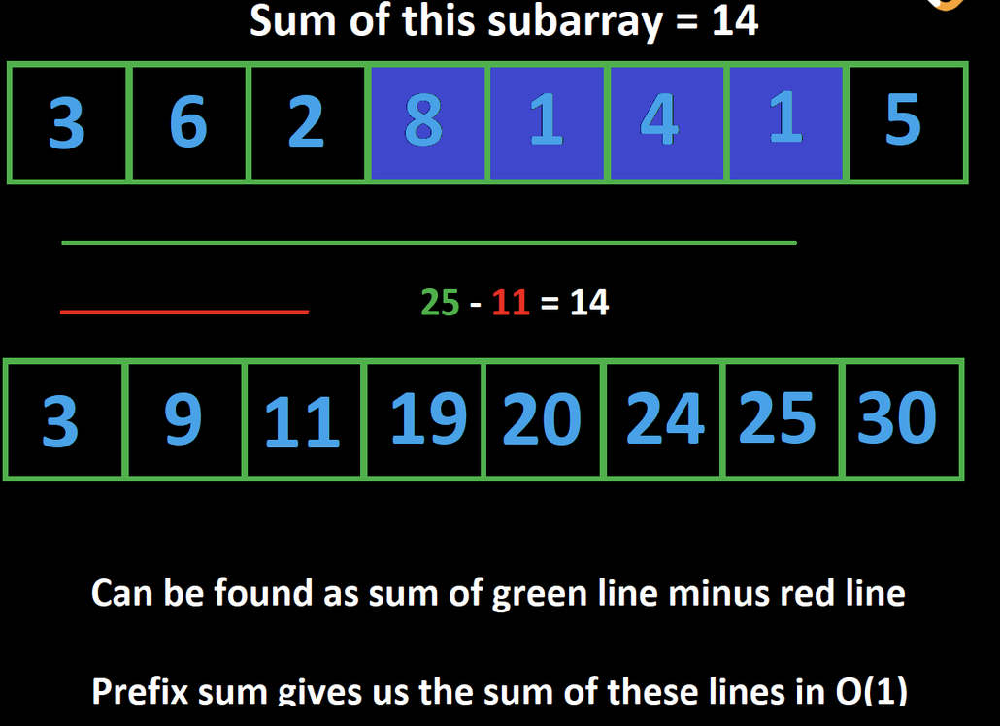

# Quick Data Structures & Algorithms

## Table of Contents
- [Introduction](#introduction)
    - [Introduction to Big O](#introduction-to-big-o)
    - [Introduction to Recursion](#introduction-to-recursion)
        - [Breaking problems down](#breaking-problems-down)
- [Arrays and Strings](#arrays-and-strings)
    - [Two pointers](#two-pointers)
    - [Sliding window](#sliding-window)
    - [Prefix sum](#prefix-sum)
    - [More common patterns](#more-common-patterns)
- [Hashing](#hashing)
    - [Hashing](#hashing)
    - [Checking for existence](#checking-for-existence)
    - [Counting](#counting)
    - [More hashing examples](#more-hashing-examples)
- [Linked lists](#linked-lists)
    - [Linked lists](#linked-lists-1)
    - [Fast and slow pointers](#fast-and-slow-pointers)
    - [Reversing a linked list](#reversing-a-linked-list)
- [Stacks and queues](#stacks-and-queues)
    - [Stacks](#stacks)
    - [String problems](#string-problems)
    - [Queues](#queues)
- [Trees and graphs](#trees-and-graphs)
    - [Binary trees](#binary-trees)
    - [Binary trees - DFS](#binary-trees---dfs)
    - [Binary trees - BFS](#binary-trees---bfs)
    - [Binary search trees](#binary-search-trees)
    - [Graphs](#graphs)
    - [Graphs - DFS](#graphs---dfs)
    - [Graphs - BFS](#graphs---bfs)
    - [Implicit graphs](#implicit-graphs)
- [Greedy](#greedy)
    - [Greedy algorithms](#greedy-algorithms)
    - [Example greedy problems](#example-greedy-problems)
- [Binary search](#binary-search)
    - [Binary search](#binary-search-1)
    - [On arrays](#on-arrays)

## Introduction

### Introduction To Big O
Big O is a notation used to describe the computational complexity of an algorithm. The computational complexity of an algorithm is split into two parts: time complexity and space complexity. The time complexity of an algorithm is the amount of time the algorithm needs to run relative to the input size. The space complexity of an algorithm is the amount of memory allocated by the algorithm when run relative to the input size.

Typically, people care about the time complexity more than the space complexity, but both are important to know.

#### How Complexity Works

Complexity is described by a function. What should the arguments to this function be?

The arguments are defined by the programmer, but they should cover all relevant variables that would change when the input changes. The most common variable you'll see is nn, which usually denotes the length of an input array or string.

In the context of interviews, there are some common assumptions that we make. For example: when dealing with integers, the larger the value, the more time operations like addition, multiplication, or printing will take. While this is relevant in theory, we typically ignore this fact because the difference is practically very small. If you are given an array of integers as an input, the only variable you would use is nn to denote the length of the array. Technically, you could introduce another variable, let's say kk which denotes the average value of the integers in the array. However, nobody does this.

When written, the function is wrapped by a capital O. Here are some example complexities:

- O(n)
- O(n^2)
- O(2n)
- O(log ⁡n)
- O(n * m)

You might be thinking, what is mm? Remember: we define the variables. As these are simply examples with no associated problem, mm could denote any arbitrary variable. For example, we could have a problem where the input is two arrays. n could denote the length of one while m denotes the length of the other.


#### Rules

These functions describe how the amount of operations/memory needed by the algorithm grows as the arguments tend to infinity. Because the variables are tending to infinity, constants are always ignored. That means that O(9999999n) = O(8n) = O(n) = O(n/500​).

What we want to focus on is how an algorithm scales with the input size. Let's say you have two algorithms. One runs in O(100n) and the other runs in O(5n). If you were to double n, then both algorithms will equally take 2x longer regardless of what the coefficients are. Therefore, both algorithms are O(n) even though the second algorithm runs 20x faster, because both grow linearly with n.

This also means that when you have addition/subtraction between terms of the same variable, some of the terms can be ignored. For example, O(2^n + n^2 − 500n)= O(2^n), because as n tends to infinity, 2^n completely dominates the other two terms.

Being able to analyze an algorithm and derive its time and space complexity is a crucial skill. Interviewers will almost always ask you for your algorithm's complexity to check that you actually understand your algorithm and didn't just memorize/copy the code. Being able to analyze an algorithm also enables you to determine what parts of it can be improved.

The best complexity possible is O(1), called "constant time" or "constant space". It means that the algorithm ALWAYS uses the same amount of resources, regardless of the input.

Note that a constant time complexity doesn't necessarily mean that an algorithm is fast (O(5000000)=O(1)), it just means that its runtime is independent of the input size.

When talking about complexity, there are normally three cases:

Best case scenario  
Average case  
Worst case scenario  

In most algorithms, all three of these will be equal, but some algorithms will have them differ. If you have to choose only one to represent the algorithm's time or space complexity, never choose the best case scenario. It is most correct to use the worst case scenario, but you should be able to talk about the difference between the cases.

#### Analyzing Time Complexity
Let's look at some example algorithms in pseudo-code and talk about their time complexities.

```
// Given an integer array "arr" with length n,

for (int num: arr) {
    print(num)
}
```

This algorithm has a time complexity of O(n). In each for loop iteration, we are performing a print, which costs O(1). The for loop iterates n times, which gives a time complexity of O(1⋅n)=O(n).

```
// Given an integer array "arr" with length n,

for (int num: arr) {
    for (int i = 0; i < 500,000; i++) {
        print(num)
    }
}
```

This algorithm has a time complexity of O(n). In each inner for loop iteration, we are performing a print, which costs O(1). This for loop iterates 500,000 times, which means each outer for loop iteration costs O(500000)=O(1). The outer for loop iterates n times, which gives a time complexity of O(n).

Even though the first two algorithms technically have the same time complexity, in reality the second algorithm is much slower than the first one. It's correct to say that the time complexity is O(n), but it's important to be able to discuss the differences between practicality and theory.

```
// Given an integer array "arr" with length n,

for (int num: arr) {
    for (int num2: arr) {
        print(num * num2)
    }
}
```

This algorithm has a time complexity of O(n^2). In each inner for loop iteration, we are performing a multiplication and print, which both cost O(1). The inner for loop runs nn times, which means each outer for loop iteration costs O(n). The outer for loop runs O(n) times, which gives a time complexity of O(n⋅n)=O(n^2).

```
// Given integer arrays "arr" with length n and "arr2" with length m,

for (int num: arr) {
    print(num)
}

for (int num: arr) {
    print(num)
}

for (int num: arr2) {
    print(num)
}
```

This algorithm has a time complexity of O(n+m). The first two for loops both cost O(n), whereas the final for loop costs O(m). This gives a time complexity of O(2n+m) = O(n+m).

```
// Given an integer array "arr" with length n,

for (int i = 0; i < arr.length; i++) {
    for (int j = i; j < arr.length; j++) {
        print(arr[i] + arr[j])
    }
}
```

This algorithm has a time complexity of O(n^2). The inner for loop is dependent on what iteration the outer for loop is currently on. The first time the inner for loop is run, it runs n times. The second time, it runs n−1 times, then n−2, n−3, and so on.

That means the total iterations is 1 + 2 + 3 + 4 + ... + n, which is the partial sum of this series, which is equal to n⋅(n+1)/2 = (n^2 + n)/2​. In big O, this is O(n^2) because the addition term in the numerator and the constant term in the denominator are both ignored.

##### Logarithmic time
A logarithm is the inverse operation to exponents. The time complexity O(log ⁡n)is called logarithmic time and is extremely fast. A common time complexity is O(n⋅log ⁡n), which is reasonably fast for most problems and also the time complexity of efficient sorting algorithms.

Typically, the base of the logarithm will be 2. This means that if your input is size n, then the algorithm will perform x operations, where 2^x = n. However, the base of the logarithm doesn't actually matter for big O, since all logarithms are related by a constant factor.

O(log⁡ n) means that somewhere in your algorithm, the input is being reduced by a percentage at every step. A good example of this is binary search, which is a searching algorithm that runs in O(log⁡n) time. With binary search, we initially consider the entire input (n elements). After the first step, we only consider n / 2 elements. After the second step, we only consider n / 4 elements, and so on. At each step, we are reducing our search space by 50%, which gives us a logarithmic time complexity.

#### Analyzing Space Complexity
When you initialize variables like arrays or strings, your algorithm is allocating memory. We never count the space used by the input (it is bad practice to modify the input), and usually don't count the space used by the output (the answer) unless an interviewer asks us to.

In the below examples, the code is only allocating memory so that we can analyze the space complexity, so we will consider everything we allocate as part of the space complexity (there is no "answer").

```
// Given an integer array "arr" with length n

for (int num: arr) {
    print(num)
}
```

This algorithm has a space complexity of O(1). The only space allocated is an integer variable num, which is constant relative to n.

```
// Given an integer array "arr" with length n

Array doubledNums = int[]

for (int num: arr) {
    doubledNums.add(num * 2)
}
```

This algorithm has a space complexity of O(n). The array doubledNums stores n integers at the end of the algorithm.

```
// Given an integer array "arr" with length n

Array nums = int[]
int oneHundredth = n / 100

for (int i = 0; i < oneHundredth; i++) {
    nums.add(arr[i])
}
```

This algorithm has a space complexity of O(n). The array nums stores the first 1% of numbers in arr. This gives a space complexity of O(n/100) = O(n).

```
// Given integer arrays "arr" with length n and "arr2" with length m,

Array grid = int[n][m]

for (int i = 0; i < arr.length; i++) {
    for (int j = 0; j < arr2.length; j++) {
        grid[i][j] = arr[i] * arr2[j]
    }
}
```

This algorithm has a space complexity of O(n⋅m). We are creating a grid that has dimensions n⋅m.


### Introduction to Recursion

Recursion is a problem solving method. In code, recursion is implemented using a function that calls itself.

The opposite of a recursive algorithm would be an iterative algorithm. There is a branch of study that proves that any iterative algorithm can be written recursively. While iterative algorithms use for loops and while loops to simulate repetition, recursive algorithms use function calls to simulate the same logic.

Let's say that we wanted to print the numbers from 1 to 10. Here's some pseudocode for an iterative algorithm:

```
for (int i = 1; i <= 10; i++) {
    print(i)
}
```

Here's some pseudocode for an equivalent recursive algorithm:

```
function fn(i):
    print(i)
    fn(i + 1)
    return

fn(1)
```

Each call to fn first prints i (which starts at 1), and then calls fn again, but incrementing i (to print the next number).

The first function call prints 1, then calls fn(2). In fn(2), we print 2, then call fn(3), and so on.

However, this code is actually wrong. Do you see the problem? The function calls will never stop! Running this code would print natural numbers (positive integers) infinitely (or until the computer exploded). The return line never gets reached because fn(i + 1) comes before it.

We need what is called a base case to make the recursion stop. Base cases are conditions at the start of recursive functions that terminate the calls.

```
function fn(i):
    if i > 10:
        return

    print(i)
    fn(i + 1)
    return

fn(1)
```

After we call fn(10), we print 10 and call fn(11). In the fn(11) call, we trigger the base case and return. So now we are back in the call to fn(10) and move to the next line, which is the return statement. This makes us return back to the fn(9) call and so on, until we eventually return from the fn(1) call and the algorithm terminates.

An important thing to understand about recursion is the order in which the code runs - the order in which the computer executes instructions. With an iterative program, it's easy - start at the top, and go line by line. With recursion, it can get confusing because calls can cascade on top of each other. Let's print numbers again, but this time only up to 3. Let's also add another print statement and number the lines:

```
function fn(i):
1.  if i > 3:
2.    return

3.  print(i)
4.  fn(i + 1)
5.  print(f"End of call where i = {i}")
6.  return

fn(1)
```


If you ran this code, you would see the following in the output:

```
// 1
// 2
// 3
// End of call where i = 3
// End of call where i = 2
// End of call where i = 1
```

As you can see, the line where we print text is executed in reverse order. The original call fn(1) first prints 1, then calls to fn(2), which prints 2, then calls to fn(3), which prints 3, then calls to fn(4). Now, this is the important part: how recursion "moves" back "up". fn(4) triggers the base case, which returns. We are now back in the function call where i = 3 and line 4 has finished, so we move to the line 5 which prints "End of call where i = 3". Once that line runs, we move to the next line, which is a return. Now, we are back in the function call where i = 2 and line 4 line has finished, so again we move to the next line and print "End of the call where i = 2". This repeats until the original function call to fn(1) returns.

Every function call "exists" until it returns. When we move to a different function call, the old one waits until the new one returns. The order in which the calls happens is remembered, and the lines within the functions are executed in order.

Note that each function call also has its own local scope. So in the example above, when we call f(3), there are 3 "versions" of i simultaneously. The first call has i = 1, the second call has i = 2, and the third call has i = 3. Let's say that we were to do i += 1 in the f(3) call. Then i becomes 4, but only in the f(3) call. The other 2 "versions" of i are unaffected because they are in different scopes.

#### Breaking problems down

This printing example is pretty pointless - it's easier to use a for loop if you just want to print numbers. Where recursion shines is when you use it to break down a problem into "subproblems", whose solutions can then be combined to solve the original problem.

Let's look at the Fibonacci numbers. The Fibonacci numbers are a sequence of numbers starting with 0, 1. Then, each number is defined as the sum of the previous two numbers. The first few Fibonacci numbers are 0, 1, 1, 2, 3, 5, 8. More formally, we have

F<sub>n</sub> = F<sub>n−1</sub> + F<sub>n−2</sub>​

This is called a recurrence relation - it's an equation that connects the terms together.

Let's use pseudocode to write a function F(n) that returns the nth Fibonacci number (0 indexed). Don't forget we need base cases with any recursive function. In this case the base cases are explicitly defined: F(0) = 0 and F(1) = 1.

```
function F(n):
    if n <= 1:
        return n

    oneBack = F(n - 1)
    twoBack = F(n - 2)
    return oneBack + twoBack
```

Let's say that we wanted to find F(3). Upon calling F(3), we would see the following flow, with each indentation level representing a function call's scope:

```
oneBack = F(2)
    oneBack = F(1)
        F(1) = 1
    twoBack = F(0)
        F(0) = 0
    F(2) = oneBack + twoBack = 1
twoBack = F(1)
    F(1) = 1
F(3) = oneBack + twoBack = 2
```

As you can see, we took the original problem F(3), and broke it down into two smaller subproblems - F(2) and F(1). By combining the recurrence relation and base cases, we can solve the subproblems and use those solutions to solve the original problem.

This is the most common use of recursion - you have your recursive function return the answer to the problem you're trying to solve for a given input. In this example, the problem we're trying to solve for a given input is "What is the nthnth Fibonacci number? As such, we designed our function to return a Fibonacci number, according to the input n. By determining the base cases and a recurrence relation, we can easily implement the function.

By following this idea, solving the subproblems is easy - if we wanted the 100th Fibonacci number, we know by definition that it is the sum of the 99th and 98th Fibonacci number. On the function call to F(100), we know that calling F(99) and F(98) will give us those numbers.

<hr>

## Arrays and Strings

In terms of algorithm problems, arrays (1D) and strings are very similar: they both represent an ordered group of elements. Most algorithm problems will include either an array or string as part of the input, so it's important to be comfortable with the basic operations and to learn the most common patterns.

"Array" can mean something different between languages. For example, Python primarily uses "lists" instead of arrays which are extremely lenient. Initialization is as easy as arr = [], and you don't need to worry about the type of data you store in the list or the size of the list. Other languages like C++ require you to specify the size and data type of the array during initialization, but also have support for lists (like std::vector in C++).

Technically, an array can't be resized. A dynamic array, or list, can be. In the context of algorithm problems, usually when people talk about arrays, they are referring to dynamic arrays. In this entire course, we will be talking about dynamic arrays/lists, but we will just use the word "array".

Similarly, strings are implemented differently between languages. In Python and Java, they are immutable. In C++, they are mutable. It's important to know the details behind arrays and strings for the language you plan on using in interviews.

Mutable: a type of data that can be changed. Immutable: A type of data that cannot be changed. If you want to change something immutable, you will need to recreate the entire thing.

Why should we care about something being mutable or immutable? If you have a mutable array arr = ["a", "b", "c"] and an immutable string s = "abc", but you want to instead represent "abd", you can easily do arr[2] = "d", but you cannot do s[2] = "d". As such, if you wanted the string s = "abd", you would need to create it entirely from scratch. With such a small string, it's not a big deal. But sometimes you are dealing with strings with 100,000 characters, so creating new versions just to modify one character is very expensive (O(n)O(n), where nn is the size of the string).

Let's take a quick look at the complexity of array and string operations:


Appending to the end of a list is <a href="https://stackoverflow.com/questions/33044883/why-is-the-time-complexity-of-pythons-list-append-method-o1"> amortized O(1)</a>.


### Two pointers
Two pointers is an extremely common technique used to solve array and string problems. It involves having two integer variables that both move along an iterable. In this article, we are focusing on arrays and strings. This means we will have two integers, usually named something like i and j, or left and right which each represent an index of the array or string.

There are several ways to implement two pointers. To start, let's look at the following method:

    Start the pointers at the edges of the input. Move them towards each other until they meet.

Converting this idea into instructions:

    Start one pointer at the first index 0 and the other pointer at the last index input.length - 1.
    Use a while loop until the pointers are equal to each other.
    At each iteration of the loop, move the pointers towards each other. This means either increment the pointer that started at the first index, decrement the pointer that started at the last index, or both. Deciding which pointers to move will depend on the problem we are trying to solve.

Here's some pseudocode illustrating the concept:

```
function fn(arr):
    left = 0
    right = arr.length - 1

    while left < right:
        Do some logic here depending on the problem
        Do some more logic here to decide on one of the following:
            1. left++
            2. right--
            3. Both left++ and right--
```

The strength of this technique is that we will never have more than O(n) iterations for the while loop because the pointers start nn away from each other and move at least one step closer in every iteration. Therefore, if we can keep the work inside each iteration at O(1), this technique will result in a linear runtime, which is usually the best possible runtime. Let's look at some examples.

    Example 1: Given a string s, return true if it is a palindrome, false otherwise.

    A string is a palindrome if it reads the same forward as backward. That means, after reversing it, it is still the same string. For example: "abcdcba", or "racecar".

After reversing a string, the first character becomes the last character. If a string is the same after being reversed, that means the first character is the same as the last character, the second character is the same as the second last character, and so on. We can use the two pointers technique here to check that all corresponding characters are equal. To start, we check the first and last characters using two separate pointers. To check the next pair of characters, we just need to move our pointers toward each other one position. We continue until the pointers meet each other or we find a mismatch.

```python
def check_if_palindrome(s):
    left = 0
    right = len(s) - 1

    while left < right:
        if s[left] != s[right]:
            return False
        left += 1
        right -= 1
    
    return True
```
Notice that if the input was an array of characters instead of a string, the algorithm wouldn't change. The two pointers technique works as long as the index variables are moving along some abstract iterable.

This algorithm is very efficient as not only does it run in O(n), but it also uses only O(1) space. No matter how big the input is, we always only use two integer variables. The time complexity is O(n) because the while loop iterations cost O(1) each, and there can never be more than O(n) iterations of the while loop - the pointers start at a distance of n from each other and move closer by one step each iteration.

    Example 2: Given a sorted array of unique integers and a target integer, return true if there exists a pair of numbers that sum to target, false otherwise. This problem is similar to Two Sum. (In Two Sum, the input is not sorted).

    For example, given nums = [1, 2, 4, 6, 8, 9, 14, 15] and target = 13, return true because 4 + 9 = 13.

The brute force solution would be to iterate over all pairs of integers. Each number in the array can be paired with another number, so this would result in a time complexity of O(n^2), where n is the length of the array. Because the array is sorted, we can use two pointers to improve to an O(n) time complexity.

Let's use the example input. With two pointers, we start by looking at the first and last number. Their sum is 1 + 15 = 16. Because 16 > target, we need to make our current sum smaller. Therefore, we should move the right pointer. Now, we have 1 + 14 = 15. Again, move the right pointer because the sum is too large. Now, 1 + 9 = 10. Since the sum is too small, we need to make it bigger, which can be done by moving the left pointer. 2 + 9 = 11 < target, so move it again. Finally, 4 + 9 = 13 = target.

The reason this algorithm works: because the numbers are sorted, moving the left pointer permanently increases the value the left pointer points to (nums[left] = x). Similarly, moving the right pointer permanently decreases the value the right pointer points to (nums[right] = y). If we have x + y > target, then we can never have a solution with y because x can only increase. So if a solution exists, we can only find it by decreasing y. The same logic can be applied to x if x + y < target.

```python
def check_for_target(nums, target):
    left = 0
    right = len(nums) - 1

    while left < right:
        # curr is the current sum
        curr = nums[left] + nums[right]
        if curr == target:
            return True
        if curr > target:
            right -= 1
        else:
            left += 1
    
    return False
```
Like in the previous example, this algorithm uses O(1) space and has a time complexity of O(n).

#### Another way to use two pointers
This method where we start the pointers at the first and last indices and move them towards each other is only one way to implement two pointers. Algorithms are beautiful because of how abstract they are - "two pointers" is just an idea, and it can be implemented in many different ways. Let's look at another method and some new examples. The following method is applicable when the problem has two iterables in the input, for example, two arrays.

    Move along both inputs simultaneously until all elements have been checked.

Converting this idea into instructions:

1. Create two pointers, one for each iterable. Each pointer should start at the first index.
2. Use a while loop until one of the pointers reaches the end of its iterable.
3. At each iteration of the loop, move the pointers forward. This means incrementing either one of the pointers or both of the pointers. Deciding which pointers to move will depend on the problem we are trying to solve.
4. Because our while loop will stop when one of the pointers reaches the end, the other pointer will not be at the end of its respective iterable when the loop finishes. Sometimes, we need to iterate through all elements - if this is the case, you will need to write extra code here to make sure both iterables are exhausted.

Here's some pseudocode illustrating the concept:

```
function fn(arr1, arr2):
    i = j = 0
    while i < arr1.length AND j < arr2.length:
        Do some logic here depending on the problem
        Do some more logic here to decide on one of the following:
            1. i++
            2. j++
            3. Both i++ and j++

    // Step 4: make sure both iterables are exhausted
    // Note that only one of these loops would run
    while i < arr1.length:
        Do some logic here depending on the problem
        i++

    while j < arr2.length:
        Do some logic here depending on the problem
        j++
```


Similar to the first method we looked at, this method will have a linear time complexity of O(n+m)O if the work inside the while loop is O(1), where n = arr1.length and m = arr2.length. This is because at every iteration, we move at least one pointer forward, and the pointers cannot be moved forward more than n + m times without the arrays being exhausted. Let's look at some examples.

    Example 3: Given two sorted integer arrays arr1 and arr2, return a new array that combines both of them and is also sorted.

The trivial approach would be to first combine both input arrays and then perform a sort. If we have n = arr1.length + arr2.length, then this gives a time complexity of O(n⋅log⁡n) (the cost of sorting when using good sorting algorithms). This would be a good approach if the input arrays were not sorted, but because they are sorted, we can take advantage of the two pointers technique to improve to O(n).

    In the explanation prior to this example, we declared n = arr1.length and m = arr2.length. Here, we are saying n = arr1.length + arr2.length. Why? Remember that when it comes to big O, we are allowed to define the variables as we see fit. We could certainly stick to using n, m. In that case, the time complexity of the sorting approach would be O((n+m)⋅log⁡(m+n)) and the time complexity of the approach we are about to cover would be O(n+m). It doesn't really make a difference, but one justification we could give here is that since we are combining the arrays, the total length is a significant number, so it makes sense to represent it as n.

We can build the answer array ans one element at a time. Start two pointers at the first index of each array, and compare their elements. At each iteration, we have 2 values. Whichever value is lower needs to come first in the answer, so add it to the answer and move the respective pointer.

```python
def combine(arr1, arr2):
    # ans is the answer
    ans = []
    i = j = 0
    while i < len(arr1) and j < len(arr2):
        if arr1[i] < arr2[j]:
            ans.append(arr1[i])
            i += 1
        else:
            ans.append(arr2[j])
            j += 1
    
    while i < len(arr1):
        ans.append(arr1[i])
        i += 1
    
    while j < len(arr2):
        ans.append(arr2[j])
        j += 1
    
    return ans
```

Like in the previous two examples, this algorithm has a time complexity of O(n) and uses O(1) space (if we don't count the output as extra space, which we usually don't).

    Example 4: 392. Is Subsequence.

    Given two strings s and t, return true if s is a subsequence of t, or false otherwise.

    A subsequence of a string is a sequence of characters that can be obtained by deleting some (or none) of the characters from the original string, while maintaining the relative order of the remaining characters. For example, "ace" is a subsequence of "abcde" while "aec" is not.

In this problem, we need to check if the characters of s appear in the same order in t, with gaps allowed. For example, "ace" is a subsequence of "abcde" because "abcde" contains the letters "ace" in that same order - the fact that they aren't consecutive doesn't matter.

We can use two pointers to solve this in linear time. If we find that s[i] == t[j], that means we "found" the letter at position i for s, and we can move on to the next one by incrementing i. We should increment j at each iteration no matter what (which means we could also implement this algorithm using a for loop). s is a subsequence of t if we can "find" all the letters of s, which means that i == s.length at the end of the algorithm.

```python
class Solution:
    def isSubsequence(self, s: str, t: str) -> bool:
        i = j = 0
        while i < len(s) and j < len(t):
            if s[i] == t[j]:
                i += 1
            j += 1

        return i == len(s)
```
Just like all the prior examples, this solution uses O(1) space. The time complexity is linear with the lengths of s and t.

#### Closing notes
Remember that the methods laid out here are just guidelines. For example, in the first method, we started the pointers at the first and last index, but sometimes you might find a problem that involves starting the pointers at different indices. In the second method, we moved two pointers forward along two different inputs. Sometimes, there will only be one input array/string, but we still initialize both pointers at the first index and move both of them forward.

Two pointers just refers to using two integer variables to move along some iterables. The strategies we looked at in this article are the most common patterns, but always be on the lookout for a different way to approach a problem. There are even problems that make use of "three pointers".

    The chapters and articles in this course are ordered in a way that ideas learned in earlier chapters can be applied to later chapters. Two pointers certainly has a lot more applications than just what is in this article - don't worry, this won't be the last we'll be seeing of it.

Before we move on to the next pattern, try the upcoming practice problems to apply what was learnt here. The practice problems are the next item in the course - you can use the "Next" button at the top of your screen, or access the problems on the left side menu.

https://leetcode.com/problems/reverse-string/  
https://leetcode.com/problems/squares-of-a-sorted-array/  


### Sliding Window

    Like two pointers, sliding windows work the same with arrays and strings - the important thing is that they're iterables with ordered elements. For the sake of brevity, the first part of this article up until the examples will be focusing on arrays. However, all the logic is identical for strings.

Sliding window is another common approach to solving problems related to arrays. A sliding window is actually implemented using two pointers! Before we start, we need to talk about the concept of a subarray.

#### Subarrays


Given an array, a subarray is a contiguous section of the array. All the elements must be adjacent to each other in the original array and in their original order. For example, with the array [1, 2, 3, 4], the subarrays (grouped by length) are:

    [1], [2], [3], [4]
    [1, 2], [2, 3], [3, 4]
    [1, 2, 3], [2, 3, 4]
    [1, 2, 3, 4]

A subarray can be defined by two indices, the start and end. For example, with [1, 2, 3, 4], the subarray [2, 3] has a starting index of 1 and an ending index of 2. Let's call the starting index the left bound and the ending index the right bound. Another name for subarray in this context is "window".


#### When should we use sliding window?

There is a very common group of problems involving subarrays that can be solved efficiently with sliding window. Let's talk about how to identify these problems.

First, the problem will either explicitly or implicitly define criteria that make a subarray "valid". There are 2 components regarding what makes a subarray valid:

    A constraint metric. This is some attribute of a subarray. It could be the sum, the number of unique elements, the frequency of a specific element, or any other attribute.
    A numeric restriction on the constraint metric. This is what the constraint metric should be for a subarray to be considered valid.

For example, let's say a problem declares a subarray is valid if it has a sum less than or equal to 10. The constraint metric here is the sum of the subarray, and the numeric restriction is <= 10. A subarray is considered valid if its constraint metric conforms to the numeric restriction, i.e. the sum is less than or equal to 10.

Second, the problem will ask you to find valid subarrays in some way.

    The most common task you will see is finding the best valid subarray. The problem will define what makes a subarray better than another. For example, a problem might ask you to find the longest valid subarray.

    Another common task is finding the number of valid subarrays. We will take a look at this later in the article.

    Whenever a problem description talks about subarrays, you should figure out if sliding window is a good option by analyzing the problem description. If you can find the things mentioned above, then it's a good bet.

Here is a preview of some of the example problems that we will look at in this article, to help you better understand what sliding window problems look like:

    Find the longest subarray with a sum less than or equal to k
    Find the longest substring that has at most one "0"
    Find the number of subarrays that have a product less than k

#### The algorithm

The idea behind a sliding window is to consider only valid subarrays. Recall that a subarray can be defined by a left bound (the index of the first element) and a right bound (the index of the last element). In sliding window, we maintain two variables left and right, which at any given time represent the current subarray under consideration.

Initially, we have left = right = 0, which means that the first subarray we look at is just the first element of the array on its own. We want to expand the size of our "window", and we do that by incrementing right. When we increment right, this is like "adding" a new element to our window.

But what if after adding a new element, the subarray becomes invalid? We need to "remove" some elements from our window until it becomes valid again. To "remove" elements, we can increment left, which shrinks our window.

As we add and remove elements, we are "sliding" our window along the input from left to right. The window's size is constantly changing - it grows as large as it can until it's invalid, and then it shrinks. However, it always slides along to the right, until we reach the end of the input.


To explain why this algorithm works, let's look at a specific example. Let's say that we are given a positive integer array nums and an integer k. We need to find the length of the longest subarray that has a sum less than or equal to k. For this example, let nums = [3, 2, 1, 3, 1, 1] and k = 5.

Initialliy, we have left = right = 0, so our window is only the first element: [3]. Now, let's expand to the right until the constraint is broken. This will occur when left = 0, right = 2, and our window is: [3, 2, 1]. The sum here is 6, which is greater than k. We must now shrink the window from the left until the constraint is no longer broken. After removing one element, the window becomes valid again: [2, 1].

Why is it correct to remove this 3 and forget about it for the rest of the algorithm? Because the input only has positive integers, a longer subarray directly equals a larger sum. We know that [3, 2, 1] already results in a sum that is too large. There is no way for us to ever have a valid window again if we keep this 3 because if we were to add any more elements from the right, the sum would only get larger. That's why we can forget about the 3 for the rest of the algorithm.
Implementation

Now that you have an idea of how sliding window works, let's talk about how to implement it. For this section, we will use the previous example (find the longest subarray with a sum less than or equal to k).

As described above, we need to identify a constraint metric. In our example, the constraint metric is the sum of the window. How do we keep track of the sum of the window as elements are added and removed? One way that we could do it is by keeping the window in a separate array. When we add elements from the right, we add them to our array. When we remove elements from the left, we remove the corresponding elements from the array. This way, we can always find the sum of our current window just by summing the elements in the separate array.

This is very inefficient as removing elements and finding the sum of the window will be O(n) operations. How can we do better?

We don't actually need to store the window in a separate array. All we need is some variable, let's call it curr, that keeps track of the current sum. When we add a new element from the right, we just do curr += nums[right]. When we remove an element from the left, we just do curr -= nums[left]. This way, all operations are done in O(1).

Next, how do we move the pointers left and right? Remember, we want to keep expanding our window, and the window always slides to the right - it just might shrink a few times in between. Because right is always moving forward, we can use a for loop to iterate right over the input. In each iteration of the for loop, we will be adding the element nums[right] to our window.

What about left? When we move left, we are shrinking our window. We only shrink our window when it becomes invalid. By maintaining curr, we can easily tell if the current window is valid by checking the condition curr <= k. When we add a new element and the window becomes invalid, we may need to remove multiple elements from the left. For example, let's say nums = [1, 1, 1, 3] and k = 3. When we arrive at the 3 and add it to the window, the window becomes invalid. We need to remove three elements from the left before the window becomes valid again.

This suggests that we should use a while loop to perform the removals. The condition will be while (curr > k) (while the window is invalid). To perform the removals, we do curr -= nums[left] and then increment left in each iteration of the while loop.

Finally, how do we update the answer? In each for loop iteration, after the while loop, the current window is valid. We can write code here to update the answer. The formula for the length of a window is right - left + 1.

Here's some pseudocode that puts it all together:

```
function fn(nums, k):
    left = 0
    curr = 0
    answer = 0
    for (int right = 0; right < nums.length; right++):
        curr += nums[right]
        while (curr > k):
            curr -= nums[left]
            left++

        answer = max(answer, right - left + 1)

    return answer
```

Here's some pseudocode for a general template:

```
function fn(arr):
    left = 0
    for (int right = 0; right < arr.length; right++):
        Do some logic to "add" element at arr[right] to window

        while WINDOW_IS_INVALID:
            Do some logic to "remove" element at arr[left] from window
            left++

        Do some logic to update the answer
```

#### Why is sliding window efficient?

For any array, how many subarrays are there? If the array has a length of n, there are n subarrays of length 1. Then there are n - 1 subarrays of length 2 (every index except the last one can be a starting index), n - 2 subarrays of length 3 and so on until there is only 1 subarray of length n. This means there are $$\ \sum_{k=1}^n k = n (n + 1) / 2$$ subarrays (it's the partial sum of this series). In terms of time complexity, any algorithm that looks at every subarray will be at least O(n^2), which is usually too slow. A sliding window guarantees a maximum of 2n window iterations - the right pointer can move nn times and the left pointer can move n times. This means if the logic done for each window is O(1), sliding window algorithms run in O(n), which is much faster.

    You may be thinking: there is a while loop inside of the for loop, isn't the time complexity O(n^2)? The reason it is still O(n) is that the while loop can only iterate n times in total for the entire algorithm (left starts at 0, only increases, and never exceeds n). If the while loop were to run n times on one iteration of the for loop, that would mean it wouldn't run at all for all the other iterations of the for loop. This is what we refer to as amortized analysis - even though the worst case for an iteration inside the for loop is O(n), it averages out to O(1) when you consider the entire runtime of the algorithm.

Now let's look at some sliding window examples.

    Example 1: Given an array of positive integers nums and an integer k, find the length of the longest subarray whose sum is less than or equal to k. This is the problem we have been talking about above. We will now formally solve it.

Let's use an integer curr that tracks the sum of the current window. Since the problem wants subarrays whose sum is less than or equal to k, we want to maintain curr <= k. Let's look at an example where nums = [3, 1, 2, 7, 4, 2, 1, 1, 5] and k = 8.

The window starts empty, but we can grow it to [3, 1, 2] while maintaining the constraint. However, after adding the 7, the window's sum becomes too large. We need to tighten the window until the sum is below 8 again, which doesn't happen until our window looks like [7]. When we try to add the next element, our window again becomes too large, and we need to remove the 7 which means we have [4]. We can now grow the window until it looks like [4, 2, 1, 1], but adding the next element makes the sum too large. We remove elements from the left until it fits the constraint again, which happens at [1, 1, 5]. The longest subarray we found was [4, 2, 1, 1] which means the answer is 4.

When we add an element to the window by moving the right bound, we just do curr += value. When we remove an element from the window by moving the left bound, we just do curr -= value. We should remove elements so long as curr > k.

```python
def find_length(nums, k):
    # curr is the current sum of the window
    left = curr = ans = 0
    for right in range(len(nums)):
        curr += nums[right]
        while curr > k:
            curr -= nums[left]
            left += 1
        ans = max(ans, right - left + 1)
    
    return ans
```


Given a subarray starting at left and ending at right, the length is right - left + 1. As mentioned before, this algorithm has a time complexity of O(n) since all work done inside the for loop is amortized O(1), where n is the length of nums. The space complexity is constant because we are only using 3 integer variables.

    Example 2: You are given a binary string s (a string containing only "0" and "1"). You may choose up to one "0" and flip it to a "1". What is the length of the longest substring achievable that contains only "1"?

    For example, given s = "1101100111", the answer is 5. If you perform the flip at index 2, the string becomes 1111100111.

Because the string can only contain "1" and "0", another way to look at this problem is "what is the longest substring that contains at most one "0"?". This makes it easy for us to solve with a sliding window where our condition is window.count("0") <= 1. We can use an integer curr that keeps track of how many "0" we currently have in our window.

```python
def find_length(s):
    # curr is the current number of zeros in the window
    left = curr = ans = 0 
    for right in range(len(s)):
        if s[right] == "0":
            curr += 1
        while curr > 1:
            if s[left] == "0":
                curr -= 1
            left += 1
        ans = max(ans, right - left + 1)
    
    return ans
```

Like the previous example, this problem runs in O(n) time, where n is the length of s, as the work done in each loop iteration is amortized constant. Only a few integer variables are used as well, which means this algorithm uses O(1) space.


#### Number of subarrays

If a problem asks for the number of subarrays that fit some constraint, we can still use sliding window, but we need to use a neat math trick to calculate the number of subarrays.

Let's say that we are using the sliding window algorithm we have learned and currently have a window (left, right). How many valid windows end at index right?

There's the current window (left, right), then (left + 1, right), (left + 2, right), and so on until (right, right) (only the element at right).

You can fix the right bound and then choose any value between left and right inclusive for the left bound. Therefore, the number of valid windows ending at index right is equal to the size of the window, which we know is right - left + 1.

    Example 3: 713. Subarray Product Less Than K.

    Given an array of positive integers nums and an integer k, return the number of subarrays where the product of all the elements in the subarray is strictly less than k.

    For example, given the input nums = [10, 5, 2, 6], k = 100, the answer is 8. The subarrays with products less than k are:

    [10], [5], [2], [6], [10, 5], [5, 2], [2, 6], [5, 2, 6]

To demonstrate the property we have just learned, let's look at the example in the description. When we reach index 2, the product becomes too large, so we need to remove the leftmost element 10. Now, the window is valid, and it has a length of 2. That means that there are 2 valid subarrays that end here ([2] and [5, 2]).

Recall that in the previous examples, we updated the answer (longest length) after the while loop, when the window must be valid. Here, we can add the current size of the window to our answer instead. The constraint that determines if a window is valid is that the product is less than k.

Additionally, note that if k <= 1 we can never have any valid windows, so we can just return 0 immediately.

```python
class Solution:
    def numSubarrayProductLessThanK(self, nums: List[int], k: int) -> int:
        if k <= 1:
            return 0

        ans = left = 0
        curr = 1

        for right in range(len(nums)):
            curr *= nums[right]
            while curr >= k:
                curr //= nums[left]
                left += 1
                
            ans += right - left + 1

        return ans
```

Again, the work done in each loop iteration is amortized constant, so this algorithm has a runtime of O(n), where n is the length of nums, and O(1) space.

#### Fixed window size

In the examples we looked at above, our window size was dynamic. We tried to expand it to the right as much as we could while keeping the window within some constraint and removed elements from the left when the constraint was violated. Sometimes, a problem will specify a fixed length k.

These problems are easy because the difference between any two adjacent windows is only two elements (we add one element on the right and remove one element on the left to maintain the length).

Start by building the first window (from index 0 to k - 1). Once we have a window of size k, if we add an element at index i, we need to remove the element at index i - k. For example, k = 2 and you currently have elements at indices [0, 1]. Now, we add 2: [0, 1, 2]. To keep the window size at k = 2, we need to remove 2 - k = 0: [1, 2].

Here's some pseudocode:

```
function fn(arr, k):
    curr = some data to track the window

    // build the first window
    for (int i = 0; i < k; i++)
        Do something with curr or other variables to build first window

    ans = answer variable, probably equal to curr here depending on the problem
    for (int i = k; i < arr.length; i++)
        Add arr[i] to window
        Remove arr[i - k] from window
        Update ans

    return ans
```

    Example 4: Given an integer array nums and an integer k, find the sum of the subarray with the largest sum whose length is k.

As we mentioned before, we can build a window of length k and then slide it along the array. Add and remove one element at a time to make sure the window stays size k. If we are adding the value at i, then we need to remove the value at i - k.

After we build the first window we initialize our answer to curr to consider the first window's sum.

```python
def find_best_subarray(nums, k):
    curr = 0
    for i in range(k):
        curr += nums[i]
    
    ans = curr
    for i in range(k, len(nums)):
        curr += nums[i] - nums[i - k]
        ans = max(ans, curr)
    
    return ans
```

The total for loop iterations is equal to n, where n is the length of nums, and the work done in each iteration is constant, giving this algorithm a time complexity of O(n), using O(1) space.

#### Closing notes

Sliding window is extremely common and versatile as a pattern. We only scratched the surface here because many sliding window problems will also need to use a hashmap, which we will talk about in the hashing chapter. After learning about hashmaps, we'll look at some more sliding window problems. In the meantime, test your knowledge by solving the upcoming practice problems.

<hr>

### Prefix Sum

Prefix sum is a technique that can be used on arrays (of numbers). The idea is to create an array prefix where prefix[i] is the sum of all elements up to the index i (inclusive). For example, given nums = [5, 2, 1, 6, 3, 8], we would have prefix = [5, 7, 8, 14, 17, 25].

    When a subarray starts at index 0, it is considered a "prefix" of the array. A prefix sum represents the sum of all prefixes.

Prefix sums allow us to find the sum of any subarray in O(1). If we want the sum of the subarray from i to j (inclusive), then the answer is prefix[j] - prefix[i - 1], or prefix[j] - prefix[i] + nums[i] if you don't want to deal with the out of bounds case when i = 0.

This works because prefix[i - 1] is the sum of all elements before index i. When you subtract this from the sum of all elements up to index j, you are left with the sum of all elements starting at index i and ending at index j, which is exactly what we are looking for.




    In the above image, we want to find the sum of the subarray highlighted in blue.

    If you take all the elements up until the end of the subarray (the green line) and subtract all the elements before it (the red line), you have the subarray.

    With a prefix sum, we can find the sum of the green line 25 and red line 11 in constant time and take their difference to find the sum of the subarray as 14.

Building a prefix sum is very simple. Here's some pseudocode:

```
Given an array nums,

prefix = [nums[0]]
for (int i = 1; i < nums.length; i++)
    prefix.append(nums[i] + prefix[prefix.length - 1])
```

Initially, we start with just the first element. Then we iterate with i starting from index 1. At any given point, the last element of prefix will represent the sum of all the elements in the input up to but not including index i. So we can add that value plus the current value to the end of prefix and continue to the next element.

A prefix sum is a great tool whenever a problem involves sums of a subarray. It only costs O(n) to build but allows all future subarray queries to be O(1), so it can usually improve an algorithm's time complexity by a factor of O(n), where nn is the length of the array. Let's look at some examples.

    Building a prefix sum is a form of pre-processing. Pre-processing is a useful strategy in a variety of problems where we store pre-computed data in a data structure before running the main logic of our algorithm. While it takes some time to pre-process, it's an investment that will save us a huge amount of time during the main parts of the algorithm.

    Example 1: Given an integer array nums, an array queries where queries[i] = [x, y] and an integer limit, return a boolean array that represents the answer to each query. A query is true if the sum of the subarray from x to y is less than limit, or false otherwise.

    For example, given nums = [1, 6, 3, 2, 7, 2], queries = [[0, 3], [2, 5], [2, 4]], and limit = 13, the answer is [true, false, true]. For each query, the subarray sums are [12, 14, 12].

Let's build a prefix sum and then use the method described above to answer each query in O(1).

```python
def answer_queries(nums, queries, limit):
    prefix = [nums[0]]
    for i in range(1, len(nums)):
        prefix.append(nums[i] + prefix[-1])
    
    ans = []
    for x, y in queries:
        curr = prefix[y] - prefix[x] + nums[x]
        ans.append(curr < limit)

    return ans
```

Without the prefix sum, answering each query would be O(n) in the worst case, where n is the length of nums. If m = queries.length, that would give a time complexity of O(n*m). With the prefix sum, it costs O(n) to build, but then answering each query is O(1). This gives a much better time complexity of O(n+m). We use O(n) space to build the prefix sum.

    Example 2: 2270. Number of Ways to Split Array

    Given an integer array nums, find the number of ways to split the array into two parts so that the first section has a sum greater than or equal to the sum of the second section. The second section should have at least one number.

A brute force approach would be to iterate over each index i from 0 until nums.length - 1. For each index, iterate from 0 to i to find the sum of the left section, and then iterate from i + 1 until the end of the array to find the sum of the right section. This algorithm would have a time complexity of O(n^2).

If we build a prefix sum first, then iterate over each index, we can calculate the sums of the left and right sections in O(1), which would improve the time complexity to O(n).

```python
class Solution:
    def waysToSplitArray(self, nums: List[int]) -> int:
        n = len(nums)
        
        prefix = [nums[0]]
        for i in range(1, n):
            prefix.append(nums[i] + prefix[-1])

        ans = 0
        for i in range(n - 1):
            left_section = prefix[i]
            right_section = prefix[-1] - prefix[i]
            if left_section >= right_section:
                ans += 1

        return ans
```

#### Do we need the array?

In this problem, the order in which we need to access prefix is incremental: to find leftSection, we do prefix[i] as i increments by 1 each iteration.

As such, to calculate leftSection we don't actually need the array. We can just initialize leftSection = 0 and then calculate it on the fly by adding the current element to it at each iteration.

What about rightSection? By definition, the right section contains all the numbers in the array that aren't in the left section. Therefore, we can pre-compute the sum of the entire input as total, then calculate rightSection as total - leftSection.

We are still using the concept of a prefix sum as each value of leftSection represents the sum of a prefix. We have simply replicated the functionality using an integer instead of an array.

```python
class Solution:
    def waysToSplitArray(self, nums: List[int]) -> int:
        ans = left_section = 0
        total = sum(nums)

        for i in range(len(nums) - 1):
            left_section += nums[i]
            right_section = total - left_section
            if left_section >= right_section:
                ans += 1

        return ans
```

We have improved the space complexity to O(1), which is a great improvement.

<hr>

### More common patterns

#### O(n) string building

We mentioned earlier that in most languages, strings are immutable. This means concatenating a single character to a string is an O(n)O(n) operation. If you have a string that is 1 million characters long, and you want to add one more character, all 1 million characters need to be copied over to another string.

Many problems will ask you to return a string, and usually, this string will be built during the algorithm. Let's say the final string is of length n and we build it one character at a time with concatenation. What would the time complexity be? The operations needed at each step would be 1 + 2 + 3 + ... + n. This is the partial sum of this series, which leads to O(n^2) operations.

Simple concatenation will result in an O(n^2) time complexity if you are using a language where strings are immutable.

There are better ways to build strings in just O(n) time. This will vary between languages - here, we'll talk about Python - if you're using another language, we recommend researching the best way to build strings in your language.

Python

1. Declare a list
2. When building the string, add the characters to the list. This is O(1) per operation. Across n operations, it will cost O(n) in total.
3. Once finished, convert the list to a string using "".join(list). This is O(n).
4. In total, it cost us O(n+n)=O(2n)=O(n).

```python
def build_string(s):
    arr = []
    for c in s:
        arr.append(c)

    return "".join(arr)
```

#### Subarrays/substrings, subsequences, and subsets

Let's quickly talk about the differences between these types and what to look out for when encountering them in problems.

##### Subarrays/substrings

    As a reminder, a subarray or substring is a contiguous section of an array or string.

If a problem has explicit constraints such as:

- Sum greater than or less than k
- Limits on what is contained, such as the maximum of k unique elements or no duplicates allowed

And/or asks for:

- Minimum or maximum length
- Number of subarrays/substrings
- Max or minimum sum

Think about a sliding window. Note that not all problems with these characteristics should be solved with a sliding window, and not all sliding window problems have these characteristics. These characteristics should only be used as a general guideline.

If a problem's input is an integer array and you find yourself needing to calculate multiple subarray sums, consider building a prefix sum.

The size of a subarray between i and j (inclusive) is j - i + 1. This is also the number of subarrays that end at j, starting from i or later.

##### Subsequences

    A subsequence is a set of elements of an array/string that keeps the same relative order but doesn't need to be contiguous.

    For example, subsequences of [1, 2, 3, 4] include: [1, 3], [4], [], [2, 3], but not [3, 2], [5], [4, 1].

Typically, subsequence problems are more difficult. Because this is only the first chapter, it is difficult to talk about subsequence patterns now. Subsequences will come up again later in the course - for example, dynamic programming is used to solve a lot of subsequence problems.

From the patterns we have learned so far, the most common one associated with subsequences is two pointers when two input arrays/strings are given (we did look at one problem in the two pointers articles involving subsequences). Because prefix sums and sliding windows represent subarrays/substrings, they are not applicable here.

##### Subsets

    A subset is any set of elements from the original array or string. The order doesn't matter and neither do the elements being beside each other. For example, given [1, 2, 3, 4], all of these are subsets: [3, 2], [4, 1, 2], [1]. Note: subsets that contain the same elements are considered the same, so [1, 2, 4] is the same subset as [4, 1, 2].

You may be thinking, what is the difference between subsequences and subsets if subsets with the same elements are considered the same? In subsequences, the order matters - let's say you had an array of integers and you needed to find a subsequence with 3 consecutive elements (like 1, 2, 3). This would be harder than finding a subset with 3 consecutive elements because, with a subset, the 3 elements simply need to exist. In a subsequence, the elements need to exist in the correct relative order.

Again, since we are only in the first chapter, it is hard to talk much about subsets. We will see subsets being used in the backtracking chapter.

One thing to note is that if a problem involves subsequences, but the order of the subsequence doesn't actually matter (let's say it wants the sum of subsequences), then you can treat it the same as a subset. A useful thing that you can do when dealing with subsets that you can't do with subsequences is that you can sort the input, since the order doesn't matter.

<hr>

## Hashing

### Hashing

Before we start this chapter, let's quickly talk about data structures.

In the most basic terms, a data structure is a format for organizing data in an efficient way. In practical terms, we can split data structures into two things: the interface and the implementation.

The interface is like a contract that specifies how we can interact with the data structure - what operations we can perform on it, what inputs it expects, and what outputs we can expect.

For example, consider a dynamic array. The interface would include operations like appending, insertion, removal, updating, and more. These operations are well-defined and have specific rules that we must follow when we use them. If we want to append an element, we use the built-in method like .append() or .push() while passing in the element we want to add as an argument. Typically this operation doesn't return anything.

Now, the implementation is the code that actually makes the data structure work. This is where the details of how the data is stored and how the operations are performed come into play. For example, the implementation of a dynamic array might involve allocating memory for the list, tracking the size, and rearranging the elements when an operation like remove is called.

For many data structures, the implementation can be quite complex, involving intricate algorithms and data manipulation. However we don't need to worry about those details - we only need to understand the interface and how to use it properly.

In this article and a few others in the course, we will talk about the underlying implementation details behind a data structure. While it does help to have a basic understanding, don't worry too much about memorizing these details. We have included them for completeness.

The more important thing is to understand the interface. All major data structures have built-in implementations in all major programming languages. In an interview, it is expected that you know how to use the built-in data structures, but you wouldn't be asked to implement them yourself.

In this chapter, we are going to talk about hash maps and sets, which are implemented using hashing.

A hash function is a function that takes an input and deterministically converts it to an integer that is less than a fixed size set by the programmer. Inputs are called keys and the same input will always be converted to the same integer. Here's an example hash algorithm for a string containing letters of the English alphabet:

1. Declare an integer total.
2. Iterate over the string. For each character, convert it to its position in the alphabet. For example, a -> 1, c -> 3, z -> 26.
3. Take that value, and multiply it by the current position in the string (index + 1). Add this to total. For example, given the string "abc", the b is at position 2 in the alphabet and position 2 in the string, so it would contribute 2 * 2 = 4 towards total.
4. After going through every character, total is the converted value.

This algorithm isn't actually a good hash function but is just an example of how one could convert strings into integers. You may be wondering: don't we need to limit total to a fixed size? Correct! Right now, this algorithm is wrong. Let's say the limit we set was x. Then change step 4 to:

- After going through every character, total % x is the converted value.

% is the modulo operation, and makes sure the final converted value will be in the range [0, x - 1].
What is the point of a hash function?

We know that arrays have O(1) random access. Given an arbitrary index, we can access and update its value in the array in constant time. The main constraint with arrays is that they are a fixed size, and the indices have to be integers. Because hash functions can convert any input into an integer, we can effectively remove the constraint of indices needing to be integers. When a hash function is combined with an array, it creates a hash map, also known as a hash table or dictionary.

With arrays, we map indices to values. With hash maps, we map keys to values, and a key can be almost anything. Typically, the only constraint on a hash map's key is that it has to be immutable (this is language dependent but generally a good rule of thumb). Values can be anything.

A hash map is probably the most important concept in all of algorithm interviewing. It is extremely powerful and allows you to reduce the time complexity of an algorithm by a factor of O(n) for a huge amount of problems. Every major language has a built-in implementation of a hash map. For example, in Python they're called dictionaries and declaring one is as simple as dic = {}. If you could only take one thing from this course, it should be to master the hash map interface for the programming language you use.

To summarize, a hash map is an unordered data structure that stores key-value pairs. A hash map can add and remove elements in O(1), as well as update values associated with a key and check if a key exists, also in O(1). You can iterate over both the keys and values of a hash map, but the iteration won't necessarily follow any order (there are many implementations and this is language dependent for the built-in types).

    An ordered data structure is one where the insertion order is "remembered". An unordered data structure is one where the insertion order is not relevant.

#### Comparison with arrays

In terms of time complexity, hash maps blow arrays out of the water. The following operations are all O(1) for a hash map:

- Add an element and associate it with a value
- Delete an element if it exists
- Check if an element exists

A hash map also has many of the same useful properties as an array with the same time complexity:

- Find length/number of elements
- Updating values
- Iterate over elements

    Hash maps are also just easier/cleaner to work with. Even if your keys are integers and you could get away with using an array, if you don't know what the max size of your key is, then you don't know how large you should size your array. With hash maps, you don't need to worry about that, since the key will be converted to a new integer within the size limit anyways.

However, from a practical perspective, there are some disadvantages to using hash maps, and it's important to know them as it is common in interviews to talk about tradeoffs.

The biggest disadvantage of hash maps is that for smaller input sizes, they can be slower due to overhead. Because big O ignores constants, the O(1) time complexity can sometimes be deceiving - it's usually something more like O(10) because every key needs to go through the hash function, and there can also be collisions, which we will talk about in the next section.

Hash tables can also take up more space. Dynamic arrays are actually fixed-size arrays that resize themselves when they go beyond their capacity. Hash tables are also implemented using a fixed size array - remember that the size is a limit set by the programmer. The problem is, resizing a hash table is much more expensive because every existing key needs to be re-hashed, and also a hash table may use an array that is significantly larger than the number of elements stored, resulting in a huge waste of space. Let's say you chose your limit as 10,000 items, but you only end up storing 10. Okay, you could argue that 10,000 is too large, but then what if your next test case ends up needing to store 100,000 elements? The point is, when you don't know how many elements you need to store, arrays are more flexible with resizing and not wasting space.

    Note: remember that time complexity functions only involve the variables you define. When we say that hash map operations are O(1), the variable we are concerned with is usually n, which is the size of the hash map. However, this may be misleading. For example, hashing a string requires O(m) time, where m is the length of the string. The constant time operations are only constant relative to the size of the map.

#### Collisions

When different keys convert to the same integer, it is called a collision. Without handling collisions, older keys will get overridden and data will be lost. There are multiple ways to handle collisions, but here we'll talk about a common one called chaining.

If you don't know what a linked list is, don't worry, they are the focus of the next chapter. For now, you can imagine them as a data structure similar to an array.

When using chaining, we store linked lists inside the hash map's array instead of the elements themselves. The linked list nodes store both the key and the value. If there are collisions, the collided key-value pairs are linked together in a linked list. Then, when trying to access one of these key-value pairs, we traverse through the linked list until the key matches.

    If this part is confusing to you, don't worry. Every major programming language's hash map implementation will handle collisions automatically. The only reason to understand the inner workings of a hash map is that an interviewer may ask you trivia or want to discuss tradeoffs of using a hash map, but this is rare.

Collisions are problematic because handling them is necessary, and handling them takes time, slowing down the overall speed and efficiency of the hash map. How can we design our hash map to minimize collisions? The most important thing is that the size of your hash table's array and modulus is a prime number. Prime numbers near significant magnitudes that are common to use are:

- 10,007
- 1,000,003
- 1,000,000,007

#### Sets

A set is another data structure that is very similar to a hash table. It uses the same mechanism for hashing keys into integers. The difference between a set and hash table is that sets do not map their keys to anything. Sets are more convenient to use when you only care about checking if elements exist. You can add, remove, and check if an element exists in a set all in O(1).

An important thing to note about sets is that they don't track frequency. If you have a set and add the same element 100 times, the first operation adds it and the next 99 do nothing.
Arrays as keys?

We said that being immutable is usually a requirement for being a hash map key. Arrays are mutable, so how do we store an ordered collection of elements as a key? Depending on the language you're using, there are several ways to convert an array into a unique immutable key. In Python, tuples are immutable, so it's as easy as doing tuple(arr). Another trick is to convert the array into a string, delimited by some character that is guaranteed to not show up in any element. For example, use a comma to separate integers. [1, 51, 163] --> "1,51,163". Some languages like C++ support mutable keys in their built-in implementations.

#### Interface guide

```python
# Declaration: a hash map is declared like any other variable. The syntax is {}
hash_map = {}

# If you want to initialize it with some key value pairs, use the following syntax:
hash_map = {1: 2, 5: 3, 7: 2}

# Checking if a key exists: simply use the `in` keyword
1 in hash_map # True
9 in hash_map # False

# Accessing a value given a key: use square brackets, similar to an array.
hash_map[5] # 3

# Adding or updating a key: use square brackets, similar to an array.
# If the key already exists, the value will be updated
hash_map[5] = 6

# If the key doesn't exist yet, the key value pair will be inserted
hash_map[9] = 15

# Deleting a key: use the del keyword. Key must exist or you will get an error.
del hash_map[9]

# Get size
len(hash_map) # 3

# Get keys: use .keys(). You can iterate over this using a for loop.
keys = hash_map.keys()
for key in keys:
    print(key)

# Get values: use .values(). You can iterate over this using a for loop.
values = hash_map.values()
for val in values:
    print(val)
```

<hr>

### Checking for existence

One of the most common applications of a hash table or set is determining if an element exists in O(1). Since an array needs O(n) to do this, using a hash map or set can improve the time complexity of an algorithm greatly, usually from O(n^2) to O(n). Let's look at some example problems.

    Example 1: 1. Two Sum

    Given an array of integers nums and an integer target, return indices of two numbers such that they add up to target. You cannot use the same index twice.

The brute force solution would be to use a nested for loop to iterate over every pair of indices and check if the sum is equal to target. This will result in a time complexity of O(n^2). In the brute force solution, the first for loop focuses on a number num and does a second for loop which looks for target - num in the array. With an array, looking for target - num is O(n), but with a hash map, it is O(1).

We can build a hash map as we iterate along the array, mapping each value to it's index. At each index i, where num = nums[i], we can check our hash map for target - num. Adding key-value pairs and checking for target - num are all O(1), so our time complexity will improve to O(n).

```python
class Solution:
    def twoSum(self, nums: List[int], target: int) -> List[int]:
        dic = {}
        for i in range(len(nums)):
            num = nums[i]
            complement = target - num
            if complement in dic: # This operation is O(1)!
                return [i, dic[complement]]
            
            dic[num] = i
        
        return [-1, -1]
```


    If the question wanted us to return a boolean indicating if a pair exists or to return the numbers themselves, then we could just use a set. However, since it wants the indices of the numbers, we need to use a hash map to "remember" what indices the numbers are at.

The time complexity is O(n)O(n) as the hash map operations are O(1). This solution also uses O(n) space as the number of keys the hash map will store scales linearly with the input size.

    Example 2: 2351. First Letter to Appear Twice

    Given a string s, return the first character to appear twice. It is guaranteed that the input will have a duplicate character.

The brute force solution would be to iterate along the string, and for each character c, iterate again up to c to see if there is any match.

```python
class Solution:
    def repeatedCharacter(self, s: str) -> str:
        for i in range(len(s)):
            c = s[i]
            for j in range(i):
                if s[j] == c:
                    return c

        return ""
```

This is O(n^2) due to the nested loop. The second loop is checking for the existence of c, which can be done in O(1) using a set.

```python
class Solution:
    def repeatedCharacter(self, s: str) -> str:
        seen = set()
        for c in s:
            if c in seen:
                return c
            seen.add(c)

        return " "
```

This improves our time complexity to O(n) as each for loop iteration now runs in constant time.

The space complexity is a more interesting topic of discussion. Many people will argue that the space complexity is O(1) because the input can only have characters from the English alphabet, which is bounded by a constant (26). This is very common with string problems and technically correct. In an interview setting, this is probably a safe answer, but you should also note that the space complexity could be O(m), where m is the number of allowable characters in the input. This is a more general answer and also technically correct.


    Example 3: Given an integer array nums, find all the unique numbers x in nums that satisfy the following: x + 1 is not in nums, and x - 1 is not in nums.

We can solve this in a straightforward manner - just iterate through nums and check if x + 1 or x - 1 is in nums. By converting nums into a set beforehand, these checks will cost O(1).

Converting the input into a set beforehand is another example of pre-processing.

```python
def find_numbers(nums):
    ans = []
    nums = set(nums)

    for num in nums:
        if (num + 1 not in nums) and (num - 1 not in nums):
            ans.append(num)
    
    return ans
```

Because the checks are O(1), the time complexity is O(n) since each for loop iteration runs in constant time. The set will occupy O(n) space.

Anytime you find your algorithm running if ... in ..., then consider using a hash map or set to store elements to have these operations run in O(1). Try these upcoming practice problems with what was learned here.


### Counting

Counting is a very common pattern with hash maps. By "counting", we are referring to tracking the frequency of things. This means our hash map will be mapping keys to integers. Anytime you need to count anything, think about using a hash map to do it.

Recall that when we were looking at sliding windows, some problems had their constraint as limiting the amount of a certain element in the window. For example, longest substring with at most k 0s. In those problems, we could simply use an integer variable curr because we are only focused on one element (we only cared about 0). A hash map opens the door to solving problems where the constraint involves multiple elements. Let's start by looking at a sliding window example that leverages a hash map.

    Example 1: You are given a string s and an integer k. Find the length of the longest substring that contains at most k distinct characters.

    For example, given s = "eceba" and k = 2, return 3. The longest substring with at most 2 distinct characters is "ece".

This problem deals with substrings and has a constraint on the substrings (at most k distinct characters). These characteristics let us know that we should consider sliding window. Remember, the idea of a sliding window is to add elements by sliding to the right until the window violates the constraint. Once it does, we shrink the window from the left until it no longer violates the constraint. In this problem, we are concerned with the number of distinct characters in the window. The brute force way to check for this constraint would be to check the entire window every time, which could take O(n) time. Using a hash map, we can check the constraint in O(1).

Let's use a hash map counts to keep count of the characters in the window. This means we will map letters to their frequency. The length (number of keys) in counts at any time is the number of distinct characters. When we remove from the left, we can decrement the frequency of the elements being removed. When the frequency becomes 0, we know this character is no longer part of the window, and we can delete the key.

In Python, the collections module provides very useful data structures. We will be using a defaultdict in the Python code. Functionality-wise, a defaultdict is the same as a hash map, it's just more pleasant to work with.

```python
from collections import defaultdict

def find_longest_substring(s, k):
    counts = defaultdict(int)
    left = ans = 0
    for right in range(len(s)):
        counts[s[right]] += 1
        while len(counts) > k:
            counts[s[left]] -= 1
            if counts[s[left]] == 0:
                del counts[s[left]]
            left += 1
        
        ans = max(ans, right - left + 1)
    
    return ans
```

As you can see, using a hash map to store the frequency of any key we want allows us to solve sliding window problems that put constraints on multiple elements. We know from earlier that the time complexity of sliding window problems are O(n) if the work done inside each for loop iteration is amortized constant, which is the case here due to a hash map having O(1) operations. The hash map occupies O(k) space, as the algorithm will delete elements from the hash map once it grows beyond kk.

    Example 2: 2248. Intersection of Multiple Arrays

    Given a 2D array nums that contains n arrays of distinct integers, return a sorted array containing all the numbers that appear in all n arrays.

    For example, given nums = [[3,1,2,4,5],[1,2,3,4],[3,4,5,6]], return [3, 4]. 3 and 4 are the only numbers that are in all arrays.

The problem states that each individual array contains distinct integers. This means that a number appears n times if and only if it appears in all arrays.

Let's use a hash map counts to count the frequency of elements. We iterate over each of the inner arrays and update counts with every element. After going through all the arrays, we can iterate over our hash map to see which numbers appear n times.

```python
from collections import defaultdict

class Solution:
    def intersection(self, nums: List[List[int]]) -> List[int]:
        counts = defaultdict(int)
        for arr in nums:
            for x in arr:
                counts[x] += 1

        n = len(nums)
        ans = []
        for key in counts:
            if counts[key] == n:
                ans.append(key)
        
        return sorted(ans)
```

This problem is a good discussion point for why a hash map is convenient. You may be thinking, since our keys are integers, why can't we just use an array instead of a hash map? We could, but the problem is that the array needs to be at least as large as the maximum element. What if we have a test case like [1, 2, 3, 1000]? We need to initialize an array of size 1000, even though only a few of the indices will actually be used. Therefore, using an array could end up being a huge waste of space. Sure, sometimes it would be more efficient because of the overhead of a hash map, but overall, a hash map is much safer. Even if 99999999999 is in the input, it doesn't matter - the hash map handles it like any other element.

Let's say that there are n lists and each list has an average of m elements. To populate our hash map, it costs O(n⋅m) to iterate over all the elements. Then, there can be at most mm elements inside ans when we perform the sort, which means in the worst case, the sort will cost O(m⋅log⁡ m). This gives us a time complexity of O(n⋅m + m⋅log⁡m)=O(m⋅(n+log⁡ m)). If every element in the input is unique, then the hash map will grow to a size of n⋅m, which means the algorithm has a space complexity of O(n⋅m).

    Example 3: 1941. Check if All Characters Have Equal Number of Occurrences

    Given a string s, determine if all characters have the same frequency.

    For example, given s = "abacbc", return true. All characters appear twice. Given s = "aaabb", return false. "a" appears 3 times, "b" appears 2 times. 3 != 2.

Using our knowledge of hash maps and sets, this is a straightforward problem. Use a hash map counts to count all character frequencies. Iterate through s and get the frequency of every character. Check if all frequencies are the same.

Because a set ignores duplicates, we can put all the frequencies in a set and check if the length is 1 to verify if the frequencies are all the same.

```python
from collections import defaultdict

class Solution:
    def areOccurrencesEqual(self, s: str) -> bool:
        counts = defaultdict(int)
        for c in s:
            counts[c] += 1
        
        frequencies = counts.values()
        return len(set(frequencies)) == 1
```

Given nn as the length of s, it costs O(n) to populate the hash map, then O(n) to convert the hash map's values to a set. This gives us a time complexity of O(n). The space that the hash map and set would occupy is equal to the number of unique characters. As previously discussed, some people would argue that this is O(1) since the characters come from the English alphabet, which is bounded by a constant. A more general answer would be to say that the space complexity is O(k), where k is the number of characters that could be in the input, which happens to be 26 in this problem.

Bonus Python one liner using collection's Counter:

```python
from collections import Counter

class Solution:
    def areOccurrencesEqual(self, s: str) -> bool:
        return len(set(Counter(s).values())) == 1
```

#### Count the number of subarrays with an "exact" constraint

In the sliding window article from chapter 1, we talked about a pattern "find the number of subarrays/substrings that fit a constraint". In those problems, if you had a window between left and right that fit the constraint, then all windows from x to right also fit the constraint, where left < x <= right.

For this pattern, we will be looking at problems with stricter constraints, so that the property just mentioned is not necessarily true.

    For example, "Find the number of subarrays that have a sum less than k" with an input that only has positive numbers would be solved with sliding window. In this section, we would be talking about questions like "Find the number of subarrays that have a sum exactly equal to k".

At first, some of these problems seem very difficult. However, the pattern is very simple once you learn it, and you'll see how similar the code is for each problem that falls in this pattern. To understand the algorithm, we need to recall the concept of prefix sums.

With a prefix sum, you can find the sum of subarrays by taking the difference between two prefix sums. Let's say that you wanted to find subarrays that had a sum exactly equal to k, and you also had a prefix sum of the input. You know that any difference in the prefix sum equal to k represents a subarray with a sum equal to k. So how do we find these differences?

Let's first declare a hash map counts that maps prefix sums to how often they occur (a number could appear multiple times in a prefix sum if the input has negative numbers, for example, given nums = [1, -1, 1], the prefix sum is [1, 0, 1] and 1 appears twice). We need to initialize counts[0] = 1. This is because the empty prefix [] has a sum of 0. You'll see why this is necessary in a second.

Next, let's declare our answer variable and curr. As we iterate over the input, curr will represent the sum of all elements we have iterated over so far (the sum of the current prefix).

Now, we iterate over the input. At each element, we update curr and also maintain counts by incrementing the frequency of curr by 1. Before we update counts however, we first need to update the answer.

How do we update the answer? Recall that in the sliding window article, when we were looking for the "number of subarrays", we focused on each index and figured out how many valid subarrays ended at the current index. We will do the same thing here. Let's say that we're at an index i. Up until this point, we know that curr stores the prefix of all elements up to i. We also know that we have stored all other prefixes before i inside of counts. Therefore, if a subarray ends at i with a sum of k, then curr - k must have been seen before.

Recall that the sum of a subarray was found by taking the difference between two prefixes. If curr - k existed as a prefix before this point and our current prefix is curr, then the difference between these two prefixes is curr - (curr - k) = k, which is exactly what we are looking for.

Therefore, we can increment our answer by counts[curr - k]. If the prefix curr - k occurred multiple times before (due to negative numbers), then each of those prefixes could be used as a starting point to form a subarray ending at the current index with a sum of k. That's why we need to track the frequency.

    Example 4: 560. Subarray Sum Equals K

    Given an integer array nums and an integer k, find the number of subarrays whose sum is equal to k.

Let's walk through an example to see why the algorithm described above works for this problem. Let's say we have nums = [1, 2, 1, 2, 1], k = 3. There are four subarrays with sum 3 - [1, 2] twice and [2, 1] twice.

The prefix sum for this input, which is what curr represents during iteration, is [1, 3, 4, 6, 7]. You can see that there are three differences in this array of 3:   (4 - 1), (6 - 3), (7 - 4).

But we said that there are four valid subarrays? Recall that we need to initialize our hash map with 0: 1, considering the empty prefix. This is because if there is a prefix with a sum equal to k, then without initializing 0: 1, curr - k = 0 wouldn't show up in the hash map and we would "lose" this valid subarray.

So at indices 1, 2, 3, and 4, we find curr - k has been seen prior. The elements are all positive so each value of curr - k only showed up once, and hence our answer is 4.

```python
from collections import defaultdict

class Solution:
    def subarraySum(self, nums: List[int], k: int) -> int:
        counts = defaultdict(int)
        counts[0] = 1
        ans = curr = 0

        for num in nums:
            curr += num
            ans += counts[curr - k]
            counts[curr] += 1
    
        return ans
```

You may be thinking, if curr is only increasing, then no value in the hash map is greater than 1, couldn't we just use a set? This would be true if the array only had positive numbers - however, the constraints say -1000 <= nums[i] <= 1000. Let's think about an example: nums = [1, -1, 1, -1], k = 0. There are four valid subarrays: [1, -1] twice, [-1, 1] once, and the entire array [1, -1, 1, -1].

The prefix sum is [1, 0, 1, 0]. There are two subarrays ending on the final index - [1, -1] and the entire array. Remember that we initialize counts[0] = 1, so after the second index, we have counts[0] = 2. So when we reach the final index and do ans += counts[curr - k] = ans += counts[0], we are adding both subarrays to our answer. When there are non-positive numbers in the input, the same prefix can occur multiple times, and a hash map is needed to count the frequency.

To summarize:

- We use curr to track the prefix sum.
- At any index i, the sum up to i is curr. If there is an index j whose prefix is curr - k, then the sum of the subarray with elements from j + 1 to i is curr - (curr - k) = k.
- Because the array can have negative numbers, the same prefix can occur multiple times. We use a hash map counts to track how many times a prefix has occurred.
- At every index i, the frequency of curr - k is equal to the number of subarrays whose sum is equal to k that end at i. Add it to the answer.

The time and space complexity of this algorithm are both O(n), where n is the length of nums. Each for loop iteration runs in constant time and the hash map can grow to a size of n elements.

    Example 5: 1248. Count Number of Nice Subarrays

    Given an array of positive integers nums and an integer k. Find the number of subarrays with exactly k odd numbers in them.

    For example, given nums = [1, 1, 2, 1, 1], k = 3, the answer is 2. The subarrays with 3 odd numbers in them are [1, 1, 2, 1, 1] and [1, 1, 2, 1, 1].

In the previous example, the constraint metric was a sum, so we had curr record a prefix sum. In this problem, the constraint metric is odd number count. Therefore, let's have curr track the count of odd numbers. At every element, we can query curr - k again. In the example test case, at the final index, curr = 4 because there are 4 odd numbers in the array. At the first index, curr = 1. This means that the subarray starting after the first index until the last index has 4 - 1 = 3 = k odd numbers, and you can see that the subarray from index 1 to 4 is one of the answers ([1, 1, 2, 1, 1]).

    We can check if a number is odd by taking it mod 2. If x is odd, then x % 2 = 1.

```python
from collections import defaultdict

class Solution:
    def numberOfSubarrays(self, nums: List[int], k: int) -> int:
        counts = defaultdict(int)
        counts[0] = 1
        ans = curr = 0
        
        for num in nums:
            curr += num % 2
            ans += counts[curr - k]
            counts[curr] += 1

        return ans
```

The time and space complexity of this algorithm is identical to the previous problem's (O(n) for both) for the same reasons. Remember when we said, "you'll see how similar the code is for each problem that falls in this pattern"? Two different problems and the difference in the code is literally 2 characters, "% 2". Note that while not all problems that follow this pattern will use identical code, they will all still be very similar.

### More hashing examples

Hash maps are nearly ubiquitous. We've talked about some of the most common patterns, but there is an unlimited number of ways you can incorporate hash maps into an algorithm. Because of how important hash maps are, we'll look at a couple more examples of how hash maps can be used in various problems. It is crucial that you are comfortable with hash maps if you want to pass interviews.

    Example 1: 49. Group Anagrams

    Given an array of strings strs, group the anagrams together.

    For example, given strs = ["eat","tea","tan","ate","nat","bat"], return [["bat"],["nat","tan"],["ate","eat","tea"]].

How can we check if two strings are anagrams of each other? We could use two hash maps, count all the characters in each string, and then compare if the hash maps are the same. This is very cumbersome to implement and also doesn't help us with grouping strings together if a group has more than 2 strings. For each group, we need a way to uniquely identify the group.

The cleanest way to know if two strings are anagrams of each other is by checking if they are equal after both being sorted. Also, all strings in a group will be the same when sorted, so we can use the sorted version as a key. We can map these keys to the groups themselves in a hash map, and then our answer is just the values of the hash map.

Essentially, every group has its own "identifier" (the sorted string), and we can use this identifier to group them in a hash map easily.

```python
from collections import defaultdict

class Solution:
    def groupAnagrams(self, strs: List[str]) -> List[List[str]]:
        groups = defaultdict(list)
        for s in strs:
            key = "".join(sorted(s))
            groups[key].append(s)
        
        return groups.values()
```


    Note for Python: dictionary.values() doesn't actually return a list, but actually a view object. However, the LeetCode judge accepts it as a valid format.

Given nn as the length of strs and mm as the average length of the strings, we iterate over each string and sort it, which costs O(n⋅m⋅log⁡ m). Then, we need to iterate over the keys. In the worst case scenario, when there are no matching anagrams, there will be nn groups, which means this will cost O(n), giving an overall time complexity of O(n⋅m⋅log ⁡m) (the final +n is dominated). The space complexity is O(n⋅m) as each string will be placed in an array within the hash map.

    Another way to solve this problem is to use a tuple of length 26 representing the count of each character as the key instead of the sorted string. This would technically solve the problem in O(n⋅m) because the 26 is a constant defined by the problem, but for test cases with smaller strings it would be slower due to the constant factor which is hidden by big O.

    It also assumes that the strings can only have 26 different characters, which is valid here but less general and less resistant to follow-ups.
<br>

    Example 2: 2260. Minimum Consecutive Cards to Pick Up

    Given an integer array cards, find the length of the shortest subarray that contains at least one duplicate. If the array has no duplicates, return -1.

We can actually solve this problem using a sliding window, but let's take a look at another approach that has more emphasis on a hash map. This question is equivalent to: what is the shortest distance between any two of the same element? If we go through the array and use a hash map to record the indices for every element, we can iterate over those indices to find the shortest distance. For example, given cards = [1, 2, 6, 2, 1], we would map 1: [0, 4], 2: [1, 3], and 6: [2]. Then we can iterate over the values and see that the minimum difference can be achieved from picking up the 2s.

```python
from collections import defaultdict

class Solution:
    def minimumCardPickup(self, cards: List[int]) -> int:
        dic = defaultdict(list)
        for i in range(len(cards)):
            dic[cards[i]].append(i)
            
        ans = float("inf")
        for key in dic:
            arr = dic[key]
            for i in range(len(arr) - 1):
                ans = min(ans, arr[i + 1] - arr[i] + 1)
        
        return ans if ans < float("inf") else -1
```

The time complexity is still O(n) even though we have a nested loop in the algorithm. This is because the inner loop in the nested loop can only iterate nn times in total, since it's iterating over indices of elements from the array, where nn is the length of the input array.

We can actually improve this algorithm slightly by observing that we don't need to store all the indices, but only the most recent one that we saw for each number. This improves the average space complexity. The current algorithm has O(n) space complexity always, but with the improvement, it is only O(n) in the worst case, when there are no duplicates.

```python
from collections import defaultdict

class Solution:
    def minimumCardPickup(self, cards: List[int]) -> int:
        dic = defaultdict(int)
        ans = float("inf")
        for i in range(len(cards)):
            if cards[i] in dic:
                ans = min(ans, i - dic[cards[i]] + 1)
            
            dic[cards[i]] = i

        return ans if ans < float("inf") else -1
```

This algorithm also runs faster because we save on an iteration, although the time complexity of both algorithms is O(n), where n is the length of the input array.


    Example 3: 2342. Max Sum of a Pair With Equal Sum of Digits

    Given an array of integers nums, find the maximum value of nums[i] + nums[j], where nums[i] and nums[j] have the same digit sum (the sum of their individual digits). Return -1 if there is no pair of numbers with the same digit sum.

This problem is similar to the first example we looked at with grouping anagrams. In the first example, groups were identified by their sorted string. In this problem, we can identify a group by its digit sum. We iterate through the array and group all the numbers with the same digit sum together in a hash map. Then we can iterate over that hash map and for each group with at least 2 elements, find the 2 max elements by sorting.

```python
from collections import defaultdict

class Solution:
    def maximumSum(self, nums: List[int]) -> int:
        def get_digit_sum(num):
            digit_sum = 0
            while num:
                digit_sum += num % 10
                num //= 10
            
            return digit_sum
        
        dic = defaultdict(list)
        for num in nums:
            digit_sum = get_digit_sum(num)
            dic[digit_sum].append(num)
        
        ans = -1
        for key in dic:
            curr = dic[key]
            if len(curr) > 1:
                curr.sort(reverse=True)
                ans = max(ans, curr[0] + curr[1])
        
        return ans
```

This algorithm is inefficient due to the sorting, which can potentially cost O(n⋅log⁡ n) if every number in the input has the same digit sum, where n is the length of the input array. Just like in the previous problem, we don't need to store all the numbers in the group. We can improve the time complexity and average space complexity by only saving the largest number seen so far for each digit sum.

```python
from collections import defaultdict

class Solution:
    def maximumSum(self, nums: List[int]) -> int:
        def get_digit_sum(num):
            digit_sum = 0
            while num:
                digit_sum += num % 10
                num //= 10
            
            return digit_sum
        
        dic = defaultdict(int)
        ans = -1
        for num in nums:
            digit_sum = get_digit_sum(num)
            if digit_sum in dic:
                ans = max(ans, num + dic[digit_sum])
            dic[digit_sum] = max(dic[digit_sum], num)

        return ans
```

Just like in the last example, the first algorithm always uses O(n) space because we store all the elements in the hash map's values, but with the improvement, the average case will use much less space since each key only stores an integer. We also save on an extra iteration and a sort in each iteration, giving us a time complexity of O(n), where n is the length of the input array.

    Example 4: 2352. Equal Row and Column Pairs

    Given an n x n matrix grid, return the number of pairs (R, C) where R is a row and C is a column, and R and C are equal if we consider them as 1D arrays.

How can we calculate the number of equal pairs? Let's say there are three rows that look like [1, 2, 3], and there are two columns that look the same. For each of the three rows, there are two columns to pair with, so that means there are 3 * 2 = 6 pairs. We can use a hash map to count how many times each row occurs. We can use a second hash map to do the same thing with the columns. Then, we can iterate over the rows hash map, and for each row, check if the same array appeared as a column. If it did, then the product of the number of appearances is added to our answer.

The problem is, arrays can't be put in a hash map as a key because they are mutable. We need to convert the rows and columns into a hashable form such as a string or tuple. The best choice will depend on the language you're using.

```python
from collections import defaultdict

class Solution:
    def equalPairs(self, grid: List[List[int]]) -> int:
        def convert_to_key(arr):
            # Python is quite a nice language for coding interviews!
            return tuple(arr)
        
        dic = defaultdict(int)
        for row in grid:
            dic[convert_to_key(row)] += 1
        
        dic2 = defaultdict(int)
        for col in range(len(grid[0])):
            current_col = []
            for row in range(len(grid)):
                current_col.append(grid[row][col])
            
            dic2[convert_to_key(current_col)] += 1

        ans = 0
        for arr in dic:
            ans += dic[arr] * dic2[arr]
        
        return ans
```

If the grid has a size of n⋅n, this algorithm has a time complexity of O(n^2) - there are n^2 elements and each element is iterated over twice initially (once for the row it occupies and once for the column it occupies). Populating and then iterating over the hash maps will be dominated by this. The space complexity is O(n^2) - if all rows and columns are unique, then each of the two hash maps will both grow to a size of n, with each key having a length of n.


## Linked lists

### Linked lists


    Before starting this chapter, you need to have a basic understanding of object-oriented programming concepts, including classes, objects, and attributes.

Let's start by introducing the concept of a node. A node can be thought of as an element, but with more information than just one piece of data like an integer or string. Nodes are an abstract idea - for example, let's say you had an array [1, 2, 3]. You could imagine each element as a node with two pieces of information: the integer, and the index. So the second element would be something like

    data: 2
    index: 1

Arrays are implemented under the hood in a way that the elements are stored contiguously in memory. Let's say you declared an array to hold 32 bit integers. Each element in the array is at an address that is 4 bytes (32 bits) away from its neighbors. This allows the programmer to access elements in an array with indexing (like arr[6] etc.).

A linked list is a data structure that is similar to an array. It also stores data in an ordered manner, but it is implemented using node objects (you will have a custom class that defines the node object). Each node will have a "next" pointer, which points to the node representing the next element in the sequence.

Here's some example code for creating a linked list to represent the data 1 --> 2 --> 3. As you can see, the class that defines a node has a field val which will hold the data, and a next pointer which references the next node. In the code, we are creating three nodes, one for each number, then setting the next pointers accordingly.

```python
class ListNode:
    def __init__(self, val):
        self.val = val
        self.next = None
    
one = ListNode(1)
two = ListNode(2)
three = ListNode(3)
one.next = two
two.next = three
head = one

print(head.val)
print(head.next.val)
print(head.next.next.val)
```

We call the node with the 1 the head because it is the start of the linked list. Usually, you will want to keep a reference to the head. This is because the head is the only node from where you can reach all elements in the linked list (you might have noticed that we can't go backward), so by keeping a reference to it, you ensure that you never "lose" any elements.

#### Advantages and disadvantages compared to arrays

To be honest, the advantages and disadvantages are not super relevant in terms of algorithm problems. This is because almost all the problems that involve linked lists will have the linked list as part of the input, so there isn't a decision on if you should use it, you're forced to. However, there are a few problems that use a linked list as part of the optimal algorithm, and you may be asked trivia in an interview, so it's still good to know the advantages and disadvantages.

The main advantage of a linked list is that you can add and remove elements at any position in O(1). The caveat is that you need to have a reference to a node at the position in which you want to perform the addition/removal, otherwise the operation is O(n), because you will need to iterate starting from the head until you get to the desired position. However, this is still much better than a normal (dynamic) array, which requires O(n) for adding and removing from an arbitrary position.

The main disadvantage of a linked list is that there is no random access. If you have a large linked list and want to access the 150,000th element, then there usually isn't a better way than to start at the head and iterate 150,000 times. So while an array has O(1) indexing, a linked list could require O(n) to access an element at a given position.

A few other notes that are less relevant for algorithm problems but may come up in an interview discussion - linked lists have the advantage of not having fixed sizes. While dynamic arrays can be resized, under the hood they still are allocated a fixed size - it's just that when this size is exceeded, the array is resized, which is expensive. Linked lists don't suffer from this. However, linked lists have more overhead than arrays - every element needs to have extra storage for the pointers. If you are only storing small items like booleans or characters, then you may be more than doubling the space needed.

#### Mechanics of a linked list

Understanding how to manipulate linked list nodes and pointers using code is essential not only to solve linked list interview questions, but the underlying concept of handling pointers is fundamental for any software engineer.

##### Assignment (=)

When you assign a pointer to an existing linked list node, the pointer refers to the object in memory. Let's say you have a node head:

```python
ptr = head
head = head.next
head = None
```

After these lines of code, ptr still refers to the original head node, even though the head variable changed. This is the first important concept: variables remain at nodes unless they are modified directly (ptr = something is the only way to modify ptr).

##### Chaining .next

If you have multiple .next, for example head.next.next, everything before the final .next refers to one node. For example, given a linked list 1 -> 2 -> 3, if you have head pointing at the first node, and you do head.next.next, you are actually referring to 2.next, because head.next is the 2. We'll soon see that this is a very useful technique.

##### Traversal

Iterating forward through a linked list can be done with a simple loop. This is the usual code that you will use to do so: as an example let's get the sum of all values from an integer linked list:

```python
def get_sum(head):
    ans = 0
    while head:
        ans += head.val
        head = head.next
    
    return ans
```

    The final node's next pointer is null. Therefore, after doing head = head.next at the final node, head becomes null and the while loop ends.

Moving to head.next is the equivalent of iterating to the next element in an array. Traversal can also be done recursively:

```python
def get_sum(head):
    if not head:
        return 0
    
    return head.val + get_sum(head.next)
```

#### Types of linked lists

##### Singly linked list

This is the most common type of linked list and the one that is given in the code above. In a singly linked list, each node only has a pointer to the next node. This means you can only move forward in the list when iterating. The pointer used to reference the next node is usually called next.

Let's say you want to add an element to a linked list so that it becomes the element at position i. To do this, you need to have a pointer to the element currently at position i - 1. The next element (currently at position i), call it x, will be pushed to the element at position i + 1 after the insertion. This means that x should become the next node to the one being added, and the node being added should become the next node to the one currently at i - 1. Here's some code and images demonstrating:

```python
class ListNode:
    def __init__(self, val):
        self.val = val
        self.next = None

# Let prev_node be the node at position i - 1
def add_node(prev_node, node_to_add):
    node_to_add.next = prev_node.next
    prev_node.next = node_to_add
```


    Note: it is unusual that you will have a pointer to the node at the position before where you want to perform an operation, but we are writing these functions as a demonstration. Typically you will be doing these operations on the fly, as you iterate through the list. If you don't have a pointer to the desired position at all, you will need to iterate from the head until you are at the desired position, which means the operation would be O(n). If you have the pointer already, it's O(1).

Let's say you want to delete the element at position i. Again, you need to have a pointer to the element currently at position i - 1. The element at position i + 1, call it x, will be shifted over to be at position i after the deletion. Therefore, you should set x as the next node to the element currently at position i - 1. Here's some code and images demonstrating:

```python
class ListNode:
    def __init__(self, val):
        self.val = val
        self.next = None

# Let prev_node be the node at position i - 1
def delete_node(prev_node):
    prev_node.next = prev_node.next.next
```


    prevNode.next is the node being deleted. prevNode.next.next is the node after that which should be kept. We change the next pointer of prevNode to point at that node instead of the one being deleted.

    Because the node being deleted could only have been reached from prevNode and we have now severed that connection, it is no longer part of the list.

As mentioned before, when you have a reference to the node at i - 1, then insertion and deletion is O(1). However, without that reference, you need to obtain the reference by iterating from the head, which for an arbitrary position is O(n).

##### Doubly linked list

A doubly linked list is like a singly linked list, but each node also contains a pointer to the previous node. This pointer is usually called prev, and it allows iteration in both directions.

In a singly linked list, we needed a reference to the node at i - 1 if we wanted to add or remove at i. This is because we needed to perform operations on the prevNode. With a doubly linked list, we only need a reference to the node at i. This is because we can simply reference the prev pointer of that node to get the node at i - 1, and then do the exact same operations as above.

With a doubly linked list, we need to do extra work to also update the prev pointers.

```python
class ListNode:
    def __init__(self, val):
        self.val = val
        self.next = None
        self.prev = None

# Let node be the node at position i
def add_node(node, node_to_add):
    prev_node = node.prev
    node_to_add.next = node
    node_to_add.prev = prev_node
    prev_node.next = node_to_add
    node.prev = node_to_add

# Let node be the node at position i
def delete_node(node):
    prev_node = node.prev
    next_node = node.next
    prev_node.next = next_node
    next_node.prev = prev_node
```

Linked lists with sentinel nodes

    We call the start of a linked list the head and the end of a linked list the tail.

Sentinel nodes sit at the start and end of linked lists and are used to make operations and the code needed to execute those operations cleaner. The idea is that, even when there are no nodes in a linked list, you still keep pointers to a head and tail. The real head of the linked list is head.next and the real tail is tail.prev. The sentinel nodes themselves are not part of our linked list.

    The previous code we looked at is prone to errors. For example, if we are trying to delete the last node in the list, then nextNode will be null, and trying to access nextNode.next would result in an error. With sentinel nodes, we don't need to worry about this scenario because the last node's next points to the sentinel tail.

The sentinel nodes also allow us to easily add and remove from the front or back of the linked list. Recall that addition and removal is only O(1) if we have a reference to the node at the position we are performing the operation on. With the sentinel tail node, we can perform operations at the end of the list in O(1).

```python
class ListNode:
    def __init__(self, val):
        self.val = val
        self.next = None
        self.prev = None

def add_to_end(node_to_add):
    node_to_add.next = tail
    node_to_add.prev = tail.prev
    tail.prev.next = node_to_add
    tail.prev = node_to_add

def remove_from_end():
    if head.next == tail:
        return

    node_to_remove = tail.prev
    node_to_remove.prev.next = tail
    tail.prev = node_to_remove.prev

def add_to_start(node_to_add):
    node_to_add.prev = head
    node_to_add.next = head.next
    head.next.prev = node_to_add
    head.next = node_to_add

def remove_from_start():
    if head.next == tail:
        return
    
    node_to_remove = head.next
    node_to_remove.next.prev = head
    head.next = node_to_remove.next

head = ListNode(None)
tail = ListNode(None)
head.next = tail
tail.prev = head
```

##### Dummy pointers

As mentioned earlier, we usually want to keep a reference to the head to ensure we can always access any element. Sometimes, it's better to traverse using a "dummy" pointer and to keep head at the head.

```python
def get_sum(head):
    ans = 0
    dummy = head
    while dummy:
        ans += dummy.val
        dummy = dummy.next
    
    # same as before, but we still have a pointer at the head
    return ans
```

Using the dummy pointer allows us to traverse the linked list without losing a reference to the head.

A large part of linked lists is moving pointers around. It's important to build an intuition behind how to correctly re-assign pointers and the order in which the re-assignments should happen. The best way to do this is to see the process visually and to work through examples. Read through the code in the above sections and watch the associated animations until you have a strong understanding of how addition and removal are handled.

When it comes to linked list problems, many solutions are difficult to reach because of their elegance. In many cases, you could simply iterate through the linked list and put all the elements in an array, then just solve the problem using the array. However, this defeats the point of the problem and will almost guarantee you fail the interview. The point of these problems is usually to manipulate pointers in a clean way using O(1) space.


### Fast and slow pointers

Fast and slow pointers is an implementation of the two pointers technique that we learned in the arrays and strings chapter. The idea is to have two pointers that don't move side by side. This could mean they move at different "speeds" during iteration, begin iteration from different locations, or any other abstract difference.

When the pointers move at different speeds, usually the "fast" pointer moves two nodes per iteration, whereas the "slow" pointer moves one node per iteration (although this is not always the case). Here's some pseudocode:

```
// head is the head node of a linked list
function fn(head):
    slow = head
    fast = head

    while fast and fast.next:
        Do something here
        slow = slow.next
        fast = fast.next.next
```

    The reason we need the while condition to also check for fast.next is because if fast is at the final node, then fast.next is null, and trying to access fast.next.next would result in an error (you would be doing null.next).

Let's look at some examples where fast and slow pointers can come in handy.

    Example 1: Given the head of a linked list with an odd number of nodes head, return the value of the node in the middle.

    For example, given a linked list that represents 1 -> 2 -> 3 -> 4 -> 5, return 3.

As mentioned in the previous article, the easiest way to solve this problem would be to just convert the linked list into an array by iterating over it, and then just returning the number in the middle.

```
function fn(head):
    array = int[]
    while head:
        array.push(head.val)
        head = head.next

    return array[array.length // 2]
```

This is basically "cheating", and would never pass as an acceptable solution in an interview. You may have realized that the difficulty in this problem comes from the fact that we don't know how long the linked list is. One thing we could do is iterate through the linked list once with a dummy pointer to find the length, then iterate from the head again once we know the length to find the middle.

```python
def get_middle(head):
    length = 0
    dummy = head
    while dummy:
        length += 1
        dummy = dummy.next
    
    for _ in range(length // 2):
        head = head.next
    
    return head.val
```

The most elegant solution comes from using the fast and slow pointer technique. If we have one pointer moving twice as fast as the other, then by the time it reaches the end, the slow pointer will be halfway through since it is moving at half the speed.

```python
def get_middle(head):
    slow = head
    fast = head
    while fast and fast.next:
        slow = slow.next
        fast = fast.next.next
    
    return slow.val
```

The pointers use O(1) space, and if there are nn nodes in the linked list, the time complexity is O(n) for the traversals.

    Example 2: 141. Linked List Cycle

    Given the head of a linked list, determine if the linked list has a cycle.

    There is a cycle in a linked list if there is some node in the list that can be reached again by continuously following the next pointer.

If a linked list has a cycle, you can imagine some group of nodes forming a circle, and traversal never ends as it moves around that circle infinitely. One way to try to solve this problem would be to just iterate through the list for an arbitrarily large amount of iterations. If there isn't a cycle, then we will eventually reach the end of the list. If there is a cycle, then we will never reach an end and after a huge amount of iterations, we can conclude that there is probably a cycle.

The problem with this approach is that it isn't an actual general solution. What if there is no cycle, but there just happens to be more nodes than the iteration cutoff? If we increase the iteration cutoff, we can always argue that we could pass in a longer linked list. If we make the cutoff too large, it becomes impractical, and we are hard coding which is a terrible practice.

The better approach is to use a fast and slow pointer. Imagine a straight racetrack (like the one used in the 100m sprint). If two runners of significantly different speeds are racing, then the slower one will never catch up to the faster one. The faster runner finishing the race is like the fast pointer reaching the end of the linked list.

But what if the runners were instead running around a circular racetrack, and needed to complete many laps? In that case, the faster runner will eventually pass (lap) the slower runner.

We can apply this logic - move a fast pointer twice the speed of a slow pointer. If they ever meet (except at the start), then we know there must be a cycle. If the fast pointer reaches the end of the linked list, then there isn't a cycle.

    Why will the pointers always meet, and the fast pointer won't just "skip" over the slow pointer in the cycle? After looping around the cycle for the first time, if the fast pointer is one position behind, then the pointers will meet on the next iteration. If the fast pointer is two positions behind, then it will be one position behind on the next iteration. This pattern continues - after looping around once, the fast pointer moves exactly one step closer to the slow pointer at each iteration, so it's impossible for it to "skip" over.


```python
class Solution:
    def hasCycle(self, head: Optional[ListNode]) -> bool:
        slow = head
        fast = head
        while fast and fast.next:
            slow = slow.next
            fast = fast.next.next
            if slow == fast:
                return True

        return False
```

This approach gives us a time complexity of O(n) and a space complexity of O(1), where n is the number of nodes in the linked list. Note that this problem can also be solved using hashing, although it would require O(n) space.

The hashing solution: if you continuously iterate using the next pointer, there are two possibilities:

    If the linked list doesn't have a cycle, you will eventually reach null and finish.
    If the linked list has a cycle, you will eventually visit a node twice. We can use a set to detect this.

```python
class Solution:
    def hasCycle(self, head: Optional[ListNode]) -> bool:
        seen = set()
        while head:
            if head in seen:
                return True
            seen.add(head)
            head = head.next
        return False
```

This solution is added for the sake of completeness - the first one is better as it uses less space.

    Example 3: Given the head of a linked list and an integer k, return the kthkth node from the end.

    For example, given the linked list that represents 1 -> 2 -> 3 -> 4 -> 5 and k = 2, return the node with value 4, as it is the 2nd node from the end.

This problem is very similar to the first example. Again, we could just convert the list to an array, or we could iterate through once to find the length and then iterate again once we know the length, but there is a more elegant solution.

If we separate the two pointers by a gap of k, and then move them at the same speed, they will always be k apart. When the fast pointer (the one further ahead) reaches the end, then the slow pointer must be at the desired node, since it is k nodes behind.

```python
def find_node(head, k):
    slow = head
    fast = head
    for _ in range(k):
        fast = fast.next
    
    while fast:
        slow = slow.next
        fast = fast.next
    
    return slow
```

For the same reasons as in the first example, the time complexity of this algorithm is O(n) and the space complexity is O(1), where n is the number of nodes in the linked list.

### Reversing a linked list

While reversing a linked list is a common interview problem in itself, it is also a technique that can be a step in solving different problems. Elegantly performing the reversal requires a good understanding of how to move pointers around, which we will aim to achieve in this article.

Imagine that we have a linked list 1 -> 2 -> 3 -> 4, and we want to return 4 -> 3 -> 2 -> 1. Let's say we keep a pointer curr that represents the current node we are at. Starting with curr at the 1, we need to get the 2 to point to curr. The problem is, once we iterate (curr = curr.next) to get to the 2, we no longer have a pointer to the 1 because it is a singly linked list. To get around this, we can use another pointer prev that tracks the previous node.

At any given node curr, we can set curr.next = prev to switch the direction of the arrow. Then, we can update prev to be curr in preparation for the next node. However, if we change curr.next, we will lose that next node. To fix this, we can use a temporary variable nextNode to point to the next node before changing any of the other pointers.

```python
def reverse_list(head):
    prev = None
    curr = head
    while curr:
        next_node = curr.next # first, make sure we don't lose the next node
        curr.next = prev      # reverse the direction of the pointer
        prev = curr           # set the current node to prev for the next node
        curr = next_node      # move on
        
    return prev
```

The time complexity of this algorithm is O(n) where nn is the number of nodes in the linked list. The while loop runs nn times, and the work done at each iteration is O(1). The space complexity is O(1) as we are only using a few pointers.

This exercise is a great one to practice operations on a linked list because it demonstrates the thought process needed. Solutions to linked list problems are usually simple and elegant - to get to them, think about what you need, and solve the problem one step at a time. In this example, we had the following thought process:

1. When we are at a node curr, we need to set its next pointer to the node we were at previously.
    - Use a prev pointer to track the previous node.
2. The prev pointer needs to also update every iteration.
    - After updating curr.next, set prev = curr in preparation for the next node.
3. If we set curr.next = prev, then we lose the reference to the original curr.next.
    - Use nextNode to keep a reference to the original curr.next.

From here, it's easy to convert these instructions into code, and we have created an efficient algorithm.

Let's look at another example.

    Example: 24. Swap Nodes in Pairs

    Given the head of a linked list, swap every pair of nodes. For example, given a linked list 1 -> 2 -> 3 -> 4 -> 5 -> 6, return a linked list 2 -> 1 -> 4 -> 3 -> 6 -> 5.

Again, let's break down what we need to do step by step, and how we can accomplish it. Consider the first pair of nodes as A -> B.

1. Starting with head at node A, we need node B to point here.
    - We can accomplish this by doing head.next.next = head

2. However, if we change B.next, we will lose access to the rest of the list.
    - Before applying the change in step 1, save a pointer nextNode = head.next.next.

    head.next.next is used differently in steps 1 and 2. When it is before the assignment operator (=), it is changing head.next's next node. When it is after the assignment, it is referring to head.next's next node.

1. We now have B pointing at A. We need to move on to the next pair C, D. However, A is still pointing at B, which isn't what we want. If we move on to the next pair immediately, we will lose a reference to A, and won't be able to change A.next.
    - Save A in another pointer with prev = head (we haven't changed head yet so it's still pointing at A).
    - To move to the next pair, do head = nextNode.

2. Once we move on to the next pair C -> D, we need A to point to D.
    - Now that head is at C, and prev is at A, we can do prev.next = head.next.

3. The first pair A, B is fully completed. B points to A and A points to D. When we started, we had head pointing to A. After going through steps 1 - 4, we completed A, B. Right now, we have head pointing to C. If we go through the steps again, we will have complete C, D, and be ready for the next pair. We can just repeat steps 1 - 4 until all pairs are swapped. But what do we return at the end?
    - Once all the pairs are finished, we need to return B. Unfortunately, we lost the reference to B a long time ago.
    - We can fix this by saving B in a dummy node before starting the algorithm.

4. What if there is an odd number of nodes? In step 4, we set A.next to C.next. What if there were only 3 nodes, so C.next was null?
    - Before moving on to the next pair, set head.next = nextNode. This is setting A.next to C.
    - Note that this effect will be overridden by step 4 in the next swap if there is still a pair of nodes remaining.
    - Since in step 2 we do head.next.next, we need our while loop condition to check for both head and head.next. That means if there is only one node left in the list, the while loop will end after the current iteration. As such, this effect wouldn't be overridden.
    - For example, consider the list A -> B -> C -> D. At some point, we have B <-> A C -> D. Here, we perform step 6, and we get B -> A -> C -> D. When we start swapping the pair C, D, step 4 will set A.next to D, which overrides what we just did with step 6. But if D didn't exist, then the iteration would have just ended. In that scenario, we would have B -> A -> C, which is what we want.

To summarize the steps:

1. Performs an edge swap from A -> B -> C -> ... to A <-> B C -> ....
2. Make sure we can still access the rest of the list beyond the current pair (saves C).
3. Now that A <-> B is isolated from the rest of the list, save a pointer to A to connect it with the rest of the list later. Move to the next pair.
4. Connect the previous pair to the rest of the list. In this case connecting A -> D.
5. Use a dummy pointer to keep a reference to what we want to return.
6. Handle the case when there's an odd number of nodes.

The order of the steps here is not chronological. It's just an order that we might think of when we are trying to consider the requirements of the problem.

```python
class Solution:
    def swapPairs(self, head: ListNode) -> ListNode:
        # Check edge case: linked list has 0 or 1 nodes, just return
        if not head or not head.next:
            return head

        dummy = head.next               # Step 5
        prev = None                     # Initialize for step 3
        while head and head.next:
            if prev:
                prev.next = head.next   # Step 4
            prev = head                 # Step 3

            next_node = head.next.next  # Step 2
            head.next.next = head       # Step 1

            head.next = next_node       # Step 6
            head = next_node            # Move to next pair (Step 3)

        return dummy
```

The time complexity of this algorithm is O(n) where n is the number of nodes in the linked list. The while loop runs nn times, and the work done at each iteration is O(1). The space complexity is O(1) as we are only using a few pointers.

Whenever you face a linked list problem, break the problem down. List all the things you need to accomplish and what you need to do to achieve them. As you can see from this example, the order in which you think of the steps will not necessarily be the same as the order in which the steps should happen.

On LeetCode, you may miss a few steps initially, and a wrong answer submission will point that out. In an interview setting, be vocal about your thought process and your interviewer should help you fill any gaps. Having an example test case like 1 -> 2 -> 3 -> 4 in front of you while you work through the logic will be extremely helpful, especially if you have a pen and paper.

#### Reversal as only part of an algorithm

We mentioned that reversing a linked list is "also a technique that can be a step in solving different problems". Before we move on, let's quickly see an example of this.

2130. Maximum Twin Sum of a Linked List asks for the maximum pair sum. The pairs are the first and last node, second and second last node, third and third last node, etc.

The trivial solution would be to convert the linked list into an array, that way you can access the pairs easily by indexing. The more elegant O(1) space solution is as follows:

1. Find the middle of the linked list using the fast and slow pointer technique from the previous article.
2. Once at the middle of the linked list, perform a reversal. Basically, reverse only the second half of the list.
3. After reversing the second half, every node is spaced n / 2 apart from its pair node, where n is the number of nodes in the list which we can find from step 1.
4. With that in mind, create another fast pointer n / 2 ahead of slow. Now, just iterate n / 2 times from head to find every pair sum slow.val + fast.val.

    Try to implement the code for this algorithm yourself as an exercise.

Unlike the previous examples, the reversal is not the entire point of the problem, but just a tool used to arrive at a better solution. Notice how we also used the fast and slow pointers from the previous article.

There are a few more uses of linked lists that we haven't talked about.

For example, when we talked about hashing, we mentioned that collisions can be handled using a technique called chaining, which makes use of linked lists. Later, we'll talk about a data structure called a deque, which can be implemented with a linked list. In the meantime, try these practice problems using the same process that we used in this chapter: break down what you need to do and how you can do it, step by step.

Most linked list problems don't have tricks, you just need a strong understanding of how to move pointers around. The best way to train this skill is to practice.

<br>

## Stacks and queues
### Stacks

A stack is an ordered collection of elements where elements are only added and removed from the same end. In the physical world, an example of a stack would be a stack of plates in a kitchen - you add plates or remove plates from the top of the pile. In the software world, a good example of a stack is the history of your current browser's tab. Let's say you're on site A, and you click on a link to go to site B, then from B you click on another link to go to site C. Every time you click a link, you are adding to the stack - your history is now [A, B, C]. When you click the back arrow, you are "removing" from the stack - click it once and you have [A, B], click it again and you have [A].

    Another term used to describe stacks is LIFO, which stands for last in, first out. The last (most recent) element placed inside is the first element to come out.

Stacks are very simple to implement. Some languages like Java have built-in stacks. In Python, you can just use a list stack = [] and use stack.append(element) and stack.pop(). In fact, any dynamic array can implement a stack. Typically, inserting into a stack is called pushing and removing from a stack is called popping. Stacks will usually also come with operations like peek, which means looking at the element at the top of the stack.

The time complexity of stack operations is dependent on the implementation. If you use a dynamic array, which is the most common and easiest way, then the time complexity of your operations is the same as that of a dynamic array. O(1) push, pop, and random access, and O(n) search. Sometimes, a stack may be implemented with a linked list with a tail pointer.

    The characteristic that makes something a "stack" is that you can only add and remove elements from the same end. It doesn't matter how you implement it, a "stack" is just an abstract interface.

    Stacks and recursion are very similar. This is because recursion is actually done using a stack. Function calls are pushed on a stack. The call at the top of the stack at any given moment is the "active" call. On a return statement or the end of the function being reached, the current call is popped off the stack.

For algorithm problems, a stack is a good option whenever you can recognize the LIFO pattern. Usually, there will be some component of the problem that involves elements in the input interacting with each other. Interacting could mean matching elements together, querying some property such as "how far is the next largest element", evaluating a mathematical equation given as a string, just comparing elements against each other, or any other abstract interaction. Sometimes, the LIFO property is hard to see, but we'll make sure to talk about how we recognize it in this chapter.

#### Interface guide
```python
# Declaration: we will just use a list
stack = []

# Pushing elements:
stack.append(1)
stack.append(2)
stack.append(3)

# Popping elements:
stack.pop() # 3
stack.pop() # 2

# Check if empty
not stack # False

# Check element at top
stack[-1] # 1

# Get size
len(stack) # 1
```

### String problems
String questions involving stacks are popular. Normally, string questions that can utilize a stack will involve iterating over the string and putting characters into the stack, and comparing the top of the stack with the current character at each iteration. Stacks are useful for string matching because it saves a "history" of the previous characters. Let's look at some examples.

    Example 1: 20. Valid Parentheses

    Given a string s containing just the characters '(', ')', '{', '}', '[' and ']', determine if the input string is valid. The string is valid if all open brackets are closed by the same type of closing bracket in the correct order, and each closing bracket closes exactly one open bracket.

    For example, s = "({})" and s = "(){}[]" are valid, but s = "(]" and s = "({)}" are not valid.

The "correct" order is determined by whatever the previous opening bracket was. Whenever there is a closing bracket, it should correspond to the most recent opening bracket. For example, if the string starts "({[", and the next 3 characters are closing brackets, then they should be in the order of how recently their opening bracket appeared: "]})" (otherwise we would end up with something like "[)" occurring). The order is last in, first out (LIFO) - the last opening bracket we saw is the first one we should close, which is perfect functionality for a stack to provide.

As we iterate over the string, if we see an opening bracket, we should put it on the stack. If we see a closing bracket, we can check the most recent unclosed opening bracket by popping it from the top of the stack. If it matches, then continue, if it doesn't, or there is no opening bracket on the stack at all (this would occur in a case like "{}]"), then we know the string is invalid. In the end, there should be no unmatched open brackets (like in the case of "(){"), so the stack should be empty for the string to be valid.

How can we associate the opening and closing brackets together? We can use a hash map to map each opening bracket to its closing bracket. Then, when we see a closing bracket, we can use the top of the stack as a key and check if the value is equal to the current character.

```python
class Solution:
    def isValid(self, s: str) -> bool:
        stack = []
        matching = {"(": ")", "[": "]", "{": "}"}
        
        for c in s:
            if c in matching: # if c is an opening bracket
                stack.append(c)
            else:
                if not stack:
                    return False
                
                previous_opening = stack.pop()
                if matching[previous_opening] != c:
                    return False
 
        return not stack
```

Because the stack's push and pop operations are O(1), this gives us a time complexity of O(n), where nn is the size of the input array. This is because each element can only be pushed or popped once. The space complexity is also O(n) because the stack's size can grow linearly with the input size.

The key to recognizing the stack solution for this problem is seeing that the problem follows a LIFO nature, where the last (most recent) opening bracket is the first to be closed.

    Example 2: 1047. Remove All Adjacent Duplicates In String

    You are given a string s. Continuously remove duplicates (two of the same character beside each other) until you can't anymore. Return the final string after this.

    For example, given s = "abbaca", you can first remove the "bb" to get "aaca". Next, you can remove the "aa" to get "ca". This is the final answer.

The tricky part of this problem is that not all removals are necessarily available at the start. As you can see in the example, deleting the "aa" is only possible after deleting the "bb". We don't need to delete the first character until we have already iterated quite a bit past it. What if the input was s = "abccba"? We have the same problem with the b now as well, and the a is two layers back. The deletion order is c -> b -> a. This follows the LIFO pattern, where the last (most recent) character is the first one to be deleted (the first half of characters being deleted is "abc", and we need to delete the c, then b, then a).

When we recognize a LIFO pattern, we know we can use a stack. Iterate over the input and put characters in the stack. At each step, if the top of the stack is the same as the current character, we know that they are adjacent (at some point in time) and can be deleted.

```python
class Solution:
    def removeDuplicates(self, s: str) -> str:
        stack = []
        for c in s:
            if stack and stack[-1] == c:
                stack.pop()
            else:
                stack.append(c)
        
        return "".join(stack)
```

Remember that stacks are defined by their interface - we just need to add and remove from the same end. Because strings in C++ are mutable, we can just use a string as a stack and return the answer directly. In Java, we can use StringBuilder as a stack as its a convenient way to get the answer in string format at the end. This algorithm has a time and space complexity of O(n), where n is the length of the input. This is because the stack operations in all implementations above are O(1), and the stacks themselves can grow to O(n) size.

    Example 3: 844. Backspace String Compare

    Given two strings s and t, return true if they are equal when both are typed into empty text editors. '#' means a backspace character.

    For example, given s = "ab#c" and t = "ad#c", return true. Because of the backspace, the strings are both equal to "ac".

Once again, we can recognize that the backspace follows the LIFO pattern, where the first character to be deleted is the one that was most recently typed. We can just simulate the typing of the strings using a stack, and then compare them at the end.

When typing characters, push them onto a stack. Whatever character is at the top of the stack is the most recently typed character, so when we backspace, we can just pop. Make sure to be careful of the edge case where we backspace on an empty string.

```python
class Solution:
    def backspaceCompare(self, s: str, t: str) -> bool:
        def build(s):
            stack = []
            for c in s:
                if c != "#":
                    stack.append(c)
                elif stack:
                    stack.pop()

            return "".join(stack)

        return build(s) == build(t)
```

Just like in the previous approaches, this approach has a time and space complexity linear with the input sizes, because our stack implementations are efficient.


### Queues

While a stack followed a LIFO pattern, a queue follows FIFO (first in first out). In a stack, elements are added and removed from the same side. In a queue, elements are added and removed from opposite sides. Like with a stack, there are multiple ways to implement a queue, but the important thing that defines it is the abstract interface of adding and removing from opposite sides.

An example of a queue in the physical world is a line at a fast food restaurant. People leave the line when they finish ordering (from the front) and people enter the line from the back (opposite ends). The first people to enter the line will be the first ones that leave it (FIFO). An example of a queue in the practical software world would be any system that handles a job on a first come, first serve basis - for example, if multiple people are trying to use a printer at the same time.

Queues are trickier to implement than stacks if you want to maintain good performance. Like a stack, you could just use a dynamic array, but operations on the front of the array (adding or removal) are O(n), where nn is the size of the array. Adding to a queue is called enqueue and deletions are called dequeue. If you want these operations to be O(1), you'll need a more sophisticated implementation.

One way to implement an efficient queue is by using a doubly linked list. Recall that with a doubly linked list, if you have the pointer to a node, you can add or delete at that location in O(1). A doubly linked list that maintains pointers to the head and tail (both ends, usually with sentinel nodes) can implement an efficient queue.

    There is also a data structure called a deque, short for double-ended queue, and pronounced "deck". In a deque, you can add or delete elements from both ends. A normal queue designates adding to one end and deleting to another end.

For algorithm problems, queues are less common than stacks, and the problems are generally more difficult. The most common use of a queue is to implement an algorithm called breadth-first search (BFS), which we will learn about in a future chapter. Outside of BFS, unlike stack, there aren't many problems whose main focus is a queue - we'll still look at a few examples, but keep in mind that a queue is mostly used to implement BFS.

#### Interface guide
```python
# Declaration: we will use deque from the collections module
import collections
queue = collections.deque()

# If you want to initialize it with some initial values:
queue = collections.deque([1, 2, 3])

# Enqueueing/adding elements:
queue.append(4)
queue.append(5)

# Dequeuing/removing elements:
queue.popleft() # 1
queue.popleft() # 2

# Check element at front of queue (next element to be removed)
queue[0] # 3

# Get size
len(queue) # 3
```

    Example: 933. Number of Recent Calls

    Implement the RecentCounter class. It should support ping(int t), which records a call at time t, and then returns an integer representing the number of calls that have happened in the range [t - 3000, t]. Calls to ping will have increasing t.

We have a stream of increasing integers, and every time we add an integer to the stream, we need to find how many numbers are in the stream within 3000. The brute force method would be to put all the integers in an array, and iterate over the array each time to count how many integers are within 3000. This would be very inefficient - let's say we have a value x. Once t goes beyond x + 3000, every future call to ping would have to iterate over x, even though we already know that x won't be included. We should get rid of x as soon as it is outdated.

To do this with a dynamic array, we could just remove values less than t - 3000 from the front. However, this is still inefficient because removing from the front of an array is O(n), where n is the size of the array. If we use an efficient queue instead, then those removals become O(1)! Let's use a queue to store the numbers, and at each call to t remove all the outdated elements before returning the count.

```python
from collections import deque

class RecentCounter:
    def __init__(self):
        self.queue = deque()

    def ping(self, t: int) -> int:
        while self.queue and self.queue[0] < t - 3000:
            self.queue.popleft()
        
        self.queue.append(t)
        return len(self.queue)


# Your RecentCounter object will be instantiated and called as such:
# obj = RecentCounter()
# param_1 = obj.ping(t)
```

n Python, we're using collections.deque to implement the queue. This data structure allows us to perform dequeue operations from the front in O(1).

    There aren't a lot of problems where a queue shines on its own, which is why this article is lackluster. Don't worry though, in the trees & graphs chapter, you'll see how queues are used to implement BFS - an extremely powerful algorithm.


<br>

## Trees and graphs

### Binary trees


    This entire chapter will make heavy use of recursion. If you aren't comfortable with recursion, please review the "Introduction to recursion" article in the first chapter before continuing.

#### Nodes and graphs

In this chapter, we will be learning about trees and graphs, which is probably the most common type of interview question (hash maps aren't really a "type" of question, and "array" or "string" is too broad). Trees and graphs are abstract data structures that show up everywhere in both the physical world and the software world. This is the longest chapter of the course, but for good reason. A huge amount of interview problems give trees or graphs as the input, and the entire problem is focused on them. As such, it is crucial that anyone going into a coding interview has a strong understanding of them.

Let's start by revisiting what a node is. We looked at nodes in the linked lists chapter - recall that a node is an abstract data type with two things. First, a node stores data. This data can be whatever you want - an integer, a boolean, a hash map, your own custom objects, or all of the above. Second, a node stores pointers to other nodes.

A graph is any collection of nodes and their pointers to other nodes. In fact, linked lists and trees are both types of graphs. As a topic, graphs are extremely broad. There is an entire field of study dedicated to graphs called graph theory.

Even though a tree is a type of graph, trees and graphs are considered different topics when it comes to algorithm problems. Because graphs are the more advanced/difficult topic, we will start by looking at trees.

    The nodes of a graph are also called vertices, and the pointers that connect them are called edges. In graphical representations, nodes/vertices are usually represented with circles and the edges are lines/arrows that connect the circles (we saw this in the linked lists chapter).

#### What is a tree?

Like a linked list, a tree is a type of graph. Also like a linked list, there are multiple types of trees. In this course, we will be focusing on binary trees. Let's take a look at what a binary tree is.

    Recall that the start of a linked list was called the head. The start of a binary tree is called the root.

In a linked list, a node's pointer pointed to the next node. In a tree, a node has pointers to its children. If a node A is pointing to a node B, then B is a child of A, and A is the parent of B. The root is the only node that has no parent. Note that in a tree, a node cannot have more than one parent.

So what makes a binary tree "binary"? In a binary tree, all nodes have a maximum of two children. These children are referred to as the left child and the right child. Note that there isn't really a difference between a child being on the left or the right, it's just the convention used to refer to the children and convenient for graphical representations.

To summarize, a binary tree is a collection of nodes. Every node has between 0 to 2 children, and every node except the root has exactly one parent.

Here is an example of a binary tree:


    The node with value 3 is the root node. As you can see, every node has exactly one parent and at most 2 children. The 6 is the left child of 5 and the 4 is the right child of 2.

Trees (not just binary trees) are implemented all around us in real life. Some examples:

- File systems
- A comment thread on an app like Reddit or Twitter
- A company's organization chart

In each of these examples, the respective root nodes and children would be:

- The root directory, and subfolders/files
- The original post/tweet, and the comments and replies
- The CEO, and direct reports

To be more specific, let's look at the company example. If we modeled the company as a tree, then each person is a node, and an edge exists from A to B if A manages B. In that case, the CEO would be the root because they are at the "top" of the company and are not managed by any other employee. Let's say the CEO has 6 direct reports - the people in the C-Suite (like CFO, COO, CTO). This means the CEO has 6 "children", which also means that this is not a binary tree. Each of the people in the C-Suite will have people reporting to them, like VPs, and those VPs will have directors reporting to them, and so on.

    The important characteristics of the company that makes it a tree are that each person only has 1 manager (parent), and the entire tree is connected (if you start at anyone and continuously trace their managers, you will always end up at the CEO).

#### Tree terminology

There is some tree-specific terminology that you will need to learn.

The root node is the node at the "top" of the tree. Every node in the tree is accessible starting from the root node. In most tree questions, the root of the tree will be given as the input, just like how in linked lists, the head was given as the input.

If you have a node A with an edge to a node B, so A -> B, we call A the parent of node B, and node B a child of node A.

If a node has no children, it is called a leaf node. The leaf nodes are the leaves of the tree.

The depth of a node is how far it is from the root node. The root has a depth of 0. Every child has a depth of parentsDepth + 1, so the root's children have a depth of 1, their children have a depth of 2, and so on.

Lastly, perhaps the most important thing to understand: a subtree of a tree is a node and all its descendants. Trees are recursive - you can treat a subtree as if it was its own tree with the chosen node being the root. What do we mean by this? Let's look at the company example again. The entire company is represented by the tree rooted at the CEO. But what if we only cared about the engineering department? Let's say the CTO has a direct report who is an SVP (Senior Vice President) of engineering, and all engineers are under this person. Take this SVP, and separate them from the rest of the company (remove their connection to the CTO). What are you left with? It's still a valid tree, but now the SVP is the root! This subtree now represents the engineering department instead of the entire company. This is the most fundamental idea for solving tree problems - you can take any given node and treat it as its own tree, which allows you to solve problems in a recursive manner.

To illustrate the concept of a subtree, take a look at the following image:


Enclosed in the green box is the subtree rooted at the node with value 1. This can be called the right subtree of the node with value 3 (the root). Notice that this subtree is a binary tree itself.

#### Code representation

Just like with a linked list, binary trees are implemented using objects of a custom class. This is the typical class definition that will be provided to you in algorithm problems:

```python
class TreeNode:
    def __init__(self, val, left, right):
        self.val = val
        self.left = left
        self.right = right
```

In binary tree problems, you will be given a reference to the root of a binary tree as the input. You can access the root's left subtree with root.left and the root's right subtree with root.right. Like with linked lists, each node will also carry a value val as data. In a linked list, the tail (last node) has its next pointer as null. In a binary tree, if a node does not have a left child, then node.left will be null, and vice-versa with the right child. Remember that if both children are null, then the node is a leaf.

In the next article, we're going to learn how to traverse through binary trees and solve problems related to them. Binary trees are among the most common problems and it is important that you fully understand their nature and how they are represented in code before continuing. As such, please review this article as many times as you need until you are comfortable.

<hr>

### Binary trees - DFS


    Before starting this article, please make sure you have a complete understanding of what a binary tree is and how it is represented in code, as well as a solid understanding of recursion.

In this article, we'll talk about how to traverse binary trees. Tree traversal is how we access the elements of a tree, and thus is mandatory for solving tree problems.

Recall that in the linked list chapter, we traversed a linked list using the following code:

```python
def get_sum(head):
    ans = 0
    while head:
        ans += head.val
        head = head.next
    
    return ans
```

The above code starts at the head and visits each node to find the sum of all values in the linked list.

For each node, there is a moment in the code execution where the head variable is referencing the node. We traverse by using the .next attribute.

Traversing a binary tree follows the same idea. We start at the root and traverse by using the child pointers .left and .right. When traversing linked lists, we usually do it iteratively. With binary trees, we usually do it recursively.

There are two main types of tree traversals. The first is called depth-first search (DFS). For binary trees specifically, there are 3 ways to perform DFS - preorder, inorder, and postorder (don't worry though, the type you choose rarely matters). The other main type of traversal is called breadth-first search (BFS). Let's start by looking at DFS.

#### Depth-first search (DFS)

    Recall that the depth of a node is its distance from the root.

In a DFS, we prioritize depth by traversing as far down the tree as possible in one direction (until reaching a leaf node) before considering the other direction. For example, let's say we choose left as our priority direction. We move exclusively with node.left until the left subtree has been fully explored. Then, we explore the right subtree.

Trees are named as such because they resemble real-life trees. You can think of the paths of a binary tree as branches growing from the root. DFS chooses a branch and goes as far down as possible. Once it fully explores the branch, it backtracks until it finds another unexplored branch.

Because we need to backtrack up the tree after reaching the end of a branch, DFS is typically implemented using recursion, although it is also sometimes done iteratively using a stack. Here is a simple example of recursive DFS to visit every node:

    Each call to dfs(node) is visiting that node. As you can see in the code, we visit the left child before visiting the right child.

```python
def dfs(node):
    if node == None:
        return

    dfs(node.left)
    dfs(node.right)
    return
```


    If you're having trouble understanding how we move back up the tree, please see the "Introduction to recursion" article in the first chapter.

    You should also be comfortable with the idea that during the DFS, many calls to dfs exist simultaneously with their own versions of node.

The good news is that the structure for performing a DFS is very similar across all problems. It goes as follows:

- Handle the base case(s). Usually, an empty tree (node = null) is a base case.
- Do some logic for the current node
- Recursively call on the current node's children
- Return the answer

    As we will see in a moment, steps 2 and 3 may happen in different orders.

The most important thing to understand when it comes to solving binary tree problems is that each function call solves and returns the answer to the original problem as if the subtree rooted at the current node was the input. The logic that will be done at each call (step 2) will depend on the problem.

We mentioned that there are three types of DFS. Each of the three types differs only in the order that they execute steps 2/3.

Let's take a look at the types now, using the following tree as a talking point:


##### Preorder traversal

In preorder traversal, logic is done on the current node before moving to the children. Let's say that we wanted to just print the value of each node in the tree to the console. In that case, at any given node, we would print the current node's value, then recursively call the left child, then recursively call the right child.

```python
def preorder_dfs(node):
    if not node:
        return

    print(node.val)
    preorder_dfs(node.left)
    preorder_dfs(node.right)
    return
```

Running the above code on the example tree, we would see the nodes printed in this order: 0, 1, 3, 4, 6, 2, 5.

Because the logic (printing) is done immediately at the start of each function call, preorder handles nodes in the same order that the function calls happen.

##### Inorder traversal

For inorder traversal, we first recursively call the left child, then perform logic (print in this case) on the current node, and then recursively call the right child. This means no logic will be done until we reach a node without a left child since calling on the left child takes priority over performing logic.

```python
def inorder_dfs(node):
    if not node:
        return

    inorder_dfs(node.left)
    print(node.val)
    inorder_dfs(node.right)
    return
```

Running the above code on the example tree, we would see the nodes printed in this order: 3, 1, 4, 6, 0, 2, 5.

Notice that for any given node, its value is not printed until all values in the left subtree are printed, and values in its right subtree are not printed until after that.

##### Postorder traversal

In postorder traversal, we recursively call on the children first and then perform logic on the current node. This means no logic will be done until we reach a leaf node since calling on the children takes priority over performing logic. In a postorder traversal, the root is the last node where logic is done.

```python
def postorder_dfs(node):
    if not node:
        return

    postorder_dfs(node.left)
    postorder_dfs(node.right)
    print(node.val)
    return
```

Running the above code on the example tree, we would see the nodes printed in this order: 3, 6, 4, 1, 5, 2, 0.

Notice that for any given node, no values in its right subtree are printed until all values in its left subtree are printed, and its own value is not printed until after that.

    The name of each traversal is describing when the current node's logic is performed.

    Pre -> before children

    In -> in the middle of children

    Post -> after children

#### Solving problems with DFS

If you're worried about needing to know three different types of DFS, don't worry. If you're using recursion (which you should be), then switching between the three types is trivial.

In many problems, the type of DFS used doesn't even matter, it's just important that all nodes are visited. Knowing the differences between the three types of DFS is mostly good for trivia.

Let's look at some example binary tree problems that can be solved with DFS.

    Example 1: 104. Maximum Depth of Binary Tree

    Given the root of a binary tree, find the length of the longest path from the root to a leaf.

Let's start with a recursive approach. When thinking about designing recursive functions, a good starting point is always the base case. What is the depth of an empty tree (zero nodes, root is null)? The depth is 0.

    Note: earlier, we said that the depth of the root is 0. This is the usual definition, but in this specific LeetCode problem, the depth for the root is defined as 1 (it's asking for how many nodes are on the path from the root to a leaf), and we need to include the root on this path, hence why we start at 1.

Next, we should think about the relationship between the current node and its children. The problem states that we are looking for a path from the root to a leaf, which means that at the current node, we can only consider either the left or right subtree, not both. If maxDepth(node.left) represents the maximum depth of the left subtree and maxDepth(node.right) represents the maximum depth of the right subtree, then we should take the greater value and add 1 to it (because the current node contributes 1 to the depth).

```python
# Definition for a binary tree node.
# class TreeNode:
#     def __init__(self, val=0, left=None, right=None):
#         self.val = val
#         self.left = left
#         self.right = right
class Solution:
    def maxDepth(self, root: Optional[TreeNode]) -> int:
        if not root:
            return 0
        
        left = self.maxDepth(root.left)
        right = self.maxDepth(root.right)
        return max(left, right) + 1
```


    A really important concept regarding recursion is that each function call stores its own variables. Because we are calling the function for each node, that means every node has its own unique values of left and right (in the video, we are representing this with the L and R at each node). When we get to the node labeled 6, there are actually 4 different values of left simultaneously.

It's that simple! Thinking recursively takes some time to get the hang of, but hopefully with the examples in this article, you will gain the intuition needed to quickly solve binary tree problems.

What about an iterative implementation?

In the solution above, we are doing a postorder traversal because the logic for the current node (basically just the return statement) happens after the calls. All three types of DFS can be implemented iteratively, but postorder and inorder are more complicated to implement than preorder (which is very easy). As we mentioned earlier, for most problems, the type of DFS doesn't matter, so we'll take a look at a preorder DFS implemented iteratively.

To implement DFS iteratively, we need to use a stack. We don't have the return values to store the depths, so we will instead need to associate the current depth with each node on the stack. The method for pairing the values will depend on the language you are using. Of the most popular languages, it's easiest in Python as you can just store tuple literals in the stack. In other languages like Java, you need to use two stacks or create a pair object or some other method.

The code format for implementing DFS iteratively is also very similar across most problems, as you'll see in the next few examples.

```python
# Definition for a binary tree node.
# class TreeNode:
#     def __init__(self, val=0, left=None, right=None):
#         self.val = val
#         self.left = left
#         self.right = right
class Solution:
    def maxDepth(self, root: Optional[TreeNode]) -> int:
        if not root:
            return 0
        
        stack = [(root, 1)]
        ans = 0
        
        while stack:
            node, depth = stack.pop()
            ans = max(ans, depth)
            if node.left:
                stack.append((node.left, depth + 1))
            if node.right:
                stack.append((node.right, depth + 1))
        
        return ans
```


    This iterative implementation may be more intuitive if you are not used to recursion.

    We are simply associating each node with its depth. For a given node with a depth of depth, the depth of the children will be depth + 1.

    The format for performing the traversal with the stack is something that can be easily re-used between problems. We make use of a stack and use a while loop until the stack is empty. In each iteration of the while loop, we handle a single node - this is equivalent to a given function call in the recursive implementation. All the logic that is done in the function should be done in the while loop, including handling the children, which is done by pushing to the stack.

The time and space complexity of tree questions is usually straightforward. The time complexity is almost always O(n), where nn is the total number of nodes, because each node is only visited once, and at each node, O(1) work is done. If more than O(1) work is done at each node, let's say O(k) work, then the time complexity will be O(n⋅k).

For space complexity, even if you are using recursion, the calls are still placed on the call stack which counts as extra space. The largest the stack will be (for either iterative or recursive) at any time will depend on the tree. For recursion, in the worst case it is O(n) if the tree is just a straight line, so usually, the correct answer to give for space complexity is O(n). If the tree is "complete" (all nodes have 0 or 2 children and each level except the last is full), then the space complexity is O(log⁡n)O(logn), but this is a best-case scenario.

    Important note regarding iterative implementations: in the code, we are adding node.left before node.right. Popping from a stack removes the most recently added element, thus we are actually visiting the right subtree first in the above code. In the recursive implementations, we visit the left subtree first. This difference is irrelevant in this problem because the only thing that matters is that we visit all nodes, regardless of order. However, it is still good to understand that when working iteratively, the visit order is opposite the insertion order.

    Example 2: 112. Path Sum

    Given the root of a binary tree and an integer targetSum, return true if there exists a path from the root to a leaf such that the sum of the nodes on the path is equal to targetSum, and return false otherwise.

First, what information do we need at each function call? We need the current node, but do we need anything else? If we also keep an integer curr that represents the current sum of the nodes from the root to the current node, we can check this value against targetSum when we find a leaf. Thus, let's have a helper function dfs(node, curr) that returns true if there is a path starting at node and ending at a leaf with a sum equal to targetSum, if we already have curr contributed towards the sum.

What are the base cases? First of all, if we have an empty tree, we can't have a path as there are no nodes, so return false. If we are at a leaf node (which we can check by seeing if both children are null), then return (curr + node.val) == targetSum.

Otherwise, if we are not at a leaf, we could either continue down the left path or the right path. We only need one path to equal targetSum, so return true if either works. Don't forget to add the current node's value to curr.

```python
class Solution:
    def hasPathSum(self, root: Optional[TreeNode], targetSum: int) -> bool:
        def dfs(node, curr):
            if not node:
                return False
            
            # if both children are null, then the node is a leaf
            if node.left == None and node.right == None:
                return (curr + node.val) == targetSum
            
            curr += node.val
            left = dfs(node.left, curr)
            right = dfs(node.right, curr)
            return left or right
        
        return dfs(root, 0)
```

Here's the iterative approach (remember that iterative is much less common and should only be used if an interviewer asks for it):

```python
class Solution:
    def hasPathSum(self, root: Optional[TreeNode], targetSum: int) -> bool:
        if not root:
            return False

        stack = [(root, 0)]
        while stack:
            node, curr = stack.pop()
            # if both children are null, then the node is a leaf
            if node.left == None and node.right == None:
                if (curr + node.val) == targetSum:
                    return True

            curr += node.val
            if node.left:
                stack.append((node.left, curr))
            if node.right:
                stack.append((node.right, curr))

        return False
```

Again, the time and space complexity are both O(n), where nn is the number of nodes in the tree, as each node is visited at most once and each visit involves constant work. In the worst case scenario for space (straight line), the recursion call stack will grow to the same size as the number of nodes in the tree.


    Example 3: 1448. Count Good Nodes in Binary Tree

    Given the root of a binary tree, find the number of nodes that are good. A node is good if the path between the root and the node has no nodes with a greater value.

Again, let's start by thinking about what information we need at each function call (other than the node). At each node, we want to know if the node is good, and to know if the node is good, we need to know the largest value between the root and the node. Let's use an integer maxSoFar to store this.

Then, we can have a function dfs(node, maxSoFar) that returns the number of good nodes in the subtree rooted at node, where the maximum number seen so far is maxSoFar.

What is the base case? If we have an empty tree, then the answer is 0 because there are no nodes, so there are no good nodes.

The total good nodes in a subtree is the number of good nodes in the left subtree + the number of good nodes in the right subtree + 1 if the current node is a good node. If node.val >= maxSoFar, that means the current node is a good node. Then we also need to find how many good nodes are in the left and right subtrees, which we can do by making recursive calls while updating maxSoFar.

```python
class Solution:
    def goodNodes(self, root: TreeNode) -> int:
        def dfs(node, max_so_far):
            if not node:
                return 0
            
            left = dfs(node.left, max(max_so_far, node.val))
            right = dfs(node.right, max(max_so_far, node.val))
            ans = left + right
            if node.val >= max_so_far:
                ans += 1

            return ans

        return dfs(root, float("-inf"))
```

Here's the iterative approach:

```python
class Solution:
    def goodNodes(self, root: TreeNode) -> int:
        if not root:
            return 0
        
        stack = [(root, float("-inf"))]
        ans = 0
        
        while stack:
            node, max_so_far = stack.pop()
            if node.val >= max_so_far:
                ans += 1
            
            if node.left:
                stack.append((node.left, max(max_so_far, node.val)))
            if node.right:
                stack.append((node.right, max(max_so_far, node.val)))
        
        return ans
```
The time and space complexity are both O(n) for the exact same reasons as the previous examples.

    Example 4: 100. Same Tree

    Given the roots of two binary trees p and q, check if they are the same tree. Two binary trees are the same tree if they are structurally identical and the nodes have the same values.

This problem really demonstrates the recursive nature of binary trees.

If p and q are the same tree, then the following is true:

- p.val = q.val
- p.left and q.left are the same tree
- p.right and q.right are the same tree

The main idea is that if any two trees are the same, then their subtrees must also be the same. This gives us a recursive definition of the problem. Because the function we are trying to implement is supposed to tell us if two trees are the same, we can use the function itself to answer conditions 2 and 3.

The following condition can be used to check if p and q are the same tree:

`p.val == q.val && isSameTree(p.left, q.left) && isSameTree(p.right, q.right)`

Now, we need base cases so that the recursion eventually terminates. If p and q are both null, then we can return true, because they are technically both the same (empty) tree. If either p or q is null but not the other, we should return false, as they are clearly not the same tree.

A good way to think about base cases is to think about a tree with only one node. Let's say that p and q are both one-node trees with the same value. The first boolean check p.val == q.val passes, so now we check the subtrees. Because the nodes don't have children, then both calls to the left and right subtrees will trigger the base case and return true.

    This is the beauty of recursion - if you're at the root, the left and right subtrees could have thousands of nodes. The process of actually going through the trees will have many cascading calls, but you don't need to worry about it - you know that simply making the call will give you the answer you need.

```python
class Solution:
    def isSameTree(self, p: TreeNode, q: TreeNode) -> bool:
        if p == None and q == None:
            return True
        
        if p == None or q == None:
            return False
        
        if p.val != q.val:
            return False
        
        left = self.isSameTree(p.left, q.left)
        right = self.isSameTree(p.right, q.right)
        return left and right
```

Here's an iterative approach. Notice that we are using the exact same code to check the cases. Instead of returning true during the traversal, we return false if any condition is broken, and then return true at the end if we managed to get through the trees without returning false.

```python
class Solution:
    def isSameTree(self, p: TreeNode, q: TreeNode) -> bool:
        stack = [(p, q)]
        while stack:
            p, q = stack.pop()
            if p == None and q == None:
                continue
            
            if p == None or q == None:
                return False
            
            if p.val != q.val:
                return False
            
            stack.append((p.left, q.left))
            stack.append((p.right, q.right))
            
        return True

```

Again, the time and space complexity are both O(n) for the same reasons as the other examples.


    Note: If you are having trouble understanding the following problem and solution, please do not feel discouraged! The problem was going to be removed from the course as it is significantly more difficult than the other examples we have looked at.

    We have only kept it in the course as a "bonus" since it is a classic problem.

    Bonus example: 236. Lowest Common Ancestor of a Binary Tree

    Given the root of a binary tree and two nodes p and q that are in the tree, return the lowest common ancestor (LCA) of the two nodes. The LCA is the lowest node in the tree that has both p and q as descendants (note: a node is a descendant of itself).

This problem is a classic one and a bit trickier than the ones we have already looked at. Again, we want our recursive function to return the answer to the question. What is the base case? If we have an empty tree, then no LCA exists - return null.

Otherwise, how can we tell if a node is the LCA? Let's say that we are at the root, then there are 3 possibilities.

    The root node is p or q. The answer cannot be below the root node, because then it would be missing the root (which is either p or q) as a descendant.
    One of p or q is in the left subtree, and the other one is in the right subtree. The root must be the answer, because it is the connection point between the two subtrees, and thus the lowest node to have both p and q as descendants.
    Both p and q are in one of the subtrees. In that case, the root is not the answer because we could look inside the subtree and find a "lower" node.

Remember: because of the recursive natures of trees, we can translate the cases into an algorithm. We just need to figure out how to find the answer if it is the first or third case.

In the first case, if we see that the current node is either p or q, we don't need to worry about the subtrees at all, because we know the answer cannot be in them. Therefore, we would return something right away. In the base case, we return null. Therefore, calling on a subtree returns a non-null value only if one of p or q is in that subtree.

Then, the second case is implied if both calls to the left and right subtrees return something, and the third case is implied if only one of the calls returns something.

```python
class Solution:
    def lowestCommonAncestor(self, root: 'TreeNode', p: 'TreeNode', q: 'TreeNode') -> 'TreeNode':
        if not root:
            return None
        
        # first case
        if root == p or root == q:
            return root
        
        left = self.lowestCommonAncestor(root.left, p, q)
        right = self.lowestCommonAncestor(root.right, p, q)

        # second case
        if left and right:
            return root
        
        # third case
        if left:
            return left
        
        return right
```

This algorithm has the usual time and space complexity of O(n) - each node is visited at most once and constant work is done at each node. The recursion call stack could use up to O(n) space.

It is possible to solve this problem iteratively, but it is significantly more difficult and cumbersome. If you're curious about it, check out the discuss section for the problem.


### Binary trees - BFS
In DFS, we prioritized depth. In breadth-first search (BFS), we prioritize breadth. Recall that a node's depth is its distance from the root. In DFS, we always tried to go down as far as we could, increasing the depth of the current node until we reached a leaf. If you performed DFS on a large tree, the depth of the nodes you would traverse may look something like 0, 1, 2, 3, 4, 5, 6, ....

In BFS, we traverse all nodes at a given depth before moving on to the next depth. So if you performed BFS on a large complete binary tree, the depth of the nodes you would traverse would look like 0, 1, 1, 2, 2, 2, 2, 3, 3, ....

    A "complete" binary tree is one where every level (except possibly the last) is full, and all the nodes in the last level are as left as possible.

We can think of each depth of a tree as a "level", as if the tree was a building with the root being the top floor and the edges were staircases down to a lower floor.


A BFS performed on the above tree would visit the nodes in the same order as their values. We visit all nodes at a depth d before visiting any node at a depth of d + 1.

While DFS was implemented using a stack (recursion uses a stack under the hood), BFS is implemented iteratively with a queue. You can implement BFS with recursion, but it wouldn't make sense as it's a lot more difficult without any benefit. As such, we will look only at iterative implementations in this course.

##### When to use BFS vs DFS?

We mentioned earlier that in many problems, it doesn't matter if you choose preorder, inorder, or postorder DFS, the important thing is that you just visit all nodes. If you have a problem like this, then it doesn't matter if you use BFS either, because every "visit" to a node will store sufficient information irrespective of visit order.

Because of this, in terms of binary tree algorithm problems, it is very rare to find a problem that using DFS is "better" than using BFS. However, implementing DFS is usually quicker because it requires less code, and is easier to implement if using recursion, so for problems where BFS/DFS doesn't matter, most people end up using DFS.

On the flip side, there are quite a few problems where using BFS makes way more sense algorithmically than using DFS. Usually, this applies to any problem where we want to handle the nodes according to their level. We'll see this in the upcoming example and practice problems.

In an interview, you may be asked some trivia regarding BFS vs DFS, such as their drawbacks. The main disadvantage of DFS is that you could end up wasting a lot of time looking for a value. Let's say that you had a huge tree, and you were looking for a value that is stored in the root's right child. If you do DFS prioritizing left before right, then you will search the entire left subtree, which could be hundreds of thousands if not millions of operations. Meanwhile, the node is literally one operation away from the root. The main disadvantage of BFS is that if the node you're searching for is near the bottom, then you will waste a lot of time searching through all the levels to reach the bottom.

In terms of space complexity, DFS uses space linear with the height of the tree (the maximum depth), whereas BFS uses space linear with the level that has the most nodes. In some cases, DFS will use less space, in other cases, BFS will use less.

For example, in a perfect binary tree, DFS would use O(log⁡ n) space, whereas BFS would use O(n). The final level in a perfect binary tree has n/2​ nodes, but the tree only has a depth of log⁡ n.

However, if you have a lopsided tree (like a straight line), then BFS will have an O(1) space complexity while DFS will have O(n) (although, a lopsided tree is an edge case whereas a more full tree is the expectation).

##### BFS code implementations

Just like DFS, the code/implementations for BFS is very similar across different problems. Here is a general format (we're printing the values of the nodes as an example):

```python
from collections import deque

def print_all_nodes(root):
    queue = deque([root])
    while queue:
        nodes_in_current_level = len(queue)
        # do some logic here for the current level

        for _ in range(nodes_in_current_level):
            node = queue.popleft()
            
            # do some logic here on the current node
            print(node.val)

            # put the next level onto the queue
            if node.left:
                queue.append(node.left)
            if node.right:
                queue.append(node.right)
```

At the start of each iteration inside the while loop (where the comment "do some logic here for the current level" is), the queue contains exactly all the nodes for the current level. In the beginning, that's just the root.

We then use a for loop to iterate over the current level. We store the number of nodes in the current level nodesInCurrentLevel before iterating to make sure the for loop doesn't iterate over any other nodes. The for loop visits each node in the current level and puts all the children (the next level's nodes) in the queue.

Because we are removing from the left and adding on the right (opposite ends), after the for loop finishes, the queue will hold all the nodes in the next level. We move to the next while loop iteration and the process repeats.

With an efficient queue, the dequeue and enqueue operations are O(1), which means that the time complexity of BFS is the same as DFS. Again, the main idea is that we visit each node only once, so the time complexity is O(n⋅k) where n is the total number of nodes, and k is the amount of work we do at each node, usually O(1). Let's look at some example problems.

    Example 1: 199. Binary Tree Right Side View

    Given the root of a binary tree, imagine yourself standing on the right side of it. Return the values of the nodes you can see ordered from top to bottom.

Essentially, this question is asking for the rightmost node at each level. If we do BFS with the same code format as above, we have a moment at each while loop iteration where we have an entire level in an array. If we prioritize the left children before the right children, then the final value at each iteration will be the rightmost node.

```python
class Solution:
    def rightSideView(self, root: Optional[TreeNode]) -> List[int]:
        if not root:
            return []
        
        ans = []
        queue = deque([root])
        
        while queue:
            current_length = len(queue)
            ans.append(queue[-1].val) # this is the rightmost node for the current level
            
            for _ in range(current_length):
                node = queue.popleft()
                if node.left:
                    queue.append(node.left)
                if node.right:
                    queue.append(node.right)
        
        return ans
```

This algorithm has a time and space complexity of O(n) for the same reasons as the algorithms in the previous article. We visit each node only once and perform a constant amount of work at each node. The queue could hold up to O(n) nodes.

    Example 2: 515. Find Largest Value in Each Tree Row

    Given the root of a binary tree, return an array of the largest value in each row of the tree.

In the context of a binary tree, row and level mean the same thing. Again, each iteration inside the while loop represents going through a level. Therefore, we can just use an integer currMax to find the largest value at each level. Notice how similar the code is between this example and the previous example.

```python
class Solution:
    def largestValues(self, root: Optional[TreeNode]) -> List[int]:
        if not root:
            return []
        
        ans = []
        queue = deque([root])
        
        while queue:
            current_length = len(queue)
            curr_max = float("-inf") # this will store the largest value for the current level
            
            for _ in range(current_length):
                node = queue.popleft()
                curr_max = max(curr_max, node.val)
                if node.left:
                    queue.append(node.left)
                if node.right:
                    queue.append(node.right)
            
            ans.append(curr_max)
        
        return ans
```

The time and space complexity is O(n) for the same reasons as the previous example.

As mentioned before, for binary trees BFS vs DFS rarely matters. However, there are some cases where BFS really shines, like in these examples. When we get to graph problems, we'll see some more problems where BFS is very powerful. In the meantime, try the next few practice problems using BFS on your own.


### Binary search trees
A binary search tree (BST) is a type of binary tree. A BST has the following property:

For each node, all values in its left subtree are less than the value in the node, and all values in its right subtree are greater than the value in the node.

    This property also implies that values in a BST must be unique.

The following is an example of a BST:


With a binary search tree, operations like searching, adding, and removing can be done in O(log⁡ n) time on average, where n is the number of nodes in the tree, using something called binary search, which is the focus of an upcoming chapter.

Let's say you have the above tree, and you want to check if the value 20 existed. Starting at the root, we can see that 23 > 20. This means we can ignore the right subtree, because every value in the subtree is also going to be greater than 20. We start searching in the left subtree. At the next step, 20 > 8, so now we can ignore the left subtree, and move to the right. Next, 20 > 17, so once again we can ignore the left subtree. Finally, we find the 20 after moving right once more.

This process has an average time complexity of O(log⁡ n). In the worst case scenario, let's say with a tree that had no right children and was just a straight line (basically a linked list), the time complexity would be O(n)O(n). Let's take a look at some BST-specific questions.

    Trivia to know: an inorder DFS traversal prioritizing left before right on a BST will handle the nodes in sorted order.


    Example 1: 938. Range Sum of BST

    Given the root node of a binary search tree and two integers low and high, return the sum of values of all nodes with a value in the inclusive range [low, high].

The trivial approach would be to do a normal BFS or DFS, visit every node, and only add nodes whose values are between low and high to the sum. However, we can make use of the BST property to develop a more efficient algorithm. In a BST, every node has a value greater than all nodes in the left subtree and a value less than all nodes in the right subtree. Therefore, if the current node's value is less than low, we know it is pointless to check the left subtree because all nodes in the left subtree will be out of the range. Similarly, if the current node's value is greater than high, it is pointless to check the right subtree. This optimization can save a potentially huge amount of computation.

```python
class Solution:
    def rangeSumBST(self, root: Optional[TreeNode], low: int, high: int) -> int:
        if not root:
            return 0

        ans = 0
        if low <= root.val <= high:
            ans += root.val
        if low < root.val:
            ans += self.rangeSumBST(root.left, low, high)
        if root.val < high:
            ans += self.rangeSumBST(root.right, low, high)

        return ans
```

And the iterative version:

```python
class Solution:
    def rangeSumBST(self, root: Optional[TreeNode], low: int, high: int) -> int:
        stack = [root]
        ans = 0
        while stack:
            node = stack.pop()
            if low <= node.val <= high:
                ans += node.val
            if node.left and low < node.val:
                stack.append(node.left)
            if node.right and node.val < high:
                stack.append(node.right)
            
        return ans
```

Although the time complexity is still O(n) for the case when all nodes in the tree are between low and high, on average this algorithm will perform better than simply searching all nodes. For example, if you had a full tree with a million nodes, and the root's value was greater than high, then you can immediately save 500,000 visits based on the logic that all nodes in the right subtree are greater than the root's value which is already outside the range.

The space complexity is O(n) for the stack / recursion call stack.

    Example 2: 530. Minimum Absolute Difference in BST

    Given the root of a BST, return the minimum absolute difference between the values of any two different nodes in the tree.

One approach would be to go through the tree and put all the values in an array, then loop over all pairs of the array to find the minimum difference. This would be O(n^2). A better approach would be to sort the array, and then iterate over the adjacent elements. The answer must be between adjacent elements in the sorted array, so this improves the time complexity to O(n⋅log ⁡n) due to the sort. Can we do better?

As briefly mentioned earlier in this article, if you perform an inorder traversal on a BST, you will visit the nodes in sorted order. Therefore, if we do an inorder DFS, we can get the nodes in sorted order without the O(n⋅log⁡ n) sort, resulting in an overall time complexity of O(n).

We will pass an array values in our dfs function. To perform the inorder traversal, we first call on the left child, then add the current value to values, then call on the right child. This will add the values in sorted order.

```python
class Solution:
    def getMinimumDifference(self, root: Optional[TreeNode]) -> int:
        def dfs(node):
            if not node:
                return
            
            left = dfs(node.left)
            values.append(node.val)
            right = dfs(node.right)

        values = []
        dfs(root)
        ans = float("inf")
        for i in range(1, len(values)):
            ans = min(ans, values[i] - values[i - 1])
        
        return ans
```

We mentioned earlier that for iterative DFS, preorder is easy but the other two are more difficult. Here's the iterative solution which involves the inorder traversal:

```python
class Solution:
    def getMinimumDifference(self, root: Optional[TreeNode]) -> int:
        def iterative_inorder(root):
            stack = []
            values = []
            curr = root

            while stack or curr:
                if curr:
                    stack.append(curr)
                    curr = curr.left
                else:
                    curr = stack.pop()
                    values.append(curr.val)
                    curr = curr.right
            
            return values
        
        values = iterative_inorder(root)
        ans = float("inf")
        for i in range(1, len(values)):
            ans = min(ans, values[i] - values[i - 1])
        
        return ans
```


As you can see, inorder DFS is a lot more complicated to implement iteratively than recursively. As such, if ever given the option, you should stick with recursion. You could be asked to do both approaches in an interview, so it might be worth remembering the process for iterative inorder, but it is uncommon.

The time and space complexity of this approach is O(n). We are able to get the values in sorted order in linear time by taking advantage of the BST property.

    Example 3: 98. Validate Binary Search Tree

    Given the root of a binary tree, determine if it is a valid BST.

Using recursion, we can construct a function dfs that takes a node and returns true if the tree rooted at node is a BST. First, what arguments do we need to pass (other than the node)? In a BST, the root node can be any value because it is not the child of any node, but every node in the left subtree should be less than it, and every node in the right subtree should be greater than it. To enforce this, we can use two integer arguments small and large, and make sure small < node.val < large holds.

If we are defining (small, large) as the interval for allowed values, how do we update them to maintain the BST property? At each node, the left subtree nodes should be less than node.val, so we can update large = node.val. The right subtree nodes should be greater than node.val, so we can update small = node.val. For the root node, we can initialize small = -infinity and large = infinity - the root can be any value since it has no parent.

Remember the definition of a BST: "In a BST, at any given node, let's say your data is val. All data in the left subtree is less than val, and all data in the right subtree is greater than val". Because of the "at any given node", this means that in a BST, all subtrees are also BSTs. Therefore, given an input node, we need to make sure that node.left and node.right are also BSTs.

    What is the base case? An empty tree (no nodes) is technically a BST. Therefore, we can return true when the current node is null.

```python
class Solution:
    def isValidBST(self, root: Optional[TreeNode]) -> bool:
        def dfs(node, small, large):
            if not node:
                return True
            
            if not (small < node.val < large):
                return False

            left = dfs(node.left, small, node.val)
            right = dfs(node.right, node.val, large)

            # tree is a BST if left and right subtrees are also BSTs
            return left and right

        return dfs(root, float("-inf"), float("inf"))
```

The return condition in our function being AND enforces all subtrees needing to also be BSTs.

Iterative version:

```python
class Solution:
    def isValidBST(self, root: Optional[TreeNode]) -> bool:
        stack = [(root, float("-inf"), float("inf"))]
        while stack:
            node, small, large = stack.pop()
            if not (small < node.val < large):
                return False
            
            if node.left:
                stack.append((node.left, small, node.val))
            if node.right:
                stack.append((node.right, node.val, large))
        
        return True
```

The time and space complexity are both O(n) for the same reasons as all the other examples.


### Graphs

Now that we are familiar with binary trees, let's talk about the bigger picture: graphs.

A graph is any collection of nodes and connections between those nodes.

    Another term for nodes is vertices, and the connections between the nodes are called edges.

Remember that a binary tree is a graph, it just has a lot of restrictions on it. The most prominent ones are that every node has at most one parent and at most two children. When we lift the restrictions, graphs can take many more forms.

Graphs are part of our everyday lives. Without even trying too hard, you can model literally anything as a graph. Some examples of practical applications would be social networks like Facebook, Twitter, Instagram, and TikTok, the roads in cities, circuit boards, internet network traffic, crypto blockchains, models in biology, and so much more.

#### Graph terminology

Before we dive in, you will first need to become familiar with some graph terminology.

Edges of a node can either be directed or undirected. Directed edges mean that you can only traverse in one direction. If you're at node A and there is a directed edge to node B, you can move from A -> B, but once you're at B you can't move B -> A. In graphical representations, directed edges will be arrows between nodes. Undirected edges mean that you can traverse in both directions. So using the same example, you can move from A -> B and B -> A. In graphical representations, undirected edges will just be straight lines between nodes.

    In binary trees, the edges were directed. Binary trees are directed graphs. You can't access a node's parent, only its children. Once you move to a child, you can't move back.

Another important term is connected component. A connected component of a graph is a group of nodes that are connected by edges. In the first and third graphs shown in the animation above, there is only one connected component. In the second graph, there are three connected components.

    In binary trees, there must only be one connected component (all nodes are reachable from the root).

A node can have any number of edges connected to it. If we have a directed graph, it can have any number of edges leaving it and any number of edges entering it. The number of edges that can be used to reach the node is the node's indegree. The number of edges that can be used to leave the node is the node's outdegree. Nodes that are connected by an edge are called neighbors. So if you have a graph like A <-> B <-> C, A is neighbors with B, B is neighbors with A and C, and C is neighbors with B.

    In binary trees, all nodes except the root had an indegree of 1 (due to their parent). All nodes have an outdegree of 0, 1, or 2. An outdegree of 0 means that it is a leaf. Specific to trees, we used the parent/child terms instead of "neighbors".

A graph can be either cyclic or acyclic. Cyclic means that the graph has a cycle, acyclic means that it doesn't. We learned what a cycle was in the linked list chapter - it's when you have a path in the edges that leads to visiting the same nodes infinitely. Here's an example of a graph with and without a cycle:

Binary trees by definition cannot have a cycle.


#### How are graphs given in algorithm problems?

In linked list problems, the head of the linked list is given. In binary tree problems, the root of the tree is given. In graph problems, only information about a graph is given. There are multiple common formats that this information can come in. We will take a look at a few.

    An important thing to understand is that with linked lists and binary trees, you are literally given objects in memory that contain data and pointers. With graphs, the graph doesn't literally exist in memory.

    In fact, only the "idea" of the graph exists. The input will give you some information about it, and it's up to you to figure out how to represent and traverse the graph with code.

    Many times, the nodes of a graph will be labeled from 0 to n - 1. The problem statement may or may not explicitly state the input is a graph. Sometimes there might be a story, and you need to determine that the input is a graph. For example, "there are n cities labeled from 0 to n - 1". You can treat each city as a node and each city has a unique label.

With binary trees, traversal was easy because at any given node, we only needed to reference node.left and node.right. This allowed us to focus only on the traversal (with DFS or BFS). With graphs, a node can have any number of neighbors. Before we start our traversal, we usually need to do some work to make sure that for any given node, we can immediately access all the neighbors of said node.

What do we mean by this? This is best explained with an example.

First input format: array of edges

In this input format, the input will be a 2D array. Each element of the array will be in the form [x, y], which indicates that there is an edge between x and y. The problem may have a story for these edges - using the cities example, the story would be something like "[x, y] means there is a highway connecting city x and city y".

    The edges could be directed or undirected. This information will be in the problem description.

So, why can't we immediately start traversal? Let's say that we want to start a DFS from node 0 (sometimes the problem will state which node you should start from, sometimes you will need to figure this out yourself). When we're at node 0, how do we find the neighbors? We would need to iterate over the entire input to find all edges that include 0. When we move to a neighbor node, we would need to iterate over the entire input again to find all the neighbors of that node.

At every node, we would need to iterate over the entire input to find the neighbors. This is very slow!

Before starting the traversal, we can pre-process the input so that we can easily find all neighbors of any given node. Ideally, you want a data structure where you can give node as an argument and be returned a list of neighbors. The easiest way to accomplish this is using a hash map.

Let's say you had a hash map graph that mapped integers to lists of integers. We can iterate over the input and for each [x, y] pair, we can put y in the list associated with graph[x]. If the edges are undirected, we will also need to put x in the list associated with graph[y]. After building this hash map, we can do graph[0] and immediately have all the neighbors of node 0.

    A good analogy for this: imagine you're on Facebook and you want to see a list of all your friends. However, the Facebook engineers decided to keep their graph in the form of an array of edges! You would need to look at every single connection in the world (which is likely in the hundreds of billions if not trillions) and find the connections that involve you. However, if the graph is built beforehand, you can easily just click the friends tab on your profile to see only your friends.


This example graph can be represented by an array of directed edges: edges = [[0, 1], [1, 2], [2, 0], [2, 3]].

    Notice that the graph in the image does not exist in memory. It exists only as an idea derived from the array [[0, 1], [1, 2], [2, 0], [2, 3]].

Here's some example code for building graph from an array of edges:

```python
from collections import defaultdict

def build_graph(edges):
    graph = defaultdict(list)
    for x, y in edges:
        graph[x].append(y)
        # graph[y].append(x)
        # uncomment the above line if the graph is undirected
    
    return graph
```


Second input format: adjacency list

In an adjacency list, the nodes will be numbered from 0 to n - 1. The input will be a 2D integer array, let's call it graph. graph[i] will be a list of all the outgoing edges from the ithith node.

The graph in the image above can be represented by the adjacency list graph = [[1], [2], [0, 3], []].

Notice that with this input, we can already access all the neighbors of any given node. We don't need to do any pre-processing! This makes an adjacency list the most convenient format. If we want all the neighbors of node 6, we just check graph[6].

Third input format: adjacency matrix

The next format is an adjacency matrix. Once again, the nodes will be numbered from 0 to n - 1. You will be given a 2D matrix of size n x n, let's call it graph. If graph[i][j] == 1, that means there is an outgoing edge from node i to node j. For example:


When given this format, you have two options. During the traversal, at any given node you can iterate over graph[node], and if graph[node][i] == 1, then you know that node i is a neighbor. Alternatively, you can pre-process the graph as we did with an array of edges. Build a hash map and then iterate over the entire graph. If graph[i][j] == 1, then put j in the list associated with graph[i]. This way, when performing the traversal, you will not need to iterate n times at every node to find the neighbors. This is especially useful when nodes have only a few neighbors and n is large.

Both of these approaches will have a time complexity of O(n2)O(n2).

Last input format: matrix

The last format we'll talk about is more subtle but very common. The input will be a 2D matrix and the problem will describe a story. Each square will represent something, and the squares will be connected in some way. For example, "Each square of the matrix is a village. Villages trade with their neighboring villages, which are the villages directly above, to the left, to the right, or below them."

In this case, each square (row, col) of the matrix is a node, and the neighbors are (row - 1, col), (row, col - 1), (row + 1, col), (row, col + 1) (if in bounds).

##### Code differences between graphs and trees

There are a few big differences between solving graph problems and solving binary tree problems. While a binary tree has a root node to start traversal from, a graph does not always have an obvious "start" point.

For a binary tree, we are given objects for the nodes, and each node has a pointer to its children. In a graph, we might need to convert the input into a hash map first. When traversing a tree, we refer to node.left and node.right at each node. When traversing a graph, we will need to use a for loop to iterate over the neighbors of the current node, since a node could have any number of neighbors.

Implementation of DFS for graphs is similar to implementation for trees. Doing it recursively follows the same format: check for the base case, recursively call on all neighbors, do some logic to calculate the answer, and return the answer. You can also do it iteratively using a stack.

In any undirected graph or a directed graph with cycles, implementing DFS the same way we did with binary trees will result in an infinite cycle (remember linked list cycles? Imagine having your code walk in a circle forever!). Like with trees, in most graph questions, we only need to (and want to) visit each node once. To prevent cycles and unnecessarily visiting a node more than once, we can use a set seen. Before we visit a node, we first check if the node is in seen. If it isn't, we add it to seen before visiting it. This allows us to only visit each node once in O(1) time because adding and checking for existence in a set takes constant time.

    This wasn't necessary with trees because we started at the root and the edges only moved "down" - once we left a node, there was no way to get back to it. With graphs, you could have a relationship like A <-> B, and move between A and B forever.

As for which node we should start traversing from, this will depend on the problem and what you are trying to solve. Let's jump into some examples in the next article. It is recommended that you keep this article open in a separate tab to use as a reference.

    Important note: In a language like Python, using a set for seen is very easy and relatively fast. In other languages, it may be much better (in terms of runtime) to use an array for seen if the range of states is known (which it usually is, because most graph problems have the nodes numbered from 0 to n - 1).


### Graphs - DFS

    Example 1: 547. Number of Provinces

    There are n cities. A province is a group of directly or indirectly connected cities and no other cities outside of the group. You are given an n x n matrix isConnected where isConnected[i][j] = isConnected[j][i] = 1 if the ithith city and the jthjth city are directly connected, and isConnected[i][j] = 0 otherwise. Return the total number of provinces.

    If you're a beginner, we recommend clicking on the problem link and having it open in another tab for all problems in this article so that you can see the example test cases and any images associated with them. You should also be familiar with graph terminology like "connected components". Please review the terminology in the article titled "Graphs" or have it open in another tab if you're not yet familiar with it.

We can see that this is an undirected graph where the graph is given as an adjacency matrix, and the problem is asking for the number of connected components. We can think of each city as a node and each connected component as a province.

Because the graph is undirected, a DFS from any given node will visit every node in the connected component it belongs to. To avoid cycles with undirected graphs, we need to use a set seen to track which nodes we have already visited. After performing a DFS on a connected component, all nodes in that component will be inside seen (because the DFS will visit every node in the component). Therefore, we can iterate from 0 until n, and each time we find a node that hasn't been visited yet, we know we also have a component that hasn't been visited yet, so we perform a DFS to "mark" the component as visited and increment our answer. The use of the set will prevent us from counting the same component more than once.

For convenience, we can convert the adjacency matrix to a hash map that maps nodes to an array of their neighbors before starting.

    Depending on the language you're using, if your keys are well defined (like the integers between 0 to n - 1), it might be better to use a boolean array instead of a set to implement seen.

```python
from collections import defaultdict

class Solution:
    def findCircleNum(self, isConnected: List[List[int]]) -> int:
        def dfs(node):
            for neighbor in graph[node]:
                # the next 2 lines are needed to prevent cycles
                if neighbor not in seen:
                    seen.add(neighbor)
                    dfs(neighbor)
        
        # build the graph
        n = len(isConnected)
        graph = defaultdict(list)
        for i in range(n):
            for j in range(i + 1, n):
                if isConnected[i][j]:
                    graph[i].append(j)
                    graph[j].append(i)
        
        seen = set()
        ans = 0
        
        for i in range(n):
            if i not in seen:
                # add all nodes of a connected component to the set
                ans += 1
                seen.add(i)
                dfs(i)
        
        return ans
```

Let's quickly talk about the code implementation and how implementing DFS here differs from trees. As mentioned before, with trees, we are given objects representing the nodes. Here, the nodes aren't exactly given to us. We are simply told that there exists some nodes numbered from 0 to n - 1, and we are given information regarding the edges.

Thus, we treat the integers from [0, n - 1] as the nodes. This is why our dfs(node) function is taking an integer as an argument. With trees, we passed the node object as an argument. Here, we pass the integer label of the node. This is a concept that you will need to master - with graphs, the graph only "exists" as an idea. It is up to you to implement a method of representing the nodes and edges and traversing over them. Thankfully, most graph problems will have the nodes labeled [0, n - 1], so we can re-use a lot of the logic between problems.

If you want to implement the DFS iteratively, you can just modify the dfs function while keeping everything else the same. Just like with binary trees, we use a stack to perform the traversal. In each while loop iteration, we pop a node from the stack, and then the iteration is equivalent to a function call with node as the argument.

```python
def dfs(start):
    stack = [start]
    while stack:
        node = stack.pop()
        for neighbor in graph[node]:
            if neighbor not in seen:
                seen.add(neighbor)
                stack.append(neighbor)
```

The time complexity of DFS on a graph is slightly different than when it is on a binary tree. With binary tree questions, we argued that each node is visited at most once, and each visit cost O(1). With graphs, we also only visit each node at most once, but the work is not necessarily O(1), because there is a for loop that iterates over the node's neighbors.

The reason visits were O(1) in a binary tree is because a node could have at most 2 children/neighbors, so we didn't need a loop. We just referenced node.left and node.right. With a graph, a node could have any amount of neighbors, so we need a non-constant loop.

As such, the time complexity for DFS on graphs is usually O(n+e), where n is the number of nodes and e is the number of edges. In the worst-case scenario where every node is connected with every other node, e=n^2.

- Each node is visited only once
- We iterate over a node's edges only when we are visiting that node
- Because we can only visit a node once, a node's edges are only iterated over once
- Therefore, all edges are iterated over only once, which costs O(e)O(e)

This is similar to the argument we made in the sliding window article that justified an O(n) time complexity despite the nested while loop. The nested while loop could only iterate nn times across the entire algorithm. Here, the for loop inside the function iterates ee times total across the entire algorithm.

Technically in this problem, the time complexity is O(n^2) because the input is given as an adjacency matrix, so we always need O(n^2) to build the hash map. The e is dominated by n^2 so it can be ignored.

What about the space complexity? When we build graph, we are storing all the edges in arrays. We also need some space for the recursion call stack (O(n) in the worst case) as well as for seen. Therefore the space complexity is O(n+e).

The space complexity isn't O(n^2) because e is not necessarily dominated. In the worst case scenario, e=n^2, but e is still independent of n. In the time complexity, we always iterated over the entire matrix to build the graph, but in terms of space complexity, the hash map only grows if the edges actually exist.

    Example 2: 200. Number of Islands

    Given an m x n 2D binary grid which represents a map of 1 (land) and 0 (water), return the number of islands. An island is surrounded by water and is formed by connecting adjacent land cells horizontally or vertically.

As mentioned earlier, a graph can be given in the form of a matrix where squares are nodes and their neighbors are the adjacent squares. In this problem, it says that land is connected horizontally (left/right) or vertically (up/down). We can think of each land square as a node, and the up/down/left/right relationship forming edges. The problem is asking us for the number of islands, aka the number of connected components.

It seems this problem is very similar to the previous one. In fact, it is the exact same problem (find the number of connected components in an undirected graph), the format of the graph is just different. Let's use the same algorithm, but implemented according to this new format.

```python
class Solution:
    def numIslands(self, grid: List[List[str]]) -> int:
        def valid(row, col):
            return 0 <= row < m and 0 <= col < n and grid[row][col] == "1"
        
        def dfs(row, col):
            for dx, dy in directions:
                next_row, next_col = row + dy, col + dx
                if valid(next_row, next_col) and (next_row, next_col) not in seen:
                    seen.add((next_row, next_col))
                    dfs(next_row, next_col)
        
        directions = [(0, 1), (1, 0), (0, -1), (-1, 0)]
        seen = set()
        ans = 0
        m = len(grid)
        n = len(grid[0])
        for row in range(m):
            for col in range(n):
                if grid[row][col] == "1" and (row, col) not in seen:
                    ans += 1
                    seen.add((row, col))
                    dfs(row, col)
        
        return ans
```

And the iterative DFS function:

```python
def dfs(start_row, start_col):
    stack = [(start_row, start_col)]
    while stack:
        row, col = stack.pop()
        for dx, dy in directions:
            next_row, next_col = row + dy, col + dx
            if valid(next_row, next_col) and (next_row, next_col) not in seen:
                seen.add((next_row, next_col))
                stack.append((next_row, next_col))
```

Some code differences: we only care about squares whose value is "1" (land). We can define a helper function valid that first checks if a given (row, col) is in bounds, and then checks if it is land. We can also declare an array directions that makes iterating over the 4 neighbors cleaner (this is a very common practice).

Note: we can avoid using the set here by modifying the input. The point of the set is to avoid visiting the same square multiple times. We only visit squares with values "1", so instead of putting a square in a set, we could just change that square's value to "0". However, some interviewers may not want you to modify the input (especially if it is something passed by reference like an array).

We said before that DFS on a graph has a time complexity of O(nodes+edges). This was because we didn't know how many edges a given node could have. However, here the problem explicitly defines that a node can have (at most) 4 edges. Therefore, the work done at each node is once again O(1), and since we are only visiting each node once, the time complexity is equal to the number of nodes, which is O(m⋅n).

    Example 3: 1466. Reorder Routes to Make All Paths Lead to the City Zero

    There are n cities numbered from 0 to n - 1 and n - 1 roads such that there is only one way to travel between two different cities. Roads are represented by connections where connections[i] = [x, y] represents a road from city x to city y. The edges are directed. You need to swap the direction of some edges so that every city can reach city 0. Return the minimum number of swaps needed.


    The format of this graph actually fits the technical definition of a tree, with 0 being the root. This is typical when a problem states that there are n nodes and n - 1 edges.

Here, we have a directed graph given as an array of edges. What edges do we need to swap? The problem states that there is only one way to travel between two different cities. We want every city to be able to reach 0, and because there is only one road between cities, all roads must be directed towards 0. This means we can traverse away from 0, and anytime we see that an edge is pointing away from 0, we know we need to swap it.

Although the graph is a directed graph, let's convert it into an undirected one so that we can reach all nodes from 0. Then, we can do a DFS starting at 0. Because our traversal direction is away from 0, at every node, every traversal to a neighbor that hasn't been visited will be away from 0. Therefore, if (node, neighbor) is in connections, we know we need to swap that road. To have fast O(1) checking for if a given edge is in connections, we can put the original directed edges in a set roads.

To summarize: we treat the graph as undirected just so that we can do a DFS starting at 0. During this DFS, every traversal we do is away from 0, so when we see an edge that we are crossing (node, neighbor) is in connections, we know we need to swap it (increment the answer).

```python
class Solution:
    def minReorder(self, n: int, connections: List[List[int]]) -> int:
        roads = set()
        graph = defaultdict(list)
        for x, y in connections:
            graph[x].append(y)
            graph[y].append(x)
            roads.add((x, y))

        def dfs(node):
            ans = 0
            for neighbor in graph[node]:
                if neighbor not in seen:
                    if (node, neighbor) in roads:
                        ans += 1
                    seen.add(neighbor)
                    ans += dfs(neighbor)
            
            return ans

        seen = {0}
        return dfs(0)
```

An iterative version of this algorithm:

```python
class Solution:
    def minReorder(self, n: int, connections: List[List[int]]) -> int:
        roads = set()
        graph = defaultdict(list)
        for x, y in connections:
            graph[x].append(y)
            graph[y].append(x)
            roads.add((x, y))
        
        ans = 0
        stack = [0]
        seen = {0}
        while stack:
            node = stack.pop()
            for neighbor in graph[node]:
                if neighbor not in seen:
                    if (node, neighbor) in roads:
                        ans += 1
                    seen.add(neighbor)
                    stack.append(neighbor)
            
        return ans
```

The time and space complexity of this algorithm is O(n) because we only visit each node once, do constant work, and are told the number of edges is n−1 = O(n). roads, graph, and seen all take up at most O(n) space.

    Example 4: 841. Keys and Rooms

    There are n rooms labeled from 0 to n - 1 and all the rooms are locked except for room 0. Your goal is to visit all the rooms. When you visit a room, you may find a set of distinct keys in it. Each key has a number on it, denoting which room it unlocks, and you can take all of them with you to unlock the other rooms. Given an array rooms where rooms[i] is the set of keys that you can obtain if you visited room i, return true if you can visit all the rooms, or false otherwise.

In the previous 3 examples, we have seen a graph given as an adjacency matrix, a graph in the form of a matrix, and a graph given as an array of edges. Here, rooms[i] is an array of other rooms we can visit from the current room, which makes this a graph given as an adjacency list. We start at room 0 and need to visit every room. At every node i, the neighbors are rooms[i]. If we can start a DFS at 0 and visit every node, then the answer is true. How can we tell how many rooms we visited at the end of the DFS? All the nodes we visited are stored in seen.

```python
class Solution:
    def canVisitAllRooms(self, rooms: List[List[int]]) -> bool:
        def dfs(node):
            for neighbor in rooms[node]:
                if neighbor not in seen:
                    seen.add(neighbor)
                    dfs(neighbor)
            
        seen = {0}
        dfs(0)
        return len(seen) == len(rooms)
```

Iterative:

```python
class Solution:
    def canVisitAllRooms(self, rooms: List[List[int]]) -> bool: 
        seen = {0}
        stack = [0]
        
        while stack:
            node = stack.pop()
            for neighbor in rooms[node]:
                if neighbor not in seen:
                    seen.add(neighbor)
                    stack.append(neighbor)

        return len(seen) == len(rooms)
```


Adjacency lists are the most convenient input format when the nodes are numbered from 0 to n - 1 because we don't need to convert it to a hash map - it basically is already in that format. As such, the only extra space we use here is in seen and the recursion call stack, which both are O(n). The time complexity is O(n+e) as we visit each node once and the for loops inside each visit will iterate up to ee times total across the entire algorithm.

    Example 5: 1557. Minimum Number of Vertices to Reach All Nodes

    Given a directed acyclic graph, with n vertices numbered from 0 to n-1, and an array edges where edges[i] = [x, y] represents a directed edge from node x to node y. Find the smallest set of vertices from which all nodes in the graph are reachable.

The problem wants the smallest set of nodes from which all other nodes can be reached. This can be rephrased as the smallest set of nodes that cannot be reached from other nodes, because if a node can be reached from another node, then we would rather just include the "parent" rather than the "child" in our set.

A node cannot be reached from another node if it has an indegree of 0 (no edges are entering the node). Therefore, we can just find the indegree of all nodes and only include the ones with a zero indegree.

    Note: this algorithm works because the graph is a directed acyclic graph (DAG). If the graph had a cycle, let's say it just formed a circle, then there would be no nodes with an indegree of 0, but we would still need to include at least one node.

```python
class Solution:
    def findSmallestSetOfVertices(self, n: int, edges: List[List[int]]) -> List[int]:
        indegree = [0] * n
        for _, y in edges:
            indegree[y] += 1
        
        return [node for node in range(n) if indegree[node] == 0]
```

This example doesn't require a DFS, but is a good exercise to better understand the mechanics of graphs.


### Graphs - BFS

Like with trees, in many graph problems, it doesn't really matter if you use DFS or BFS, and there are rarely scenarios where DFS performs better than BFS - people just choose DFS because it's faster/cleaner to implement, especially recursively. Every problem we looked at in the previous example could be solved with a BFS.

But, there are some problems where using BFS is clearly better than using DFS. In trees, this was the case when we were concerned with tree levels. In graphs, it is mostly the case when you are asked to find the shortest path.

Recall that in binary trees, BFS would visit all nodes at a depth d before visiting any node at a depth d + 1. BFS visited the nodes according to their distance from the root.

99% of the time, a graph will not have a tree structure. But even then, the same logic still applies. Imagine whatever node you start from as a "root". Then, the neighbors of the root represent the next level, and the neighbors of those nodes represent the level after that.

BFS on a graph always visits nodes according to their distance from the starting point. This is the key idea behind BFS on graphs - every time you visit a node, you must have reached it in the minimum steps possible from wherever you started your BFS.

    The above statement was always the case on binary trees, even if you did a DFS, because there is only one possible path to any node from the root. In a graph, there could be many paths from a given starting point to any other node. Using BFS will ensure that out of all possible paths, you take the shortest one.

We implemented DFS primarily with recursion, which uses a stack under the hood. To implement BFS, we will use a queue (iteratively) instead.

    Example 1: 1091. Shortest Path in Binary Matrix

    Given an n x n binary matrix grid, return the length of the shortest clear path in the matrix. If there is no clear path, return -1. A clear path is a path from the top-left cell (0, 0) to the bottom-right cell (n - 1, n - 1) such that all visited cells are 0. You may move 8-directionally (up, down, left, right, or diagonally).

We can treat the matrix as a graph where each square is a node and all squares have up to 8 edges to adjacent squares (up to, because squares on the edges have less due to potential neighbors being out of bounds). There could be many paths on the matrix, but we want the shortest one. Remember: with traversals, we only want to visit each square at most once, not just for efficiency but also to avoid cycles. If we were to do a DFS, we might not find the shortest path. Take the following example:


The path marked by the arrows is the optimal path (7 squares), and the red path is a path that might happen if you were to use DFS (11 squares). As you can see, the red path is longer and also "uses" up squares on the optimal path, and thus, this algorithm will not produce a correct answer. To find the shortest path, we should use BFS. With BFS, every time we visit a node, it is guaranteed that we reached it in the fewest steps possible.

    Green squares represent the current level. Blue squares represent the previous level.

Remember when we looked at BFS on trees, and every iteration of the while loop represented a level/depth? Every time the animation above updates is like another "level" on the graph. Each level has the same distance from the start (0, 0) if you were to take the optimal path. With trees, we used a for loop inside of a while loop. This was because we cared about the levels as a whole - we wanted to analyze each level separately (find the maximum element, etc.). Here, we don't really care about the levels as a whole - we just want to reach the end (n - 1, n - 1). As such, we don't need the for loop, just the while loop on a queue. We can store the number of steps we have taken with each node, and once we reach the bottom right we know that we have the answer. Recall that this is because the first time we visit a node with BFS, we know we must have reached it with the minimum possible steps.

    Alternatively, you can keep using the format from the binary tree problems.

    Then, you wouldn't need to store the number of steps taken so far with each node. You could initialize a variable level before starting the BFS and increment it every time you move up a level (each while loop iteration = one level). When you encounter the target node (n - 1, n - 1), you can return level.

```python
from collections import deque

class Solution:
    def shortestPathBinaryMatrix(self, grid: List[List[int]]) -> int:
        if grid[0][0] == 1:
            return -1
        
        def valid(row, col):
            return 0 <= row < n and 0 <= col < n and grid[row][col] == 0
        
        n = len(grid)
        seen = {(0, 0)}
        queue = deque([(0, 0, 1)]) # row, col, steps
        directions = [(0, 1), (1, 0), (1, 1), (-1, -1), (-1, 1), (1, -1), (0, -1), (-1, 0)]
        
        while queue:
            row, col, steps = queue.popleft()
            if (row, col) == (n - 1, n - 1):
                return steps
            
            for dx, dy in directions:
                next_row, next_col = row + dy, col + dx
                if valid(next_row, next_col) and (next_row, next_col) not in seen:
                    seen.add((next_row, next_col))
                    queue.append((next_row, next_col, steps + 1))
        
        return -1
```

If the queue implementation is efficient, then removing from the left is O(1) which makes the work at each node O(1). This means the time complexity is equal to the number of nodes, which is O(n^2). The space complexity is also O(n^2) as seen can grow to that size.

    With an efficient queue, BFS has the same time and space complexity as DFS.

The steps taken to implement BFS are very similar to DFS. At each node, do some logic, then iterate over the neighbors (in this case, the 8 directions), check if the neighbor is in seen, and if it isn't, add it to seen and the queue. The main difference is that we are using a queue instead of a stack.

    Example 2: 863. All Nodes Distance K in Binary Tree

    Given the root of a binary tree, a target node target in the tree, and an integer k, return an array of the values of all nodes that have a distance k from the target node.

In a binary tree, we only have pointers from parents to children. We can easily find the nodes at distance k that are in the target node's subtree, but what about all the other nodes? Let's convert the tree into a graph by assigning every node a parent pointer. Then, the tree becomes an undirected graph, and we can use a simple BFS to find the nodes at distance k.

We can perform the parent assignments using either BFS or DFS - it doesn't really matter, so we'll use DFS. Then, we'll perform a BFS starting at target, and after we have reached k steps, we will return the nodes in the queue.

    We are using the for loop inside the while loop again because this time we want all nodes on the kthkth level.

    Note: in the Java and C++ implementations, we are using a hash map to remember the parents for each node. In Python and JavaScript, we are assigning a parent attribute to the node objects.

    Assigning new attributes like this may be seen as a bad practice, and you should be careful doing so in an interview. The hash map may be considered the "safer" approach.

```python
from collections import deque

class Solution:
    def distanceK(self, root: TreeNode, target: TreeNode, k: int) -> List[int]:
        def dfs(node, parent):
            if not node:
                return
            
            node.parent = parent
            dfs(node.left, node)
            dfs(node.right, node)
            
        dfs(root, None)
        queue = deque([target])
        seen = {target}
        distance = 0
        
        while queue and distance < k:
            current_length = len(queue)
            for _ in range(current_length):
                node = queue.popleft()
                for neighbor in [node.left, node.right, node.parent]:
                    if neighbor and neighbor not in seen:
                        seen.add(neighbor)
                        queue.append(neighbor)
            
            distance += 1
        
        return [node.val for node in queue]
```

Both the DFS and BFS perform constant work at each node, and only visit each node at most once. Therefore we have a time and space complexity of O(n) (the space comes from the recursion call stack when we assign the parents, the queue, and seen).

    Example 3: 542. 01 Matrix

    Given an m x n binary (every element is 0 or 1) matrix mat, find the distance of the nearest 0 for each cell. The distance between adjacent cells (horizontally or vertically) is 1.

    For example, given mat = [[0,0,0],[0,1,0],[1,1,1]], return [[0,0,0],[0,1,0],[1,2,1]].

For all 0, the distance is 0, so we don't need to change those. For all 1, we need to find the nearest 0. One way to solve this is to perform a BFS from each 1 that stops upon finding the first 0 - but this would be very inefficient. Imagine if you had a huge matrix with only 1. The time complexity would be O(m^2⋅n^2) (each BFS costs O(m⋅n) and we would need O(m⋅n) different BFS if the entire matrix is only 1, except for a single 0 in a corner). Can we find a linear time approach that avoids visiting the same square multiple times?

Instead of performing the BFS from the ones, what if we started from the zeros? If we have a square x with value 1 and its nearest square with value 0 is y, then it doesn't make a difference if we traverse from x -> y or y -> x. If we perform a BFS starting from all the zeros, whenever we encounter a 1, we know that the current number of steps is the answer for that 1. Using seen will prevent the answer from being overridden.

```python
from collections import deque

class Solution:
    def updateMatrix(self, mat: List[List[int]]) -> List[List[int]]:
        def valid(row, col):
            return 0 <= row < m and 0 <= col < n and mat[row][col] == 1
        
        # if you don't want to modify the input, you can create a copy at the start
        m = len(mat)
        n = len(mat[0])
        queue = deque()
        seen = set()
        
        for row in range(m):
            for col in range(n):
                if mat[row][col] == 0:
                    queue.append((row, col, 1))
                    seen.add((row, col))
        
        directions = [(0, 1), (1, 0), (0, -1), (-1, 0)]

        while queue:
            row, col, steps = queue.popleft()
            
            for dx, dy in directions:
                next_row, next_col = row + dy, col + dx
                if (next_row, next_col) not in seen and valid(next_row, next_col):
                    seen.add((next_row, next_col))
                    queue.append((next_row, next_col, steps + 1))
                    mat[next_row][next_col] = steps
        
        return mat
```

This algorithm improves the time complexity to O(m⋅n), because the BFS now only visits each square once, and does a constant amount of work each time. The space complexity is also O(m⋅n) for the queue and seen.

    Example 4: 1293. Shortest Path in a Grid with Obstacles Elimination

    You are given an m x n integer matrix grid where each cell is either 0 (empty) or 1 (obstacle). You can move up, down, left, or right from and to an empty cell in one step. Return the minimum number of steps to walk from the upper left corner to the lower right corner given that you can eliminate at most k obstacles. If it is not possible, return -1.

This problem is almost the same as the first example we looked at in this article. We have a binary matrix, we are allowed to walk along one of the numbers, and we need to find the shortest path from top left to bottom right. The difference with this problem is that we are allowed to eliminate up to k obstacles.

Eliminating an obstacle is the same as walking over it. We can add another state variable remain that represents how many removals we have remaining. At each square, if a neighbor is an obstacle, we can still walk to it if remain > 0.

```python
from collections import deque

class Solution:
    def shortestPath(self, grid: List[List[int]], k: int) -> int:
        def valid(row, col):
            return 0 <= row < m and 0 <= col < n
        
        m = len(grid)
        n = len(grid[0])
        queue = deque([(0, 0, k, 0)])
        seen = {(0, 0, k)}
        directions = [(0, 1), (1, 0), (0, -1), (-1, 0)]
        
        while queue:
            row, col, remain, steps = queue.popleft()
            if row == m - 1 and col == n - 1:
                return steps
            
            for dx, dy in directions:
                next_row, next_col = row + dy, col + dx
                if valid(next_row, next_col):
                    if grid[next_row][next_col] == 0:
                        if (next_row, next_col, remain) not in seen:
                            seen.add((next_row, next_col, remain))
                            queue.append((next_row, next_col, remain, steps + 1))
                    # otherwise, it is an obstacle and we can only pass if we have remaining removals
                    elif remain and (next_row, next_col, remain - 1) not in seen:
                        seen.add((next_row, next_col, remain - 1))
                        queue.append((next_row, next_col, remain - 1, steps + 1))
        
        return -1
```

We said that the time complexity for graph algorithms is O(nodes+edges)O(nodes+edges). The argument was that we never visited a node more than once. Technically, we should be using ss instead of nodesnodes, where ss denotes the number of states, and we never visit a state more than once due to seen.

It's just that for all the problems we have looked at so far, the node entirely described a state. Therefore, we always had s=nodess=nodes.

In this problem, we have two variables representing a state - (node, remain). There are m⋅nm⋅n values for node and kk values for remain. This gives us m⋅n⋅km⋅n⋅k states.

The work done at each state is O(1), which gives us a time complexity of O(m⋅n⋅k). The space complexity is the same, as seen grows linearly with the number of states.

    Example 5: 1129. Shortest Path with Alternating Colors

    You are given a directed graph with n nodes labeled from 0 to n - 1. Edges are red or blue in this graph. You are given redEdges and blueEdges, where redEdges[i] and blueEdges[i] both have the format [x, y] indicating an edge from x to y in the respective color. Return an array ans of length n, where answer[i] is the length of the shortest path from 0 to i where edge colors alternate, or -1 if no path exists.

In this problem, we start at node 0 and want to find the shortest path to all other nodes. Normally, a simple BFS with a steps variable can accomplish this easily. However, we have the added constraint that the edges we cross must be alternating in color. Let's assign RED = 0 and BLUE = 1. When we do BFS, we can store either RED or BLUE along with the node to indicate what color the last edge was. We can then perform a BFS starting from both (0, RED) and (0, BLUE).

Every time we traverse an edge, we need to first make sure that we are only considering edges of the correct color, and then when making the traversal we need to switch RED <-> BLUE.

    One neat trick to flip between 1 and 0 is f(x) = 1 - x. f(1) = 0 and f(0) = 1.

Whenever we introduce new state variables, we need to also include those variables in seen. So we treat (node, color) as one state and store those states in seen.

```python
from collections import defaultdict, deque

class Solution:
    def shortestAlternatingPaths(self, n: int, redEdges: List[List[int]], blueEdges: List[List[int]]) -> List[int]:
        RED = 0
        BLUE = 1
        
        graph = defaultdict(lambda: defaultdict(list))
        for x, y in redEdges:
            graph[RED][x].append(y)
        for x, y in blueEdges:
            graph[BLUE][x].append(y)
        
        ans = [float("inf")] * n
        queue = deque([(0, RED, 0), (0, BLUE, 0)])
        seen = {(0, RED), (0, BLUE)}
        
        while queue:
            node, color, steps = queue.popleft()
            ans[node] = min(ans[node], steps)
            
            for neighbor in graph[color][node]:
                if (neighbor, 1 - color) not in seen:
                    seen.add((neighbor, 1 - color))
                    queue.append((neighbor, 1 - color, steps + 1))
        
        return [x if x != float("inf") else -1 for x in ans]
```

The number of states is the product of the ranges of each state variable. Here, the range of color is always 2, so it doesn't affect the time complexity. This gives us our standard time and space complexity of O(n+e) where ee is the total number of edges (both colors).

The space complexity is the same due to graph, seen, and queue.

As we can see, BFS problems generally follow the same format for implementation. You just need to identify: what are the nodes, what are the edges, do you need state variables other than the node, and where should the BFS start? 


### Implicit graphs
When we first started looking at graphs, we talked about some common input formats for graphs (adjacency list, adjacency matrix, array of edges, matrix). The problems we have looked at so far have conformed to these input formats, which made it easier for us to identify that the problem should be modeled as a graph. Some problems explicitly told us we were dealing with a graph, while some had a story like "cities connected by roads". Regardless, the input format was usually a giveaway.

Sometimes, a graph is more subtle. The input may look nothing like one of the formats we have talked about. Remember that a graph is any abstract collection of elements (nodes) connected by some abstract relationship (edges). If a problem involves transitioning between states, then try to think about if the states can be nodes and the transition criteria can be edges. Additionally, if the problem wants the shortest path or fewest operations etc., it is a great candidate for BFS. Let's look at some examples.

    Example 1: 752. Open the Lock

    You have a lock with 4 circular wheels. Each wheel has the digits 0 to 9. The wheels rotate and wrap around - so 0 can turn to 9 and 9 can turn to 0. Initially, the lock reads "0000". One move consists of turning a wheel one slot. You are given an array of blocked codes deadends - if the lock reads any of these codes, then it can no longer turn. Return the minimum number of moves to make the lock read target.

In this problem, we can consider each lock state as a node. The edges are all nodes that differ by only one position by a value of 1. For example, "5231" and "5331" are neighbors. From here, we can just perform a simple BFS from "0000", with the one condition that we cannot visit any nodes in deadends. For O(1)O(1) checking, let's turn deadends into a set before starting our BFS.

To find the neighbors of a node, we can loop over each of the 4 slots, and each slot, increment and decrement the slot by 1. To handle the wrap-around case, we can use the modulo operator - decrement(x) = (x - 1) % 10 and increment(x) = (x + 1) % 10. This works because decrement(0) = 9 and increment(9) = 0.

    Just to be a bit cleaner, we can put all the blocked codes from deadends in seen before starting BFS instead of adding an additional if check for if a neighbor is in deadends.

```python
class Solution:
    def openLock(self, deadends: List[str], target: str) -> int:
        def neighbors(node):
            ans = []
            for i in range(4):
                num = int(node[i])
                for change in [-1, 1]:
                    x = (num + change) % 10
                    ans.append(node[:i] + str(x) + node[i + 1:])
            
            return ans

        if "0000" in deadends:
            return -1
        
        queue = deque([("0000", 0)])
        seen = set(deadends)
        seen.add("0000")
        
        while queue:
            node, steps = queue.popleft()
            if node == target:
                return steps
        
            for neighbor in neighbors(node):
                if neighbor not in seen:
                    seen.add(neighbor)
                    queue.append((neighbor, steps + 1))
        
        return -1
```

Technically, the time complexity of this algorithm is O(d), where d = deadends.length for converting deadends into a set. This is because everything else in the problem is constant (4 slots, 10 digits). However, if the lock had a variable number of slots, let's say n, then this changes our time complexity to O(10^n⋅n^2+d). There are 10n10n different states because each slot has 10 options. At each state, we perform O(n^2) work because we loop over the n slots while performing string concatenation, which is O(n) for immutable strings.


## Greedy
### Greedy algorithms
A greedy algorithm is any algorithm that makes the locally optimal decision at every step.

Let's break this definition down. First, what makes a decision "optimal"? This will depend on the problem. For example, if we are choosing some elements and the problem wants us to find the maximum sum of elements we take, then given a choice between two numbers, it is optimal to take the larger one.

Second, what makes a decision "local"? A decision is local when it considers only the available options at the current step. It is based on the information it has at the time, and doesn't consider any consequences that may happen in the future from this decision.

    Most greedy problems will be asking for the maximum or minimum of something, but not always.

Imagine that you were delivering pizzas, and you had to visit 5 different houses. You're terrible at planning, so you decide to just start with the nearest house. After completing that delivery, you again choose to go to the nearest of the 4 remaining houses, and so on until you finish the deliveries. It turns out, that if you went in a different order, there was a bridge between two of the houses that could have reduced your total travel time. At each step, you were greedy and only cared about the immediate optimal choice. The choices were local because you considered only the next house and ignored all future decisions at the time of each decision.

    A lot of algorithms involving heaps can also be considered greedy. A heap gives us a maximum or minimum element, and generally greedy approaches will be choosing max/min elements at each "step". Most of the algorithms we looked at in the previous chapter can be classified as greedy.

    Another thing to note is that in many greedy problems, you will be sorting the input at the start. Again, this is because we want to greedily choose the max/min elements in many problems, and sorting the input makes this convenient.

Typically, implementing a greedy algorithm is very easy. The hard part is realizing/proving that a greedy strategy actually works. In many problems, a greedy approach may lead to an answer that is very close to the correct answer, but still wrong. In the context of LeetCode, we need fully correct solutions, so using a greedy algorithm when it doesn't work is no good. But in real life, greedy algorithms can give good approximations with significantly less computation. A good example of this is the travelling salesman problem (TSP). A greedy approach to TSP yields an answer that is usually only wrong by about 25%, with a time complexity of O(n^2). For an exact solution, we haven't found a classical algorithm faster than O(2^n), and many people doubt such an algorithm exists.

"Greedy" isn't a data structure and it isn't any single algorithm either, but more of a way to approach a problem. As such, it's hard to become "good" at greedy algorithms, and there isn't much to "learn" about it. With that being said, this will be a short chapter mostly walking through examples. The concept of "greedy" is extremely general and the main thing to practice is recognizing when it applies. Greedy algorithms are usually very efficient, so if you are given a problem that can be solved greedily, it's important to recognize it.


### Example greedy problems


    Example 1: 2126. Destroying Asteroids

    You are given an integer array asteroids and an integer mass representing the mass of a planet. The planet will collide with the asteroids one by one - you can choose the order. If the mass of the planet is less than the mass of an asteroid, the planet is destroyed. Otherwise, the planet gains the mass of the asteroid. Can you destroy all the asteroids?

We need to choose the optimal order in which the planet collides with the asteroids. Let's say that at the start, only two asteroids have a mass less than or equal to the planet, x and y, where x < y < planet. Which should we choose to collide first? The answer is that it doesn't matter. Because our mass can only increase, if at any point we can destroy an asteroid, we will always be able to destroy that asteroid in the future. What's the easiest way to figure out what asteroids we can take at any given step?

To maintain the asteroids that we can destroy, we can sort the input and iterate through it. Then, we can just greedily choose the asteroid with the smallest mass at each step. If at any step, the smallest remaining asteroid has a mass greater than our planet, then destroying all asteroids is impossible and no order of asteroids would allow us to continue.

    Although there could be many strategies that lead to a correct solution, greedily choosing the smallest remaining asteroid at every step is an intuitive and easy to implement strategy.

```python
class Solution:
    def asteroidsDestroyed(self, mass: int, asteroids: List[int]) -> bool:
        asteroids.sort()
        for asteroid in asteroids:
            if asteroid > mass:
                return False
            mass += asteroid
        
        return True
```
As you can see, after realizing that greedily choosing the smallest asteroid is the optimal method, implementing the algorithm is very simple. This algorithm has a time complexity of O(n⋅log⁡ n) due to the sort, where n is the number of asteroids. The amount of space used is dependent on the language you are using. For example, Python implements timsort which uses up to O(n) space, but a language that uses quicksort uses O(log⁡ n) space.

    Example 2: 2294. Partition Array Such That Maximum Difference Is K

    Given an integer array nums and an integer k, split nums into subsequences, where each subsequences' maximum and minimum element is within k of each other. What is the minimum number of subsequences needed?

    For example, given nums = [3, 6, 1, 2, 5] and k = 2, the answer is 2. The subsequences are [3, 1, 2] and [6, 5].

We talked about subsequences briefly in the arrays and strings chapter, but as a reminder, a subsequence is a group of elements from the array that keep their order. They're like subarrays, but the elements don't need to be adjacent.

In this problem, for each subsequence, we only care about the maximum and minimum value. The actual order of the elements in the subsequence doesn't matter. Without the order requirement, subsequence is the same as subset. We also spoke about subsets briefly, but a subset is just any set of elements from the array.

What is the best way to group the elements? We want to minimize the number of groups, so we want to maximize the number of elements in the groups. Let's say we start with the smallest number in the input x. We want all elements in the range [x, x + k] to be grouped. It doesn't make sense for any of these elements to not be in the group - let's say we decided to exclude x + k - 1. Then, the next group would have to start at a smaller number. This limits the range of elements that can be grouped, which goes against what we want.

Thus, it's best to greedily take all elements within the range [x, x + k] for the smallest number x. After that, we can "erase" those numbers from the array, and we have the same problem again with a different x. What is the best way to execute this? Sort the array and iterate over it. Because we logically reduced subsequences to subsets, sorting doesn't change anything.

```python
class Solution:
    def partitionArray(self, nums: List[int], k: int) -> int:
        nums.sort()
        ans = 1
        x = nums[0]
        
        for i in range(1, len(nums)):
            if nums[i] - x > k:
                x = nums[i]
                ans += 1
        
        return ans
```

To summarize: set x at the start and take as many elements as you can. Once you go beyond x + k, increment the answer and start again with a new x. This runs in O(n⋅log ⁡n)O(n⋅log n) where nn is the length of the input array due to the sort. Again, the only extra space used is during the sort, and the complexity depends on the sorting algorithm used by your language of choice.


    Example 4: 1481. Least Number of Unique Integers after K Removals

    Given an array of integers arr and an integer k, find the least number of unique integers after removing exactly k elements.

We need to perform k removals - what element is the best to remove? We can improve our answer only if we remove all of an element, so we should greedily remove the element with the lowest frequency at each step.

We can use a hash map to find the frequency of each element. Then we can sort the keys according to their frequencies, and iterate through the keys starting with the least frequent element. At each key, if the frequency is less than or equal to k, we can remove that key and decrease k by the count. We continue this until we run out of removals. The number of keys remaining at the end is the answer.


```python
from collections import Counter

class Solution:
    def findLeastNumOfUniqueInts(self, arr: List[int], k: int) -> int:
        counts = Counter(arr)
        ordered = sorted(counts.values(), reverse=True)
        
        while k:
            val = ordered[-1]
            if val <= k:
                k -= val
                ordered.pop()
            else:
                break

        return len(ordered)
```

In the worst case scenario where all elements are unique, there will be n keys in our hash map, where n is the length of the input array, so the sort will cost O(n⋅log⁡ n). Each iteration in our while loop runs in O(1), and it can also run at most n times, giving a final time complexity of O(n⋅log⁡ n). The space complexity is O(n) due to the hash map.

    Example 5: 881. Boats to Save People

    You are given an array people where people[i] is the weight of the ithith person. A boat can hold up to two people, if their weight combined is less than or equal to limit. What is the fewest number of boats you need to carry everyone? Note: no person is heavier than limit.

We want to minimize the number of boats, which means we want to maximize the number of boats that are carrying two people. At any given moment, let's say the heaviest person weighs x, and the lightest person weighs y. If x + y > limit, that means x cannot pair with anyone and must use their own boat. Therefore, for every heaviest person, we should greedily try to pair them with the lightest person.

The intuition behind this: if the lightest person can pair with the heaviest person, why would you choose anyone else to pair the lightest person with? Every pairing gives the same value - it will reduce the answer by 1. By pairing the heaviest person, you are making it easier in the future to create more pairings.

To keep track of the lightest and heaviest person at any given time, sort the input and use two pointers. Have i point to the lightest person and j point to the heaviest person.

```python
class Solution:
    def numRescueBoats(self, people: List[int], limit: int) -> int:
        ans = 0
        i = 0
        j = len(people) - 1
        people.sort()
        
        while i <= j:
            if people[i] + people[j] <= limit:
                i += 1

            j -= 1
            ans += 1
        
        return ans
```

Every iteration of the while loop will put the current heaviest person in a boat (that's why we do j-- on every iteration). If the lightest person can also come along, then we include them as well (i++).

Like with the two pointer implementations we have already seen, the two pointers part of the algorithm runs in O(n), where n = people.length. However, we needed to sort the input for this algorithm to work, which gives us a time complexity of O(n⋅log⁡ n). The only extra space used is for the sort, which as mentioned previously will depend on the language you're using.

As we can see from the examples, most greedy problems involve sorting the input. You could argue that a lot of the problems we have looked at in earlier chapters were greedy problems - especially in the previous chapter (heap). Most greedy problems just require some logical reasoning to see that a greedy approach works, and then implementation is relatively straightforward.


## Binary search
### Binary search

Binary search is a search algorithm that runs in O(log⁡ n) in the worst case, where n is the size of the search space. For binary search to work, your search space usually needs to be sorted. Binary search trees, which we looked at in the trees and graphs chapter, are based on binary search.

Normally, binary search is done on an array of sorted elements, but you can use binary search in more creative ways, as we'll see in an upcoming article. For now, we'll just talk about sorted arrays of numbers.

If you have a sorted array arr and an element x, then in O(log ⁡n) time and O(1) space, binary search can:

- Find the index of x if it is in arr
- Find the first or the last index in which x can be inserted to maintain being sorted otherwise

Here's the idea behind binary search:

Let's say that there is a sorted integer array arr, and you know that the number x is in it, but you don't know at what index. You want to find the position of x. Start by checking the element in the middle of arr. If this element is too small, then we know every element in the left half will also be too small, since the array is sorted. Similarly, if the element is too large, then every element in the right half will also be too large.

We can discard the half that can't contain x, and then repeat the process on the other half. We continue this process of cutting the array in half until we find x.

This is how binary search is implemented:

1. Declare left = 0 and right = arr.length - 1. These variables represent the inclusive bounds of the current search space at any given time. Initially, we consider the entire array.
2. While left <= right:
    - Calculate the middle of the current search space, mid = (left + right) // 2 (floor division)
    - Check arr[mid]. There are 3 possibilities:
        - If arr[mid] = x, then the element has been found, return.
        - If arr[mid] > x, then halve the search space by doing right = mid - 1.
        - If arr[mid] < x, then halve the search space by doing left = mid + 1.
3. If you get to this point without arr[mid] = x, then the search was unsuccessful. The left pointer will be at the index where x would need to be inserted to maintain arr being sorted.

Because the search space is halved at every iteration, binary search's worst-case time complexity is O(log⁡ n). This makes it an extremely powerful algorithm as logarithmic time is very fast compared to linear time.

    You have probably used binary search in real life without even realizing it. For example, if you have ever looked up a word in a dictionary, then you probably flipped to about the middle, looked at the first letter of the words on the page you flipped to, and then either checked the left or right half depending on the first letter of the word you were looking for.

Implementation template

Here are example code implementations:

```python
def binary_search(arr, target):
    left = 0
    right = len(arr) - 1
    while left <= right:
        mid = (left + right) // 2
        if arr[mid] == target:
            # do something
            return
        if arr[mid] > target:
            right = mid - 1
        else:
            left = mid + 1
    
    # target is not in arr, but left is at the insertion point
    return left
```

#### Duplicate elements

If your input has duplicates, you can modify the binary search template to find either the first or the last position of a given element. If target appears multiple times, then the following template will find the left-most index:

```python
def binary_search(arr, target):
    left = 0
    right = len(arr)
    while left < right:
        mid = (left + right) // 2
        if arr[mid] >= target:
            right = mid
        else:
            left = mid + 1

    return left
```

The following template will find the right-most insertion point (the index of the right-most element plus one):

```python
def binary_search(arr, target):
    left = 0
    right = len(arr)
    while left < right:
        mid = (left + right) // 2
        if arr[mid] > target:
            right = mid
        else:
            left = mid + 1

    return left
```

egarding both of the above templates, if the element you are searching for does not exist, then left will be at the index where the element should be inserted to maintain sorted order (just like in a normal binary search).

    You should think about binary search anytime the problem provides anything sorted. O(log⁡ n) is extremely fast and binary search is usually a huge optimization.


### On arrays
Binary search is a common optimization to a linear scan when searching for an element's index or insertion point if it doesn't exist. In these problems, left and right represent the bounds of the subarray we are currently considering. mid represents the index of the middle of the current search space. Sometimes, you will directly be binary searching for the answer. Other times, binary search will just be a tool that speeds up your algorithm. Let's look at some examples.

    A note on implementing binary search:

    Many people get confused when implementing binary search: how should you initialize the right bound? Do you run while left < right or left <= right? Do you update with mid + 1 or mid? What about mid - 1 or mid?

    Our advice: check out the templates provided in the "Interviews and tools" chapter. When solving problems, don't ponder on the implementation details and simply copy-paste the templates. For interviews, you can either commit the templates to memory or have them open in another tab or a piece of paper during the interview.

    Example 1: 704. Binary Search

    You are given an array of integers nums which is sorted in ascending order, and an integer target. If target exists in nums, return its index. Otherwise, return -1.

We'll start with a simple example to show the code implementation. The brute force solution would be to perform a linear scan - just check every index. This runs in O(n), where n is the length of the input array. Because the array is sorted, we can use binary search to improve the time complexity to O(log⁡ n).

```python
class Solution:
    def search(self, nums: List[int], target: int) -> int:
        left = 0
        right = len(nums) - 1
        
        while left <= right:
            mid = (left + right) // 2
            num = nums[mid]
            
            if num == target:
                return mid
            
            if num > target:
                right = mid - 1
            else:
                left = mid + 1
        
        return -1
```

We don't use any extra space except for a few integer variables.

    Example 2: 74. Search a 2D Matrix

    Write an efficient algorithm that searches for a value target in an m x n integer matrix matrix. Integers in each row are sorted from left to right. The first integer of each row is greater than the last integer of the previous row.

Because each row is sorted and fully less than the next row, we can treat the matrix as one array. This hypothetical single array has a length of m * n. If we consider the indices between [0, m * n - 1], then how do we find the row and column that each index converts to?

Each row has n elements. That means that row 0 is indices [0, n - 1]. Row 1 is indices [n, 2 * n - 1], and so on. This is equivalent to the floor division of n, aka row = i // n - the row increments every n indices.

The column can range between [0, n - 1]. Every n indices, the column resets to 0. This is perfect for the modulo operator. col = i % n.

Then, we can just binary search on this hypothetical single array. The following image demonstrates the indices of this hypothetical single array on the 2d matrix.


```python
class Solution:
    def searchMatrix(self, matrix: List[List[int]], target: int) -> bool:
        m, n = len(matrix), len(matrix[0])
        left, right = 0, m * n - 1
        
        while left <= right:
            mid = (left + right) // 2
            row = mid // n
            col = mid % n
            num = matrix[row][col]
            
            if num == target:
                return True
            
            if num < target:
                left = mid + 1
            else:
                right = mid - 1
        
        return False
```

Because there are O(m⋅n) elements, the initial search space has a size of O(m⋅n), which means this algorithm has a time complexity of O(log⁡(m⋅n)). We don't use any extra space except for a few integer variables.

    Example 3: 2300. Successful Pairs of Spells and Potions

    You are given two positive integer arrays spells and potions, where spells[i] represents the strength of the ithith spell and potions[j] represents the strength of the jth potion. You are also given an integer success. A spell and potion pair is considered successful if the product of their strengths is at least success. For each spell, find how many potions it can pair with to be successful. Return an integer array where the ith element is the answer for the ith spell.

Let's say n = spells.length and m = potions.length. The brute force approach would be to iterate over all pairs and checking which ones have a product greater than success, which has a time complexity of O(n⋅m).

If a spell has a strength x, then it will form a successful pair with any potion with a strength of at least success / x. If we sort potions, then we can perform a binary search for success / x to find the index of the insertion point. Since we know the length of potions, we also then know how many potions have a strength of at least success / x. If i is the insertion point, then there are m - i potions.

```python
class Solution:
    def successfulPairs(self, spells: List[int], potions: List[int], success: int) -> List[int]:
        def binary_search(arr, target):
            left = 0
            right = len(arr) - 1
            while left <= right:
                mid = (left + right) // 2
                if arr[mid] < target:
                    left = mid + 1
                else:
                    right = mid - 1
            
            return left
        
        potions.sort()
        ans = []
        m = len(potions)
        
        for spell in spells:
            i = binary_search(potions, success / spell)
            ans.append(m - i)
        
        return ans
```

To sort potions, it costs O(m⋅log ⁡m). Then, we iterate n times, performing a O(log⁡ m) binary search on each iteration. This gives us a time complexity of O((m+n)⋅log⁡m), which is much faster than O(m⋅n)because log⁡ m is small. Because we are sorting the input, some space is used depending on the sorting algorithm used by your language.

Binary searching on an array is a simple tool to improve an algorithm's time complexity by a huge amount. Anytime you have a sorted array (or are able to sort an array without consequence), consider using binary search to quickly find the insertion index of a desired element.
